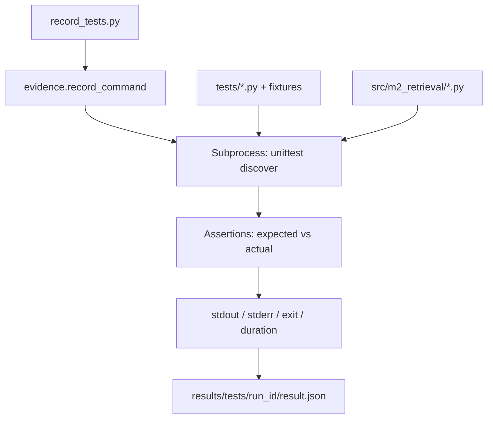
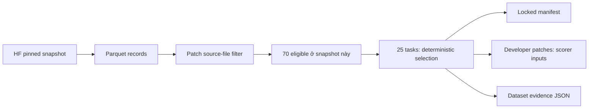
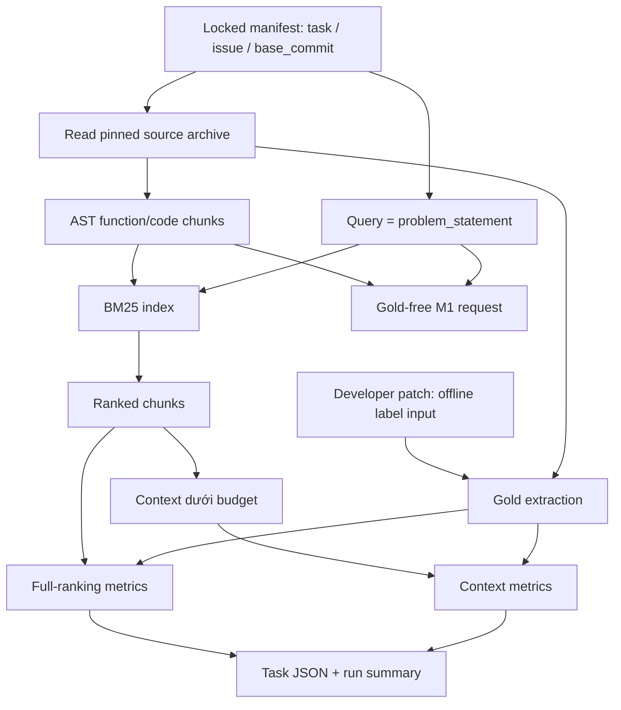
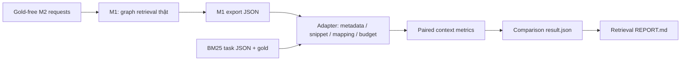

# Giải thích M2 — Repair & Verification tuần 5–6 và hướng dẫn tự kiểm thử

Tài liệu này giải thích implementation và kết quả hiện có, đối chiếu trực tiếp với code, script, manifest và JSON đã lưu. Không phải kế hoạch cho các tuần sau. Những số liệu bên dưới gắn với run cụ thể; chạy lại có thể khác thời gian và tạo đường dẫn kết quả mới.

**Điều quan trọng nhất:** tên nhiệm vụ của bạn là “Repair & Verification”, nhưng các đầu việc **tuần 5–6** được leader giao là **xây dựng baseline tìm kiếm code và đánh giá retrieval**. Package này chưa phải agent sinh patch/sửa lỗi. Chạy thành công ở đây nghĩa là tìm kiếm và chấm retrieval hoàn tất, **không có nghĩa repository SWE-bench đã được sửa**.

## Mục lục

1. [Nhiệm vụ M2 tuần 5–6 thực sự yêu cầu gì?](#1-nhiệm-vụ-m2-tuần-56-thực-sự-yêu-cầu-gì)
2. [Bảng nội dung đã hoàn thành và còn thiếu](#2-bảng-nội-dung-đã-hoàn-thành-và-còn-thiếu)
3. [Đã thực hiện công việc theo cách nào?](#3-đã-thực-hiện-công-việc-theo-cách-nào)
4. [Cấu trúc thư mục hiện có](#4-cấu-trúc-thư-mục-hiện-có)
5. [Giải thích từng file code](#5-giải-thích-từng-file-code)
6. [Dataset, source và gold patch nằm ở đâu?](#6-dataset-source-và-gold-patch-nằm-ở-đâu)
7. [BM25 và cách tạo context hoạt động thế nào?](#7-bm25-và-cách-tạo-context-hoạt-động-thế-nào)
8. [Gold-file/gold-function được tạo thế nào?](#8-gold-filegold-function-được-tạo-thế-nào)
9. [Các chỉ số đánh giá và cách hiểu](#9-các-chỉ-số-đánh-giá-và-cách-hiểu)
10. [Luồng A: kiểm thử implementation](#10-luồng-a-kiểm-thử-implementation)
11. [Luồng B: chuẩn bị dataset](#11-luồng-b-chuẩn-bị-dataset)
12. [Luồng C: đánh giá retrieval trên SWE-bench thật](#12-luồng-c-đánh-giá-retrieval-trên-swe-bench-thật)
13. [Ví dụ thật: Django 10554](#13-ví-dụ-thật-django-10554)
14. [Luồng D: so sánh Graph của M1 với BM25](#14-luồng-d-so-sánh-graph-của-m1-với-bm25)
15. [Đã kiểm thử những gì?](#15-đã-kiểm-thử-những-gì)
16. [Kết quả hiện tại và bằng chứng](#16-kết-quả-hiện-tại-và-bằng-chứng)
17. [Tự chạy từ đầu đến cuối trên Windows PowerShell](#17-tự-chạy-từ-đầu-đến-cuối-trên-windows-powershell)
18. [Xử lý lỗi và các nhầm lẫn thường gặp](#18-xử-lý-lỗi-và-các-nhầm-lẫn-thường-gặp)
19. [Bàn giao cho M1/M3/leader và việc tiếp theo](#19-bàn-giao-cho-m1m3leader-và-việc-tiếp-theo)
20. [Thuật ngữ và tài liệu đối chiếu](#20-thuật-ngữ-và-tài-liệu-đối-chiếu)

## 1. Nhiệm vụ M2 tuần 5–6 thực sự yêu cầu gì?

### 1.1. Nguồn yêu cầu

Phần “Tuần 5–6 — Task grounding và graph retrieval” trong:

`D:\Project\CAPSTONES\New_task\project_plan_16_weeks.md`

1. Implement BM25 baseline trên function/code chunks.
2. Chuẩn hóa gold-file/gold-function extraction từ developer patch.
3. Chạy retrieval evaluation ban đầu trên 20–30 SWE-bench tasks.
4. Phối hợp M1 debug context format và gold-label mapping.

Deliverable của M2: **BM25 baseline và script đo Recall@k**.

Definition of Done chung của tuần 5–6:

- Có bảng **Graph vs BM25**, gồm Recall@3, Recall@5, Recall@10 và token cost.
- Có ít nhất **10 task được manual-inspect** để xác nhận retrieval hợp lý.

DoD chung cần kết quả của nhiều thành viên, không thể chỉ dựa trên việc M2 chạy unit tests PASS.

### 1.2. Đầu việc 1 — BM25 baseline trên function/code chunks

**Vấn đề:** một issue có thể liên quan nhiều file/hàm. Trước khi so sánh với cách tìm context bằng graph của M1, cần một cách tìm kiếm đơn giản, độc lập, có thể tái lập.

**BM25** là cách xếp hạng đoạn code theo từ khóa của issue. Nó không dùng graph, embedding hay LLM. Ví dụ issue nhắc `union`, `order_by`, `compiler`, BM25 ưu tiên những đoạn có các từ đó, có tính đến độ hiếm của từ và độ dài đoạn.

**Function/code chunk** là đơn vị tìm kiếm:

- Hàm thường, hàm bất đồng bộ, method trong class, hàm lồng nhau.
- Hàm dài được chia thành cửa sổ code có overlap.
- Code ngoài hàm, như import/hằng số/class header, được giữ dưới dạng module chunks.

**Đầu ra cần có:** danh sách đoạn code đã xếp hạng và một tập context nằm trong ngân sách token. Đây là đối chứng để biết graph retrieval có thực sự giúp ích hay không.

### 1.3. Đầu việc 2 — Gold-file/gold-function từ developer patch

**Vấn đề:** tìm kiếm đưa ra nhiều đoạn code; phải biết những file/hàm nào được coi là nhãn tham chiếu để chấm.

**Developer patch** là bản sửa do developer trong dataset thực hiện, không phải patch do package này sinh ra. Từ diff đó, M2 xác định:

- File nguồn Python nào được sửa.
- Những function/method nào trong source trước sửa chứa các dòng được thay đổi.
- Trường hợp file mới, hàm mới, module edit, rename, delete hoặc ánh xạ không chắc chắn.

**Đầu ra cần có:** gold files, gold functions, nhật ký mapping và coverage. Phải dùng cùng quy tắc cho mọi task, không tự sửa nhãn để tăng điểm.

Một file/hàm chỉ xuất hiện sau patch không thể được tìm trong source trước patch. Implementation báo rõ loại này thay vì ép nó thành một hàm có sẵn.

### 1.4. Đầu việc 3 — Retrieval evaluation trên 20–30 SWE-bench tasks

**Vấn đề:** unit tests chứng minh một số trường hợp nhỏ đúng, nhưng không cho biết baseline hoạt động ra sao trên issue và repository thật.

M2 đã chọn một manifest cố định gồm **25 task multi-file Python từ SWE-bench Verified**, sau đó, với từng task:

1. Lấy source tại `base_commit` trước sửa.
2. Tách code thành chunks và lập BM25 index.
3. Dùng nguyên `problem_statement` làm query.
4. Xếp hạng và đóng gói context.
5. Tạo gold labels từ developer patch để chấm.
6. Đo Recall@k, MRR, token estimate và thời gian.
7. Lưu kết quả chi tiết riêng cho từng task và tổng hợp toàn bộ run.

**Đầu ra cần có:** script chạy được, manifest có thể tái lập, số liệu ban đầu và artifacts cho phép kiểm tra lại. Không cần chạy LLM hoặc SWE-bench repair harness để làm retrieval source-only.

### 1.5. Đầu việc 4 — Phối hợp M1 debug context format/gold-label mapping

**Vấn đề:** M1 dùng graph node ID và source ranges; M2 dùng canonical function ID. Nếu hai bên định nghĩa function, range hoặc corpus khác nhau, điểm số không công bằng.

M2 đã chuẩn bị:

- Request gửi M1, chỉ chứa issue và source candidates trước sửa, không có gold.
- Adapter nhận JSON context của M1.
- Kiểm tra cùng task/repo/commit/query/corpus/budget.
- Mapping path + symbol + span của M1 về định danh chấm của M2.
- Đối chiếu snippet với source thật trước sửa.
- Script so sánh context của Graph và BM25 dưới cùng token policy.

**Điều chưa có:** output graph retrieval thật của M1 trên 25 task này và phiên phối hợp có xác nhận của nhóm. Vì thế phần giao tiếp kỹ thuật đã sẵn, nhưng chưa được coi là hoàn thành toàn bộ collaboration/DoD.

### 1.6. Ranh giới với M1, M3 và M2 tuần 3–4

| Phần                         | Vai trò trong kế hoạch tuần 5–6                                          | Package này có làm thay không?                                   |
| ---------------------------- | ------------------------------------------------------------------------ | ---------------------------------------------------------------- |
| M1 — Graph & Retrieval       | Tạo task anchors, trace edges, traverse graph, rank và pack context      | Không. M2 chỉ nhận/kiểm tra output thật để so sánh               |
| M2 — Repair & Verification   | BM25, gold extraction, retrieval evaluation, debug mapping với M1        | Có, trong phạm vi trình bày ở đây                                |
| M3 — MCP, Evaluation & Paper | MCP tools, flow issue → anchors → context, subset chung, Related Work    | Không. Manifest25 của M2 vẫn là pilot tạm thời cần thống nhất M3 |
| M2 tuần 3–4 trong VGAR       | Test runner, baseline test evidence và hạ tầng verification đã làm trước | Không chạy/import/tích hợp lại ở package này                     |
| vgar_mcp_mvp cũ              | Coding agent/hệ thống repair đang đóng băng                              | Không thay đổi hoặc tiếp tục plan đang đóng băng                 |

Thư mục này **độc lập theo yêu cầu của bạn**. Nó không gọi MCP server hoặc LangGraph agent trong VGAR. Sự liên quan với VGAR là định hướng contracts/ranges/handoff, không phải dependency chạy code.

## 2. Bảng nội dung đã hoàn thành và còn thiếu

Các đường dẫn trong bảng tính từ `D:\Project\CAPSTONES\M2_week_5_6\`. Mục 4–6 ghi cụ thể cấu trúc và các đường dẫn đầy đủ.

| Nội dung                       | Hoàn thành ở mức nào?                                                | Nằm ở đâu?                                                                                 | Output/nội dung                                                                    | Tác dụng và giới hạn                                                    |
| ------------------------------ | -------------------------------------------------------------------- | ------------------------------------------------------------------------------------------ | ---------------------------------------------------------------------------------- | ----------------------------------------------------------------------- |
| Tách function/code chunks      | Đã triển khai và kiểm thử                                            | `src/m2_retrieval/chunks.py`                                                               | Chunks: ID, parent ID, path, symbol, range, snippet, hashes; parse failures        | Tạo corpus BM25; dùng Python AST, không tạo call graph                  |
| BM25 baseline                  | Đã triển khai và kiểm thử                                            | `src/m2_retrieval/bm25.py`                                                                 | Ranked chunks có score; packed context                                             | Baseline lexical độc lập; không hiểu ngữ nghĩa/quan hệ gọi hàm          |
| Gold-file extraction           | Đã triển khai theo policy                                            | `src/m2_retrieval/gold_labels.py`                                                          | `gold_files`, `all_changed_source_files`, `unretrievable_files`                    | Chấm các file có thể tìm ở base; file mới được báo riêng                |
| Gold-function extraction       | Đã triển khai theo policy, có boundary/regression tests              | Cùng `gold_labels.py`                                                                      | `gold_functions`, `mapping_events`, `mapping_coverage`, `function_labels_complete` | Gold là changed-code proxy, không phải toàn bộ causal relevance         |
| Dataset pin và manifest        | Đã tạo bộ25 task thật                                                | `dataset.py`, `scripts/prepare_dataset.py`, `data/manifests/verified-c104f840cc67-25.json` | Revision, tasks, commit/query/patch hashes, selection audit                        | Không chọn theo điểm retrieval; chưa là subset chung M3/final blind set |
| Source tại base commit         | Đã tải/cache và dùng trong25 task                                    | `dataset.py`, `data/repositories/archives/`                                                | Commit tar.gz + `.tar.json` provenance                                             | Không checkout/import code benchmark; không có Git object/tree proof    |
| Script Recall@k/MRR            | Đã triển khai                                                        | `metrics.py`, `evaluation.py`, `scripts/run_evaluation.py`                                 | File/function Recall@1/3/5/10/20, MRR, all-gold coverage                           | Dedup trước k; N/A có denominator rõ                                    |
| Retrieval evaluation20–30 task | Đã hoàn thành25/25,0 failed                                          | `results/retrieval/20261001T134641055034Z-5295e04e781d/`                                   | Summary, task JSON, context, gold, rankings, requests                              | Chứng minh retrieval pipeline chạy, không chứng minh sửa lỗi PASS       |
| Lưu test evidence              | Đã triển khai                                                        | `evidence.py`, `scripts/record_tests.py`, `results/tests/`                                 | Command, stdout/stderr, exit, time, interpreter, source fingerprint                | Test suite có một result.json/run; retrieval có thêm task files         |
| Resume có kiểm tra integrity   | Đã triển khai và kiểm thử                                            | `evaluation.py`, `tests/test_resume.py`, `tests/test_review_regressions.py`                | Run mới tái sử dụng task artifact phù hợp                                          | Khác source/config/manifest hoặc artifact bị sửa thì từ chối            |
| M1 request/adapter             | Đã triển khai và kiểm thử bằng fixtures                              | `m1_adapter.py`, `m1_requests/`, `docs/M1_M3_HANDOFF.md`                                   | Gold-free requests; validate/export mapping                                        | Fixtures chỉ chứng minh adapter, không phải kết quả Graph thật          |
| Phối hợp M1 debug thật         | **Chưa hoàn thành**                                                  | Handoff/checklist đã có trong `docs/M1_M3_HANDOFF.md`                                      | Cần export thật và thống nhất mapping                                              | Không thể thay bằng việc unit tests PASS                                |
| Bảng Graph vs BM25             | **Chưa hoàn thành**                                                  | `scripts/compare_m1.py`, `results/comparison/`, `REPORT.md`                                | Hiện `AWAITING_M1`,0/25 pairs                                                      | Không có số Graph giả, không coi missing là score0                      |
| Inspection ≥10 task            | Đã có10 case notes do assistant; **chưa có human/team confirmation** | `docs/INSPECTION_10_TASKS.md`                                                              | Issue/diff/gold/ranking và nhận xét từng case                                      | Cần thành viên/leader kiểm tra lại và ghi xác nhận                      |
| Manifest chung M3              | **Chưa thống nhất**                                                  | `provisional_m3_alignment` trong manifest, handoff docs                                    | Bộ25 pilot hiện tại                                                                | Chưa xác nhận môi trường chạy benchmark tests                           |

**Kết luận:** phần implementation/evaluation của M2 đã có bằng chứng hoạt động. Không đánh dấu “100% DoD chung tuần 5–6” khi chưa có Graph outputs, paired comparison và xác nhận phối hợp.

## 3. Đã thực hiện công việc theo cách nào?

### 3.1. Các bước triển khai đã thực hiện

1. **Tách scope:** tạo thư mục riêng, Python environment riêng; không sửa VGAR/vgar_mcp_mvp.
2. **Viết kiểm thử các trường hợp nhỏ:** chunking, tính BM25, budget, diff mapping, metrics và evidence.
3. **Implement các thành phần lõi:** AST chunks → BM25 → context; developer diff → gold; rankings + gold → metrics.
4. **Làm pipeline thật:** pin dataset, khóa manifest, lấy source tại base commit, chạy từng task tuần tự và lưu artifacts.
5. **Xử lý lỗi backend source:** lần smoke đầu dùng Git fetch bị timeout ở matplotlib; chuyển sang đọc commit archives qua GitHub codeload. Giữ nguyên failure evidence và công khai giới hạn provenance.
6. **Chạy smoke3, pilot5, evaluation25:** không chọn lại task dựa theo điểm số.
7. **Review và thêm regression tests:** sửa lỗi coordinate, duplicate definition, resume integrity, M1 export validation, ranking trace và corpus filtering.
8. **Chạy fresh final25 với source cuối:** không dùng metrics từ implementation cũ làm kết quả bàn giao.
9. **Tạo handoff/report/inspection:** báo rõ Graph chưa có, không tự điền điểm giả.

Các mốc phát triển chi tiết nằm trong `PROGRESS.md`; các lỗi review và cách sửa nằm trong `docs/REVIEW_FINDINGS.md`.

### 3.2. Những thứ không được thực hiện trong task này

- Không sinh hoặc apply agent patch vào repository benchmark.
- Không gọi reasoning/coding model, API Gemini/OpenAI/Ollama.
- Không fine-tune, không tạo training dataset VGAR-Repair-v1.
- Không dùng GPU, Docker, SWE-bench harness, pytest của benchmark.
- Không tạo MCP server, không chạy LangGraph end-to-end.
- Không build Arch-CPG, call graph, CFG hoặc PDG.
- Không tự commit/push. Thư mục hiện tại chưa là một Git repository độc lập.

Những thứ trên không phải lỗi thiếu implementation trong bốn đầu việc M2 tuần 5–6; nhưng một số sẽ cần ở giai đoạn tích hợp/repair sau này.

## 4. Cấu trúc thư mục hiện có

### 4.1. Cây thư mục

`<run_id>` và `<instance_id>` dưới đây là ký hiệu thay cho tên thật, không phải thư mục mang nguyên tên đó. `data/m1_exports/` là đường dẫn adapter mong đợi, chưa có bộ export thật tại thời điểm đối chiếu.

```text
D:\Project\CAPSTONES\M2_week_5_6\
├── GIAI_THICH_M2_W5_W6_VA_CACH_KIEM_THU.md   ← tài liệu đang đọc
├── README.md
├── PROGRESS.md
├── pyproject.toml
├── .gitignore
├── .venv\                                  ← Python environment riêng trên máy hiện tại
├── docs\
│   ├── IMPLEMENTATION_PLAN.md
│   ├── HUONG_DAN_M2_W5_W6.md
│   ├── M1_M3_HANDOFF.md
│   ├── INSPECTION_10_TASKS.md
│   └── REVIEW_FINDINGS.md
├── src\m2_retrieval\
│   ├── __init__.py
│   ├── chunks.py
│   ├── bm25.py
│   ├── gold_labels.py
│   ├── metrics.py
│   ├── dataset.py
│   ├── evaluation.py
│   ├── m1_adapter.py
│   ├── evidence.py
│   └── report.py
├── scripts\
│   ├── record_tests.py
│   ├── prepare_dataset.py
│   ├── run_evaluation.py
│   └── compare_m1.py
├── tests\
│   ├── test_core.py
│   ├── test_pipeline.py
│   ├── test_gold_boundaries.py
│   ├── test_handoff_and_failure.py
│   ├── test_archive.py
│   ├── test_resume.py
│   └── test_review_regressions.py
├── data\
│   ├── downloads\c104f840cc67f8b6eec6f759ebc8b2693d585d4a\
│   │   ├── hf_metadata.json
│   │   └── test-00000-of-00001.parquet
│   ├── manifests\verified-c104f840cc67-25.json
│   ├── gold\patches\<instance_id>.patch
│   └── repositories\
│       ├── archives\<owner>__<repo>-<base_commit>.tar.gz
│       │            <owner>__<repo>-<base_commit>.tar.json
│       ├── astropy__astropy\                  ← cache Git lịch sử
│       ├── django__django\                    ← cache Git lịch sử
│       └── matplotlib__matplotlib\            ← cache Git lịch sử
└── results\
    ├── bootstrap\test-red.json
    ├── tests\<run_id>\result.json
    ├── dataset\<run_id>\result.json
    ├── retrieval\<run_id>\
    │   ├── result.json
    │   ├── tasks\<instance_id>.json
    │   ├── m1_requests\<instance_id>.json
    │   └── REPORT.md                          ← được tạo khi gọi comparison/report
    ├── comparison\<run_id>\result.json
    └── checks\<run_id>\result.json
```

Python có thể tạo `__pycache__/` trong src/scripts/tests. Đó là cache bytecode, không phải source mới, không phải dataset hay output nghiên cứu.

### 4.2. Vai trò từng thư mục và file cấu hình/tài liệu

| Đường dẫn đầy đủ                                               | Vai trò/cách sử dụng                                                                                                                                   |
| -------------------------------------------------------------- | ------------------------------------------------------------------------------------------------------------------------------------------------------ |
| `D:\Project\CAPSTONES\M2_week_5_6\src\m2_retrieval\`           | Logic thuật toán; script CLI gọi các module này                                                                                                        |
| `D:\Project\CAPSTONES\M2_week_5_6\scripts\`                    | Các điểm vào cho người dùng chạy; tự thêm src vào import path, không cần cài VGAR                                                                      |
| `D:\Project\CAPSTONES\M2_week_5_6\tests\`                      | Source các tests stdlib unittest, chứa fixtures nhỏ trong code                                                                                         |
| `D:\Project\CAPSTONES\M2_week_5_6\data\`                       | Dataset đầu vào, manifest, gold patch, source cache; không phải kết quả chấm                                                                           |
| `D:\Project\CAPSTONES\M2_week_5_6\results\`                    | Bằng chứng mỗi lần chạy; không chỉnh tay để tăng điểm                                                                                                  |
| `D:\Project\CAPSTONES\M2_week_5_6\docs\`                       | Plan, guide ngắn, contract, inspection và review findings                                                                                              |
| `D:\Project\CAPSTONES\M2_week_5_6\.venv\`                      | Interpreter/dependencies riêng; có thể tái tạo khi chuyển máy, không phải code cần bàn giao qua Git                                                    |
| `D:\Project\CAPSTONES\M2_week_5_6\pyproject.toml`              | Tên package, Python `>=3.11,<3.14`, setuptools build config; runtime dependencies trống, data extra pin `pyarrow==23.0.1`                              |
| `D:\Project\CAPSTONES\M2_week_5_6\.gitignore`                  | Bỏ qua venv, pycache, caches, gold, results khi sau này dùng Git. Không đồng nghĩa các artifacts không quan trọng: phải bàn giao qua gói dữ liệu riêng |
| `D:\Project\CAPSTONES\M2_week_5_6\README.md`                   | Đọc nhanh scope, commands, kết quả và giới hạn                                                                                                         |
| `D:\Project\CAPSTONES\M2_week_5_6\PROGRESS.md`                 | Checkpoint khôi phục qua các phiên; mốc cũ giữ để đối chiếu, trạng thái cuối ở phần bàn giao cuối                                                      |
| `D:\Project\CAPSTONES\M2_week_5_6\docs\IMPLEMENTATION_PLAN.md` | Kế hoạch triển khai và các quyết định đã ghi                                                                                                           |
| `D:\Project\CAPSTONES\M2_week_5_6\docs\HUONG_DAN_M2_W5_W6.md`  | Hướng dẫn thao tác ngắn hơn tài liệu này                                                                                                               |
| `D:\Project\CAPSTONES\M2_week_5_6\docs\M1_M3_HANDOFF.md`       | M2 gửi gì/nhận gì, field/range/token policy và checklist debug chung                                                                                   |
| `D:\Project\CAPSTONES\M2_week_5_6\docs\INSPECTION_10_TASKS.md` | Nhận xét10 cases thật, chưa có chữ ký xác nhận của người trong nhóm                                                                                    |
| `D:\Project\CAPSTONES\M2_week_5_6\docs\REVIEW_FINDINGS.md`     | Những lỗi đã phát hiện/sửa và regression tests tương ứng                                                                                               |

Không có yêu cầu hiện tại phải tạo folder `config/`, SQLite database hoặc lưu mỗi chunk vào một file riêng. Chunks/candidate map được lưu trong task JSON. `.gitignore` có dòng `data/chunks/` nhưng điều đó **không chứng minh thư mục ấy đã được tạo hoặc được pipeline sử dụng**.

## 5. Giải thích từng file code

Tất cả file ở phần này nằm trong:

`D:\Project\CAPSTONES\M2_week_5_6\src\m2_retrieval\`

### 5.1. `__init__.py`

Đánh dấu thư mục là Python package. Nó không phải agent, không tự chạy evaluation khi mở folder.

### 5.2. `chunks.py` — đọc cấu trúc và tạo đơn vị tìm kiếm

**Input:** dictionary `{relative_path: source_text}` của source trước sửa.

**Cách hoạt động:**

1. `normalize_path`: chỉ chấp nhận relative POSIX path an toàn; từ chối absolute path, `..`, dấu `\`, dấu `:` và tiền tố `./`.
2. `is_source`: lấy `.py`, loại các path components `tests/test/testing/docs/doc/.venv/venv/__pycache__`; loại tên `test_*` hoặc `*_test.py`.
3. `decode_source`: nhận biết encoding Python; không import code.
4. `entities`: dùng `ast.parse`, tìm functions/methods/nested functions/async functions và decorators.
5. `extract_chunks`: chia hàm dài thành windows80 dòng, overlap16 dòng; tạo module chunks cho những đoạn code ngoài hàm.
6. `physical_lines`: giữ tọa độ theo CR/LF, tránh `formfeed` bị coi nhầm là dòng mới.

**Output:** `(chunks, parse_failures)`. Một chunk có `chunk_id`, `parent_id`, `path`, `symbol`, `kind`, line/column metadata, `snippet`, `text`, source/content hashes.

`parent_id` thường là `path::qualified_name`. Các windows của cùng hàm dùng chung parent ID nhưng chunk IDs khác. Khi AST definitions trùng tên đầy đủ, ID thêm `@definition:start:end` để phân biệt getter/setter hoặc handlers khai báo lặp.

Đây là heuristic lọc source, không biết chắc mọi thư mục tên “test” có ý nghĩa gì trong mọi repo. Các file Python trong examples/tutorials/scripts vẫn có thể được giữ và gây lexical noise.

### 5.3. `bm25.py` — tìm kiếm và đóng gói context

**Input:** chunks + issue query; không nhận gold labels làm tham số tìm kiếm.

- `tokenize`: giữ identifier đầy đủ và thêm phần snake/camel case, lowercase.
- `BM25.__init__`: tạo inverted index, term frequencies, document lengths, average length.
- `BM25.search`: cộng điểm các query terms xuất hiện; query terms duy nhất được sort để tái lập floating-point summation. Tie-break theo chunk ID.
- `estimate_tokens`: `ceil(số byte UTF-8/4)`.
- `context_text`: tính cả header path/symbol và snippet.
- `pack_context`: lấy chunks theo thứ hạng nếu còn budget; chunk quá lớn bị bỏ qua, không cắt tùy tiện giữa code.

**Output:** ranking có `score` và context có `items`, `total_token_count`, `token_budget`, `truncated`, `skipped_chunk_ids`, `token_policy`.

Index ở RAM, được build theo task; không có persistent SQLite/Elasticsearch index trong package này.

### 5.4. `gold_labels.py` — patch thành nhãn chấm

**Input:** unified developer diff + source trước sửa.

- `parse_patch`: đọc old/new paths, hunk headers, removed/added lines; kiểm tra counts/path.
- `align_patch`: đối chiếu old context với base source, dựng after-source trong RAM và bản đồ line origins.
- `owner`: chọn function chứa dòng sửa, ưu tiên function lồng sâu nhất.
- `extract_gold`: xuất gold sets và dispositions/coverage.

**Output:** nhãn và nhật ký được đặt trong trường `gold` của task JSON. Không ghi after-source thành patch sửa repo.

Nếu header hunk lệch nhưng old context khớp exact duy nhất, implementation relocate và ghi offset. Nếu thiếu hoặc ambiguous context, không fuzzy-match đoán vị trí.

### 5.5. `metrics.py` — chấm retrieval

**Input:** ranking/context + gold.

- File ranking: dedup theo path trước khi lấy top-k.
- Function ranking: bỏ module chunks, dedup theo parent ID trước khi lấy top-k.
- Tính Recall@k, MRR và all-gold@k.
- Gold rỗng/incomplete ở cấp function → `null`/N/A, không giả0 hoặc1.
- Aggregate lấy macro mean trên task đủ điều kiện của từng metric, ghi `eligible_tasks`, completed/failed counts.

**Output:** dictionary metrics từng task và summary toàn run.

### 5.6. `dataset.py` — dữ liệu pin và nguồn benchmark

**Input:** count/revision hoặc một task manifest row.

- Kiểm tra repo name, instance ID, base SHA40 ký tự và issue không rỗng.
- `prepare_dataset`: lấy Hugging Face metadata/revision, đọc Parquet bằng pyarrow, lọc multi-file source Python, chọn round-robin theo repository và ID.
- Lưu manifest và gold patches riêng.
- `read_repository_sources`: tải/tái dùng source archive tại SHA cố định, kiểm tra URL/sidecar/hash/root.
- `read_archive_sources`: streaming tar, đọc eligible Python files, không extract ra worktree, không chạy benchmark code.

Giới hạn code đang dùng: source archive download tối đa300MB; file source tối đa2MB; tối đa50.000 eligible source files; có socket timeout và kiểm tra thời gian/size trong download loop. Đây không phải cam kết mọi network call có hard deadline chính xác180 giây.

**Output:** source dictionary + provenance; hoặc manifest file + metadata chọn task.

### 5.7. `evaluation.py` — điều phối retrieval pipeline

`evaluate_task` nhận task/source, tạo chunks/index/ranking/context, rồi extract gold và chấm metrics.

`evaluate_manifest` làm thêm:

- Validate manifest, query/patch hashes và gold patch path.
- Hash config/source/manifest thành binding.
- Đọc source từng task tuần tự.
- Viết task JSON và gold-free M1 request.
- Cập nhật summary sau từng task.
- Nếu một task lỗi: lưu error, tiếp tục các task còn lại; final status có thể là `PARTIAL_FAILURE`.
- Resume chỉ nhận task artifacts còn nguyên và binding phù hợp, tạo một run mới.

**Chú ý chính xác về gold:** pipeline có đọc patch text để kiểm tra hash trước khi gọi `evaluate_task`. Tuy nhiên BM25 search chỉ dùng chunks và `problem_statement`; **ranking/context không sử dụng patch**, và gold extraction diễn ra sau ranking/context. Không nên mô tả rằng file patch hoàn toàn chưa được mở ở mọi tầng pipeline.

### 5.8. `m1_adapter.py` — tiếp nhận Graph context thật

**Input:** M1 export JSON + BM25 task artifact.

`adapt_context` kiểm tra metadata, ContextPayload shape, path, source range/snippet, score/confidence, token accounting và mapping canonical IDs. Giữ node IDs/rationale thật của M1; không dựng graph fields cho BM25.

Context được recount/repack với estimator chung trước chấm. `compare_run` xử lý từng export, ghi missing/invalid exports, paired metrics và trạng thái.

**Output:** comparison JSON; nếu không có M1 output thì `AWAITING_M1`, không có Graph score.

Adapter kiểm tra tính nhất quán dữ liệu và source snippet; **không tự chứng minh graph rationale hay edge confidence đúng về ngữ nghĩa**. Chất lượng graph thực vẫn cần M1 và inspection.

### 5.9. `evidence.py` — ghi lại bằng chứng chạy

- `new_run`: tạo ID có UTC timestamp + UUID, thư mục riêng và initial status.
- `write_json`: ghi UTF-8 qua temporary file, flush/fsync rồi atomic replace; tránh người đọc thấy JSON đang viết dở.
- `source_fingerprint`: hash các `.py` trong src/scripts/tests và pyproject. Markdown/data/results không nằm trong source fingerprint này.
- `record_command`: chạy subprocess, capture stdout/stderr, exit/duration/environment, timeout/error.

Một run có thể cập nhật `result.json` của chính nó nhiều lần, nhưng lần chạy mới tạo folder mới, không ghi đè folder run cũ. Hash hỗ trợ phát hiện thay đổi, **không phải chữ ký số chống giả mạo có chủ đích**.

### 5.10. `report.py` — báo cáo từ artifacts

Đọc run/comparison JSON thật và sinh `REPORT.md` trong retrieval run tương ứng.

Tách rõ:

- Bảng **BM25 ranking đầy đủ**.
- Bảng **Graph vs BM25 packed context cùng budget**.

Nếu thiếu Graph, ghi pending, không điền0. `compare_m1.py` gọi report generator; chỉ chạy `run_evaluation.py` không bảo đảm run mới đã có REPORT.md. Chạy comparison lại có thể cập nhật REPORT.md của run ấy; các comparison JSON vẫn nằm trong thư mục run riêng.

### 5.11. Các scripts bạn trực tiếp chạy

| Đường dẫn đầy đủ                                              | Input CLI                                                           | Công việc                                           | Output                                                         |
| ------------------------------------------------------------- | ------------------------------------------------------------------- | --------------------------------------------------- | -------------------------------------------------------------- |
| `D:\Project\CAPSTONES\M2_week_5_6\scripts\record_tests.py`    | `--pattern`, `--timeout-seconds`                                    | Chạy unittest discovery trong tests và ghi evidence | `results/tests/<run_id>/result.json`                           |
| `D:\Project\CAPSTONES\M2_week_5_6\scripts\prepare_dataset.py` | `--count`, `--revision`                                             | Chuẩn bị dataset/manifest/gold patches              | `data/...` và `results/dataset/<run_id>/result.json`           |
| `D:\Project\CAPSTONES\M2_week_5_6\scripts\run_evaluation.py`  | `--manifest`, `--limit`, `--budget-tokens`, `--offline`, `--resume` | Đánh giá BM25 thật                                  | `results/retrieval/<run_id>/...`                               |
| `D:\Project\CAPSTONES\M2_week_5_6\scripts\compare_m1.py`      | `--run`, `--exports`                                                | Validate M1 outputs, paired evaluation, sinh report | `results/comparison/<run_id>/result.json`, retrieval REPORT.md |

## 6. Dataset, source và gold patch nằm ở đâu?

### 6.1. Dataset gốc

Dataset ID được dùng: **`princeton-nlp/SWE-bench_Verified`**.

Revision đã pin: **`c104f840cc67f8b6eec6f759ebc8b2693d585d4a`**.

Các file local:

```text
D:\Project\CAPSTONES\M2_week_5_6\data\downloads\c104f840cc67f8b6eec6f759ebc8b2693d585d4a\hf_metadata.json
D:\Project\CAPSTONES\M2_week_5_6\data\downloads\c104f840cc67f8b6eec6f759ebc8b2693d585d4a\test-00000-of-00001.parquet
```

`hf_metadata.json` ghi metadata snapshot; Parquet chứa records dataset gốc. Dataset/repositories benchmark public; không cần GitHub PAT của repo private nhóm cho bước này.

Snapshot hiện tại có500 raw records. Filter implementation xác định70 task có developer patch sửa ít nhất hai file nguồn Python, không tính test/docs theo policy `is_source`.

**70 là số đếm của snapshot và policy này, không phải số cố định với mọi cách định nghĩa multi-file.** File mới cũng có thể được tính khi chọn multi-file; lúc chấm retrieval phải báo khả năng tìm file đó ở base riêng.

### 6.2. Manifest — input trực tiếp của evaluation script

```text
D:\Project\CAPSTONES\M2_week_5_6\data\manifests\verified-c104f840cc67-25.json
```

Manifest khóa25 task trước ranking, chọn round-robin repository và instance IDs tăng dần, phủ10 repositories. Không dùng random seed; không stratify difficulty/patch size; chưa là tập final blind hay tập chung M3.

Trường tổng quan: `dataset_id`, `dataset_revision`, `split`, `purpose`, `provisional_m3_alignment`, `query_policy`, `selection_audit`, `tasks`.

Mỗi task row chứa:

- `instance_id`: ID bài toán.
- `repo`: repository nguồn, ví dụ `django/django`.
- `base_commit`: commit SHA40 ký tự trước patch.
- `problem_statement`: issue text, chính là query.
- `query_hash`, `patch_hash`: dấu nhận diện input.
- `gold_patch_path`: đường dẫn tương đối đến developer patch.
- `changed_source_files`: các source files thay đổi theo diff.
- `difficulty` nếu record có field này.

Manifest có thông tin gold để phục vụ evaluation. **Không đưa nguyên manifest/patch directory vào agent hoặc M1 retrieval.** Sử dụng `m1_requests/` đã tách gold-free.

### 6.3. Developer patches

```text
D:\Project\CAPSTONES\M2_week_5_6\data\gold\patches\<instance_id>.patch
```

Ví dụ thật:

`D:\Project\CAPSTONES\M2_week_5_6\data\gold\patches\django__django-10554.patch`

Nội dung là unified diff: headers old/new paths, `@@ ... @@` hunk headers, dòng `-` bị xóa và dòng `+` được thêm. Đây là **nhãn tham chiếu đầu vào**, không phải output agent.

### 6.4. Source trước sửa

Source không nằm ở một worktree đã checkout. Pipeline đọc trực tiếp file `.tar.gz` chứa snapshot repository tại base commit.

Ví dụ Django:

```text
D:\Project\CAPSTONES\M2_week_5_6\data\repositories\archives\django__django-14d026cccb144c6877294ba4cd4e03ebf0842498.tar.gz
D:\Project\CAPSTONES\M2_week_5_6\data\repositories\archives\django__django-14d026cccb144c6877294ba4cd4e03ebf0842498.tar.json
```

`.tar.json` lưu URL, archive hash và base commit. Tên sidecar là **`.tar.json`**, không phải `.tar.gz.json`.

URL source của ví dụ này:

`https://codeload.github.com/django/django/tar.gz/14d026cccb144c6877294ba4cd4e03ebf0842498`

Path như `django/db/models/sql/compiler.py` trong task JSON là **path bên trong source snapshot**, không phải khẳng định có file vật lý `M2_week_5_6\django\db\...` trên máy bạn.

Cache Git ở `data/repositories/astropy__astropy`, `django__django`, `matplotlib__matplotlib` thuộc smoke backend cũ đã được giữ lại. Final evaluation dùng `archives/`, không cần các bare Git caches ấy. Không tự xóa chúng khi đọc tài liệu.

## 7. BM25 và cách tạo context hoạt động thế nào?

### 7.1. Tách code thành chunks

Ví dụ minh họa, không phải một file mới được tạo trong repo:

```python
class TokenService:
    def validate(self, token):
        return token.startswith("valid-")
```

Với source path `auth/token.py`, qualified name là `auth.token.TokenService.validate`, parent ID thường là:

```text
auth/token.py::auth.token.TokenService.validate
```

Nếu function dài hơn80 dòng: windows80 dòng, bước dịch64 dòng (=80−16). Chúng dùng chung parent ID, tránh tính một hàm thành nhiều gold hits.

Module chunks giúp tìm file qua import/hằng số nhưng không được tính là function. Class không trở thành một “function”; methods được trích riêng, phần class header/field ngoài functions có thể là module chunks.

### 7.2. Tokenization cho code

`TokenService` được giữ dưới dạng `tokenservice`, đồng thời có `token` và `service`; `user_name` giữ `user_name` và thêm `user`, `name`.

Vì issue thường dùng các từ tách rời còn code dùng identifier ghép, cách này tăng cơ hội lexical match. Tuy nhiên tokenizer hiện dùng ASCII alphanumeric/underscore, không phải tokenizer ngôn ngữ tự nhiên đầy đủ cho mọi ngôn ngữ.

### 7.3. Điểm BM25

Implementation dùng:

```text
IDF(t) = ln(1 + (N − df(t) + 0.5) / (df(t) + 0.5))

score(d,q) = Σ IDF(t) × [tf(t,d) × (k1+1)] /
                         [tf(t,d) + k1 × (1−b+b×len(d)/avgdl)]

k1 = 1.2; b = 0.75
Σ lấy trên các query terms duy nhất có trong corpus.
```

Trong đó N là số chunks; df là số chunks chứa từ; tf là số lần từ xuất hiện trong chunk; len/avgdl là độ dài sau tokenization.

Hiểu đơn giản:

- Từ hiếm và khớp issue thường có ích hơn từ phổ biến.
- Từ lặp nhiều tăng điểm nhưng không tăng vô hạn tuyến tính.
- Chunk dài được điều chỉnh để không thắng chỉ vì có nhiều từ.
- Điểm cao là mức khớp lexical, **không phải confidence0..1 hay xác suất sửa đúng**.

### 7.4. Ranking khác context

**Ranking** là thứ tự tất cả chunks có lexical hits. **Context** là các chunks thực sự được giữ dưới budget4000 estimated tokens.

Packing là greedy theo thứ hạng: chunk vừa budget thì thêm, không vừa thì skip và xét chunk tiếp theo. Vì vậy một gold function có trong ranking nhưng vẫn có thể không vào context.

Các windows cùng parent có thể cùng nằm trong context và tốn token. Metrics dedup khi chấm, nhưng packing không phải thuật toán tối ưu diversity hoặc nén context.

### 7.5. Token estimate không phải LLM tokens

Mỗi item tính:

```text
ceil(byte UTF-8 của "path::symbol\n" + snippet / 4)
```

Chi phí context là tổng estimate các items. Đây là quy tắc chung để so sánh, không phải Qwen tokenizer, không phải API billing và không bảo đảm đúng context window của một model cụ thể.

## 8. Gold-file/gold-function được tạo thế nào?

### 8.1. Flow của nhãn chấm

```text
Developer patch + base source
          │
          ├─ đọc paths/hunks, validate counts
          ├─ đối chiếu old context với source base
          ├─ dựng after-source TRONG RAM và line origins
          ├─ parse AST before/after
          ├─ map changed lines về function trước sửa
          └─ xuất gold + dispositions + coverage
```

Đường nhãn này phục vụ **scorer**, không phục vụ BM25 search. After-source chỉ để phân biệt dòng mới trong hàm cũ với hàm mới; không phải một bước repair agent.

### 8.2. Policy cho những trường hợp đặc biệt

| Trường hợp                                          | Xử lý hiện tại                                             | Ý nghĩa khi chấm                                     |
| --------------------------------------------------- | ---------------------------------------------------------- | ---------------------------------------------------- |
| Sửa dòng trong hàm có sẵn                           | Map tới base parent ID                                     | Function trở thành gold                              |
| Thêm dòng trong hàm có sẵn                          | Dùng AST/origins để map về hàm cũ                          | Không nhầm thành hàm mới                             |
| Sửa nested function                                 | Ưu tiên owner lồng sâu nhất                                | Không tự đánh gold cả parent chỉ vì chứa nested code |
| Sửa decorator                                       | Decorator nằm trong span entity                            | Map tới function được decorate                       |
| Sửa import/hằng số/module code                      | `module_edit`                                              | File có thể gold, không invent gold function         |
| Thêm function mới                                   | `new_function`                                             | Không có base function để retrieve; báo disposition  |
| Thêm file mới                                       | `new_file`, `unretrievable_files`                          | Không tính như file tìm được từ base; báo coverage   |
| Rename/delete                                       | Sử dụng old path và ghi event                              | Chấm trên source trước sửa                           |
| Duplicate qualified name                            | Disambiguate bằng defining spans/line origins              | Tránh getter/setter khác bị tính false hit           |
| Hunk header lệch                                    | Chỉ exact old-context mapping hợp lệ; ghi `hunk_relocated` | Không fuzzy-match để tăng coverage                   |
| Missing/ambiguous source context hoặc parse failure | `unmapped`/`unmapped_after`/`missing_base_file`            | Function labels incomplete → function metrics N/A    |

### 8.3. Gold không đồng nghĩa toàn bộ code cần để sửa

Một patch có thể sửa nhiều helpers, examples hoặc API signatures ngoài triệu chứng chính. Ngược lại, có code cần đọc nhưng developer không sửa nên không nằm trong gold.

Vì vậy gold ở đây là **developer-changed-code proxy**. Nó hữu ích cho baseline localization nhưng không đủ để kết luận “context đầy đủ để sửa” hoặc “hệ thống hiểu toàn bộ causal chain”.

`mapping_coverage=1.0` nghĩa events thuộc nhóm mapping đã được phân loại theo policy, gồm cả module/new-function. Không có nghĩa mọi thay đổi đều thành retrievable function hoặc gold hoàn hảo.

## 9. Các chỉ số đánh giá và cách hiểu

### 9.1. Recall@k

```text
Recall@k = số gold identities có trong top-k / số gold identities đủ điều kiện
```

Ví dụ có2 gold files, top5 unique files chứa1 → File Recall@5=0.5.

Top-k files và top-k functions là **hai danh sách khác nhau**. Không lấy top5 chunks rồi gọi đó là top5 files. Implementation dedup trước k, và bỏ module chunks khi tạo function ranking.

Function recall thấp hơn file recall không tự chứng minh metric sai: tìm đúng một file lớn chưa chắc tìm đúng method cần sửa.

### 9.2. MRR

Mỗi task: `1/rank` của gold identity đầu tiên; không tìm thấy thì0. Macro MRR là trung bình các task đủ điều kiện.

Ví dụ gold function đầu tiên ở vị trí20 → reciprocal rank=0.05. MRR chỉ nhìn hit đầu tiên; không bảo đảm tìm đủ mọi gold functions.

### 9.3. All-gold@k

Mỗi task có giá trị1 nếu top-k bao phủ **tất cả** gold đủ điều kiện, ngược lại0. Macro mean cho biết tỷ lệ task có full gold coverage ở k đó. Khác Recall trung bình.

### 9.4. Denominator và N/A

Mỗi metric có `eligible_tasks`. Macro mean chỉ lấy những task metric đó có giá trị, nhưng phải đồng thời báo attempted/completed/failed và eligibility để không che giấu failure.

Gold function rỗng hoặc labels incomplete → `null` trong JSON, `N/A` trong báo cáo. Đây không phải score0 hoặc1.

### 9.5. Thời gian và cost

- `index_seconds`: chunk extraction + corpus hashing + index construction trong evaluate_task.
- `retrieval_seconds`: BM25 search + context packing; không phải tổng thời gian task.
- Task `duration_seconds`: bao gồm đọc source/kiểm tra input/chấm/chuẩn bị outputs; không nên hiểu nó là toàn bộ chi phí ghi mọi bytes cuối cùng.
- Run `duration_seconds`: thời gian pipeline run; includes per-task output processing, không gồm setup thủ công trước đó.
- `context_token_estimate`: estimate, không billing.
- Không gọi LLM → API cost0; vẫn có CPU, RAM, SSD và băng thông. Run này không có thống kê peak RAM được đo để bảo đảm mọi máy16GB đều chạy ổn.

### 9.6. Hai bộ metric phải đọc riêng

| Field/bảng                                            | Chấm gì?                                    | Dùng khi nào?                  |
| ----------------------------------------------------- | ------------------------------------------- | ------------------------------ |
| `metrics` trong task                                  | BM25 ranking đầy đủ                         | Phân tích lexical localization |
| `context_metrics` trong task                          | Những items đã được pack trong budget       | Context thực sự đưa downstream |
| `graph_metrics`/`bm25_metrics` trong comparison pairs | Hai packed contexts cùng task/corpus/budget | Graph vs BM25 công bằng        |

Không dùng ranking Recall của BM25 để so trực tiếp với một Graph context hữu hạn.

## 10. Luồng A: kiểm thử implementation

### 10.1. Input nằm ở đâu?

```text
D:\Project\CAPSTONES\M2_week_5_6\tests\test_core.py
D:\Project\CAPSTONES\M2_week_5_6\tests\test_pipeline.py
D:\Project\CAPSTONES\M2_week_5_6\tests\test_gold_boundaries.py
D:\Project\CAPSTONES\M2_week_5_6\tests\test_handoff_and_failure.py
D:\Project\CAPSTONES\M2_week_5_6\tests\test_archive.py
D:\Project\CAPSTONES\M2_week_5_6\tests\test_resume.py
D:\Project\CAPSTONES\M2_week_5_6\tests\test_review_regressions.py
```

Fixtures là source strings, diff strings, expected values hoặc temporary archives/JSON được tạo trong tests. Ví dụ `SOURCE` trong `test_core.py` có decorated login, class method, nested function và setting. Helper `task()` trong `test_pipeline.py` tạo issue/diff nhỏ.

Không có yêu cầu tải SWE-bench hoặc mở thư mục VGAR để chạy41 tests này. Không có thư mục repo demo vật lý cố định mà test phải sửa.

### 10.2. Xử lý và kiểm tra

Bạn chạy `scripts/record_tests.py`. Script sử dụng đúng `sys.executable` của `.venv`, tạo subprocess:

```text
python -m unittest discover -s tests -p test*.py -v
```

Unittest import các test modules, chạy từng test method và so actual result với assertions. Temporary directories dùng trong test được dọn sau test, nhưng outer result JSON giữ stdout/stderr của suite.

Một số test cố tình đưa invalid patch/export/timeout. PASS ở đó nghĩa **hệ thống từ chối hoặc ghi lỗi đúng như kỳ vọng**, không phải input xấu trở thành hợp lệ.

### 10.3. Output nằm ở đâu?

Mỗi lần chạy:

`D:\Project\CAPSTONES\M2_week_5_6\results\tests\<run_id>\result.json`

Một file chứa command argv, cwd, interpreter/Python/platform, timestamps, timeout, source fingerprint, stdout, stderr, exit code, duration, status/complete.

**Unittest thường in danh sách test và “Ran41 tests…OK” vào stderr. Stderr có nội dung không đồng nghĩa suite lỗi.** Xem status/exit và các dòng test failure.

### 10.4. Sơ đồ



Nếu VS Code không render Mermaid, đọc tương đương: **test files + implementation → unittest/assertions → recorder → result.json**.

## 11. Luồng B: chuẩn bị dataset

### 11.1. Input

`scripts/prepare_dataset.py --count 25 --revision <SHA đã pin>`.

Input bên ngoài: Hugging Face metadata và test Parquet của snapshot đã pin. Cần Internet khi gọi preparation; có cached Parquet không đồng nghĩa script này hoàn toàn offline vì vẫn hỏi HF metadata.

### 11.2. Xử lý

1. Resolve/validate revision.
2. Tải Parquet nếu thiếu, lưu download hash.
3. Đọc batches64 records bằng pyarrow; bộ500 rows vẫn được tổng hợp để chọn subset, không phải pipeline streaming dataset vô hạn.
4. Parse developer patches, filter ≥2 source Python files theo policy.
5. Chọn25 round-robin repository/ID, trước khi biết BM25 scores.
6. Lưu patch từng task và manifest khóa.
7. Ghi dataset run evidence.

### 11.3. Output

- HF snapshot: `data/downloads/<revision>/`.
- Manifest: `data/manifests/verified-c104f840cc67-25.json`.
- Patch inputs: `data/gold/patches/<instance_id>.patch`.
- Evidence: `results/dataset/<run_id>/result.json`.

Preparation **chưa tải source archives và chưa chạy retrieval**; source được tải khi evaluation cần.



## 12. Luồng C: đánh giá retrieval trên SWE-bench thật

### 12.1. Inputs và vị trí

| Input              | Vị trí                                                                          | Vai trò                           |
| ------------------ | ------------------------------------------------------------------------------- | --------------------------------- |
| Manifest25         | `D:\Project\CAPSTONES\M2_week_5_6\data\manifests\verified-c104f840cc67-25.json` | Khóa tasks/commits/query/hashes   |
| Issue query        | `tasks[i].problem_statement` trong manifest                                     | Input duy nhất dùng để query BM25 |
| Source base        | `D:\Project\CAPSTONES\M2_week_5_6\data\repositories\archives\...tar.gz`         | Corpus trước sửa                  |
| Archive provenance | Cùng folder, `...tar.json`                                                      | Kiểm tra snapshot/cache           |
| Developer patch    | `D:\Project\CAPSTONES\M2_week_5_6\data\gold\patches\<instance_id>.patch`        | Nhãn offline, không input search  |
| Evaluation config  | Arguments + `config` trong result.json                                          | k1/b/window/overlap/budget/limit  |

### 12.2. Xử lý một task, theo thứ tự thật

1. Validate task metadata và kiểm tra query/patch hash; gold path phải trong data/gold.
2. Lấy source archive đúng commit; kiểm tra sidecar/archive hash/root.
3. Đọc eligible Python files thành source strings, ghi provenance/exclusions.
4. Parse AST, tạo function/code chunks; ghi parse failures.
5. Hash corpus, lập BM25 index.
6. Query bằng `problem_statement`, rank lexical hits.
7. Pack context budget4000; **không dùng gold để chọn items**.
8. Extract gold bằng developer diff/base source.
9. Chấm full ranking và context riêng.
10. Lưu task artifact và request gold-free cho M1.
11. Hash artifact, cập nhật result.json/summary/progress line.
12. Chuyển task tiếp theo. Một task lỗi không bị thay bằng task dễ khác.

SWE-bench issue có thể vốn chứa code gợi ý/draft; đó là nội dung `problem_statement` công khai. Điều bị cấm là thêm developer patch/labels/hints riêng vào query hoặc context retrieval.

### 12.3. Outputs của một run

Run chuẩn hiện tại:

`D:\Project\CAPSTONES\M2_week_5_6\results\retrieval\20261001T134641055034Z-5295e04e781d\`

| Output                           | Nội dung                                                                                                  | Tác dụng                             |
| -------------------------------- | --------------------------------------------------------------------------------------------------------- | ------------------------------------ |
| `result.json`                    | Run status/config/environment/source hashes, task summaries, metrics, stdout/stderr, duration             | Entry point đọc kết quả toàn batch   |
| `tasks/<instance_id>.json`       | Query/source provenance, gold/events, ranked snippets, context, metrics, candidate map, identity ordering | Audit/replay từng task               |
| `m1_requests/<instance_id>.json` | Query/commit/corpus hashes, budget/token policy, base candidates                                          | Gửi M1 mà không lộ gold              |
| `REPORT.md`                      | Bảng đọc thuận tiện từ JSON, Graph status                                                                 | Báo cáo, không thay thế raw evidence |

**Yêu cầu lưu toàn bộ kết quả:** suite unit tests có một result.json riêng. Retrieval sử dụng **một bộ artifacts/run**, không nhét toàn bộ snippets25 task vào một file duy nhất. `result.json` là tổng hợp; muốn đối chiếu chi tiết phải giữ cả `tasks/` và `m1_requests/`. Không chỉ gửi REPORT.md hoặc copy summary rồi xóa task files.

### 12.4. Các fields quan trọng trong task JSON

| Field                                        | Ý nghĩa                                                                                                         |
| -------------------------------------------- | --------------------------------------------------------------------------------------------------------------- |
| `query`, `query_hash`                        | Issue text thực sự được dùng và hash                                                                            |
| `base_commit`, `repository`                  | Source snapshot/task                                                                                            |
| `patch_hash`                                 | Nhận diện patch dùng làm nhãn, không phải agent patch                                                           |
| `corpus_hash`, `corpus_chunk_count`          | Nhận diện corpus và số chunks                                                                                   |
| `source_provenance`                          | Cache path/URL/archive hash/commit validation/source counts/exclusions                                          |
| `parse_failures`                             | Source files không parse được, không bị silent drop                                                             |
| `gold`                                       | Label sets, dispositions và coverage                                                                            |
| `ranked`                                     | Snippets đầu ranking và representatives để inspection; **không mặc định mọi snippet toàn ranking đều được lưu** |
| `ranking_saved_count`, `ranking_total_count` | Số ranked snippets lưu và tổng hits                                                                             |
| `ranked_identity_order`                      | Toàn bộ dedup file/function order, replay Recall/MRR kể cả tail                                                 |
| `candidate_map`                              | Chunks/spans/base snippets cho adapter/handoff                                                                  |
| `context`                                    | Items thực được pack, budget, token estimate, skipped IDs                                                       |
| `metrics`, `context_metrics`                 | Full-ranking metrics và budgeted-context metrics                                                                |
| `duration_seconds`                           | Thời gian task theo điểm đo trong pipeline                                                                      |

### 12.5. Sơ đồ retrieval và scorer tách biệt



Đường từ developer patch đi tới scorer, **không đi vào BM25 index/query/context packing**. Source sau patch chỉ dựng trong RAM ở nhánh gold.

## 13. Ví dụ thật: Django 10554

### 13.1. Task input

Task: **`django__django-10554`**, repository `django/django`.

Base commit: `14d026cccb144c6877294ba4cd4e03ebf0842498`.

Issue tiêu đề: “Union queryset with ordering breaks on ordering with derived querysets”. Nội dung có reproduction với `union`, `order_by`, `values_list` và stack trace kết thúc ở lỗi `ORDER BY position 4 is not in select list`.

Bạn đọc issue ở row tương ứng trong manifest; bản query đã dùng còn lưu ở:

`D:\Project\CAPSTONES\M2_week_5_6\results\retrieval\20261001T134641055034Z-5295e04e781d\tasks\django__django-10554.json`

Input patch:

`D:\Project\CAPSTONES\M2_week_5_6\data\gold\patches\django__django-10554.patch`

### 13.2. Xử lý thực tế

Source archive có818 eligible Python source files, khoảng4.47MB source bytes theo provenance. Chunking tạo **12.269 chunks**. Đây không phải818 Python modules đã import; source chỉ được đọc/parse.

Ba ranked chunks đầu nằm trong `django/db/models/query.py`:

1. `django.db.models.query.ValuesListIterable.__iter__`, dòng125–146.
2. `django.db.models.query.FlatValuesListIterable.__iter__`, dòng181–185.
3. `django.db.models.query.ValuesIterable.__iter__`, dòng103–116.

Các tên này khớp từ của issue nhưng không phải gold function chính. Đây là ví dụ lexical retrieval có thể dừng ở public API/iterable thay vì implementation compiler sâu hơn.

### 13.3. Gold và kết quả thực tế

Gold files:

```text
django/db/models/sql/compiler.py
django/db/models/sql/query.py
```

Gold function có thể retrieve từ base:

```text
django/db/models/sql/compiler.py::django.db.models.sql.compiler.SQLCompiler.get_order_by
```

Developer còn thêm `add_select_col`; đây là function mới sau patch nên không ép thành gold function tồn tại trước sửa.

| Chỉ số của task                  | Giá trị thật | Diễn giải                                       |
| -------------------------------- | -----------: | ----------------------------------------------- |
| File Recall@5, full ranking      |          0.5 | Top5 unique files chứa1/2 gold files            |
| File Recall@10, full ranking     |          1.0 | Top10 unique files đủ2/2 gold files             |
| Function Recall@10, full ranking |          0.0 | Gold function chưa trong top10 unique functions |
| Function Recall@20, full ranking |          1.0 | Gold function ở top20                           |
| Function MRR, full ranking       |         0.05 | First gold function rank20                      |
| Function MRR, packed context     |          0.0 | Gold function không nằm trong context đã pack   |
| Packed token estimate            |         3991 | Nằm trong budget4000, estimator chung           |
| Mapping coverage                 |          1.0 | Mapping events được phân loại theo policy       |

**Bài học:** tìm thấy gold trong ranking chưa đủ; context hữu hạn có thể không giữ đoạn đó. Task `SUCCEEDED` ở đây không phải Django issue được sửa.

M1 có thể dùng case này để kiểm tra graph paths từ QuerySet/public API đến compiler. Đó là hướng debug cần output thật, không phải kết luận graph đã tốt hơn.

## 14. Luồng D: so sánh Graph của M1 với BM25

### 14.1. M2 gửi cho M1 những gì?

Ví dụ request thật:

`D:\Project\CAPSTONES\M2_week_5_6\results\retrieval\20261001T134641055034Z-5295e04e781d\m1_requests\django__django-10554.json`

Fields: `instance_id`, `repository`, `base_commit`, `query`, `query_hash`, `corpus_hash`, `budget_tokens`, `token_policy`, `candidates`.

Candidates có canonical ID/path/symbol/spans/source hash/base snippet. Không chứa `gold`, developer patch, hints hay test patch. Source candidates giúp thống nhất corpus/mapping, **không phải M1 đã chạy graph retrieval**.

### 14.2. M1 trả về những gì?

Đường dẫn mong đợi:

`D:\Project\CAPSTONES\M2_week_5_6\data\m1_exports\<instance_id>.json`

Ví dụ Django sẽ là `data\m1_exports\django__django-10554.json`. Hiện chưa có bộ export thật.

M1 JSON wrapper có metadata cùng task/commit/query/corpus, và trường `context` giữ public ContextPayload:

```text
context:
  graph_version
  anchor_ids
  items:
    node_id, path, symbol, range, snippet,
    relevance_score, graph_distance, graph_rationale,
    confidence, token_count
  total_token_count
  token_budget
  truncated
```

Metadata evaluation nằm ngoài context. Không thêm `schema_version` vào public payload. Range: lines1-based, columns0-based UTF-8 bytes, end column exclusive.

Xem JSON shape minh họa đầy đủ trong `docs/M1_M3_HANDOFF.md`; không copy ví dụ placeholder thành export benchmark.

### 14.3. Adapter kiểm tra như thế nào?

1. Task/repo/commit/query hash/corpus hash phải bằng BM25 artifact.
2. Payload/item fields đúng shape; paths an toàn, range hợp lệ.
3. Score/confidence hữu hạn trong0..1, graph distance integer không âm, rationale không rỗng.
4. Token total đúng tổng item counts và không vượt budget; budget bằng BM25.
5. Path + symbol + span map được một canonical parent, không ambiguous.
6. Snippet phải khớp base source trong candidate map theo byte columns.
7. Giữ graph node IDs/rationale thật; recount/repack bằng estimator chung.
8. Chấm hai **packed contexts** bằng cùng gold, lưu pair metrics.

Nếu export sai/thiếu: ghi `invalid_exports`/`missing_exports`, không tự đoán nhãn hoặc thay bằng BM25 context.

### 14.4. Output và trạng thái

Comparison hiện tại:

`D:\Project\CAPSTONES\M2_week_5_6\results\comparison\20261001T135005639423Z-ff60c4173af5\result.json`

```json
{
  "status": "AWAITING_M1",
  "paired_tasks": 0,
  "eligible_bm25_tasks": 25,
  "exit_code": 2
}
```

Đây là trích các fields thật, không phải toàn bộ JSON. `complete=true` trong comparison nghĩa **script đã hoàn tất việc kiểm tra**, không có nghĩa đủ DoD khi status vẫn pending.

- `AWAITING_M1`: chưa có pairs và chưa có invalid exports; hiện đang thiếu25 exports.
- `INCOMPLETE_COMPARISON`: có thiếu/invalid exports, chưa đủ hợp lệ.
- `SUCCEEDED`: tất cả eligible BM25 tasks có export hợp lệ và đã pair. Nếu parent run chỉ có3 task thì successful comparison chỉ đủ3, không tự biến thành25.



## 15. Đã kiểm thử những gì?

### 15.1. Các nhóm tests hiện có — tổng41

| File trong `D:\Project\CAPSTONES\M2_week_5_6\tests\` | Số tests | Nội dung kiểm tra                                                                                                                                                                                          |
| ---------------------------------------------------- | -------: | ---------------------------------------------------------------------------------------------------------------------------------------------------------------------------------------------------------- |
| `test_core.py`                                       |        9 | Code tokenizer; decorators/nested/method/module chunks; parse failure; BM25 khớp tính tay; không vượt budget; function/module gold; new file; dedup windows; empty gold N/A                                |
| `test_pipeline.py`                                   |        7 | Chạy pipeline fixture không sửa source; đổi patch không đổi ranking; deterministic selection; metadata/path validation; stdout/stderr/timeout recorder; wrong M1 commit; valid M1 span mapping giữ node ID |
| `test_gold_boundaries.py`                            |        7 | Decorator edits; innermost nested owner; new-only functions; thêm dòng trong function cũ; rename/delete; malformed hunks/paths; long function windows                                                      |
| `test_handoff_and_failure.py`                        |        5 | Snippet giả bị reject; token/path/column inconsistency; incomplete labels không score giả; missing M1 không score0; so sánh budgeted contexts thay vì full ranking                                         |
| `test_archive.py`                                    |        2 | Đọc pinned archive source, không execute code, loại tests; wrong root/commit/traversal bị reject                                                                                                           |
| `test_resume.py`                                     |        2 | Resume giữ full task artifact và M1 request; binding manifest thay đổi bị reject                                                                                                                           |
| `test_review_regressions.py`                         |        9 | `testing/` filter; formfeed lines; module-only mapping; exact hunk relocation; duplicate qname; malformed M1 root; tampered resume artifact; tail MRR replay; deterministic scores qua hash seeds          |
| **Tổng**                                             |   **41** | Test implementation/adapter/integrity, không phải41 SWE-bench repair tasks                                                                                                                                 |

Một test có thể chứa nhiều assertions. Số41 là số unittest test methods, không phải số files hoặc số production features được chứng minh đầy đủ.

### 15.2. Những ví dụ kiểm chứng quan trọng

- BM25 test tự tính expected score với hai documents `apple apple` và `pear`, so bằng `assertAlmostEqual`.
- No-leakage test đổi developer patch nhưng giữ source/query; ranking phải giống nhau. Nó chứng minh đường BM25 không dùng patch trong các fixtures được kiểm tra, không phải bảo chứng mọi integration tương lai không leakage.
- Budget test đưa một chunk quá lớn rồi chunk nhỏ; chunk nhỏ vẫn được giữ, tổng không vượt budget.
- Gold boundary tests bảo đảm thêm function mới khác với thêm dòng vào function đã tồn tại.
- Archive tests đặt code không được thực thi vào tar; reader chỉ đọc text.
- Recorder test chủ động subprocess exit2 và timeout: yêu cầu lưu đúng stdout/stderr/status, không che lỗi.
- Resume integrity test sửa bytes task JSON, yêu cầu reject.
- Tail-ranking test bảo đảm MRR có thể replay khi gold nằm ngoài số snippets đầu được lưu.
- Determinism regression chạy các subprocess với ba Python hash seeds và so điểm số.

### 15.3. Tests đã chạy trên dữ liệu thật khác gì unit tests?

Đã chạy retrieval3 task,5 task và25 task thật từ dataset. Đây là evaluation pipeline source-only. **Không chạy pytest/test suites của Astropy, Django, Matplotlib…**, không chạy FAIL_TO_PASS/PASS_TO_PASS grading.

Vì vậy output25 `SUCCEEDED` chỉ chứng minh dữ liệu/source/label/ranking/scoring đi qua pipeline, không xác nhận environment repair của từng task khả thi.

### 15.4. Những lần FAIL/RED cũ có ý nghĩa gì?

Trong quá trình triển khai, tests được viết trước implementation/fix. RED là test thất bại có chủ đích để thể hiện tính năng/lỗi còn thiếu; GREEN là sau sửa, tests pass.

- `results/bootstrap/test-red.json`: implementation ban đầu chưa có module.
- Smoke Git backend `20261001T132614642557Z-91f7f9d14f23`: matplotlib fetch timeout;2 tasks khác thành công.
- Review regression RED `20261001T134120716670Z-ab8ea11e4e6e`: các lỗi trước fix.
- Filtering RED `20261001T134512501764Z-08698f16fbba`: pytest `testing/` chưa được loại.

Các artifacts được giữ để đối chiếu. Đừng lấy một file RED cũ rồi kết luận code cuối vẫn FAIL; cũng đừng xóa logs lỗi để làm lịch sử trông đẹp hơn. Đọc run ID/source fingerprint và trạng thái bàn giao cuối trong PROGRESS.

## 16. Kết quả hiện tại và bằng chứng

### 16.1. Những artifacts chuẩn đã đối chiếu

| Bằng chứng                     | Đường dẫn tính từ project root                                       | Kết quả đã lưu                                                                          |
| ------------------------------ | -------------------------------------------------------------------- | --------------------------------------------------------------------------------------- |
| Full suite41                   | `results/tests/20261001T135440291251Z-0d46873dde55/result.json`      | PASS, exit0; unittest41 tests trong0.637s; recorder duration khoảng0.929s               |
| Kiểm tra lại khi viết tài liệu | `results/tests/20261001T143918867222Z-bd8d53c32643/result.json`      | PASS, exit0;41 tests trong0.706s; recorder duration khoảng0.927s; không thay đổi source |
| Dataset pin/filter cuối        | `results/dataset/20261001T134557108756Z-d1e9786391ab/result.json`    | 500 raw,70 eligible,25 selected                                                         |
| Final retrieval25              | `results/retrieval/20261001T134641055034Z-5295e04e781d/result.json`  | 25/25,0failed, SUCCEEDED, exit0,152.95s với cached archives/offline                     |
| Paired comparison              | `results/comparison/20261001T135005639423Z-ff60c4173af5/result.json` | AWAITING_M1,0/25pairs, exit2                                                            |
| Artifact audit                 | `results/checks/20261001T135217743162Z-b135549b9a16/result.json`     | PASS: hashes/binding/budget/Recall-MRR replay/gold-free requests                        |
| Dependencies                   | `results/checks/20261001T135228577181Z-b587af9d79b3/result.json`     | pip check PASS                                                                          |
| Compile                        | `results/checks/20261001T135441526941Z-b8f01a8b63d4/result.json`     | compileall src/scripts/tests PASS                                                       |

Các số trên là **bằng chứng đã lưu** được đọc lại khi viết tài liệu, không phải cam kết mọi lần chạy đều có cùng thời gian. Run ID dùng UTC; timestamp không phải mặc định giờ Việt Nam.

Fingerprint source của final retrieval:

```text
sha256:37df2c82422c1dfcd37411fbe36b95fe26f7929eeffc8afc934335f775997f15
```

### 16.2. Macro metrics của full BM25 ranking

| Chỉ số                        |    Mean | Eligible tasks | Cách hiểu                                                                      |
| ----------------------------- | ------: | -------------: | ------------------------------------------------------------------------------ |
| File Recall@3                 |  0.2086 |             25 | Trung bình khoảng20.86% gold files có thể retrieve nằm trong top3 unique files |
| File Recall@5                 |  0.3952 |             25 | Khoảng39.52%, không phải39.52% bugs đã sửa                                     |
| File Recall@10                |  0.6152 |             25 | Khoảng61.52%                                                                   |
| Function Recall@3             |  0.0895 |             25 | Khoảng8.95% gold functions trong top3                                          |
| Function Recall@5             |  0.1095 |             25 | Khoảng10.95%                                                                   |
| Function Recall@10            |  0.1855 |             25 | Khoảng18.55%                                                                   |
| File MRR                      |  0.4450 |             25 | Mean reciprocal rank first gold file                                           |
| Function MRR                  |  0.2581 |             25 | Mean reciprocal rank first gold function                                       |
| Packed context token estimate | 3995.96 |             25 | Mean estimate, budget4000/task                                                 |
| Mapping coverage              |  1.0000 |             25 | Events được phân loại theo policy                                              |
| File retrievability coverage  |  0.9900 |             25 | New-only file được báo riêng                                                   |

Astropy13398 có4 changed source files nhưng chỉ3 tồn tại ở base, file retrievability coverage3/4. Các task khác ở bộ này có coverage1; macro mean0.99. Không bỏ file mới mà không báo denominator.

### 16.3. Có thể kết luận gì và chưa thể kết luận gì?

Có thể nói: **M2 đã có baseline hoạt động, gold extraction với policy rõ, bộ25 task cố định và evidence tái kiểm tra được.**

Chưa thể nói:

- Graph tốt hơn BM25: chưa có M1 outputs.
- Agent sửa được25 bugs: không chạy repair.
- Hệ thống toàn proposal chạy end-to-end: scope package khác.
- Token estimate là actual model/billing tokens.
- Gold labels là toàn bộ code thật sự cần để sửa.
- Source archive validation là cryptographic Git commit/tree proof.
- Bộ25 là final blind/representative benchmark hay có runnable repair environments đã audit.
  -10 assistant case notes đã được leader/người trong nhóm xác nhận.

## 17. Tự chạy từ đầu đến cuối trên Windows PowerShell

### 17.1. Chọn đúng tình huống, tránh cài/chạy lại không cần thiết

| Tình huống                                                | Làm gì?                                                             | Không cần làm gì?                                     |
| --------------------------------------------------------- | ------------------------------------------------------------------- | ----------------------------------------------------- |
| Máy bạn hiện tại đã có `.venv`, manifest và archive cache | Mục17.3 kiểm tra/tests;17.5 nếu muốn evaluation lại;17.6 xem output | Không tạo venv/cài pyarrow/tải dataset lại            |
| Chỉ muốn đọc kết quả đã có                                | Mục17.6                                                             | Không chạy test hoặc evaluation lại                   |
| Thành viên mới copy/clone code, chưa có venv/data         | Mục17.2 →17.3 →17.4 →17.5                                           | Không cài model/Torch/Docker/VGAR                     |
| Chạy lại sau mất mạng/gián đoạn                           | Mục17.8 nếu binding còn phù hợp                                     | Không sửa manifest/code để lách resume                |
| Đã nhận output M1 thật                                    | Mục17.9                                                             | Không regenerate BM25 nếu cùng source/manifest/budget |

Commands dùng executable `.venv` trực tiếp: không phụ thuộc việc terminal đang hiện `(.venv)`, không cần Activate.ps1, không cần biến `$python`. Nếu chuyển sang máy/folder khác, đổi project root cho đúng.

### 17.2. Chỉ chạy khi máy mới/chưa có môi trường

```powershell
# LẦN ĐẦU: vào đúng thư mục independent M2.
Set-Location 'D:\Project\CAPSTONES\M2_week_5_6'

# LẦN ĐẦU: liệt kê Python đã cài. Environment hiện tại dùng Python 3.11.6.
py -0p

# CHỈ KHI CHƯA CÓ .venv: tạo environment riêng, không ghi vào VGAR/vgar_mcp_mvp.
py -3.11 -m venv .venv

# CHỈ KHI PYARROW CHƯA CÓ: dùng để đọc Parquet khi prepare dataset.
& '.\.venv\Scripts\python.exe' -m pip install pyarrow==23.0.1

# KIỂM TRA: không phải lệnh cài lại.
& '.\.venv\Scripts\python.exe' -m pip check
```

Nếu `py -3.11` không có, cài Python phù hợp hoặc dùng interpreter đã có trong dải `>=3.11,<3.14`; Python3.11 là environment đã dùng cho artifacts này. Không suy ra tất cả phiên bản/máy đã được qualification đầy đủ.

Không cần `pip install -e .` để chạy scripts: mỗi script tự thêm src vào import path. Chạy suite unit tests không cần pyarrow; pyarrow cần ở bước đọc Parquet chuẩn bị dataset.

### 17.3. Mỗi phiên terminal và chạy test suite

```powershell
# MỖI TERMINAL MỚI: chọn working directory đúng.
Set-Location 'D:\Project\CAPSTONES\M2_week_5_6'

# KIỂM TRA INTERPRETER: không cài gì.
& '.\.venv\Scripts\python.exe' --version

# KHI MUỐN TỰ TEST IMPLEMENTATION: chạy41 tests, lưu full evidence mới.
& '.\.venv\Scripts\python.exe' '.\scripts\record_tests.py'

# NGAY SAU LỆNH TEST: 0 là suite PASS; khác0 đọc result JSON script vừa in.
$LASTEXITCODE
```

Kỳ vọng với implementation đã đối chiếu: `Ran 41 tests ... OK`, `Status: PASS; exit=0`, kèm `Evidence: ...\results\tests\<new_run_id>\result.json`.

Nếu muốn một nhóm test, thay lần chạy full bằng:

```powershell
# CHỈ NHÓM GOLD:7 tests trong file này; vẫn tạo evidence JSON.
& '.\.venv\Scripts\python.exe' '.\scripts\record_tests.py' --pattern 'test_gold_boundaries.py'
$LASTEXITCODE
```

`--pattern` là tên/pattern **test files của M2**, không phải chọn một file production Django để tìm kiếm. Full suite đã chạy tất cả test files, gồm cases nhiều source files; không bị giới hạn một file nguồn.

### 17.4. Chỉ chuẩn bị dataset khi chưa có manifest/data phù hợp

```powershell
# KIỂM TRA: True nghĩa manifest hiện có, không phải xác nhận mọi cache đều đủ.
Test-Path '.\data\manifests\verified-c104f840cc67-25.json'

# CHỈ KHI CẦN CHUẨN BỊ: giữ SHA để dùng đúng snapshot hiện tại.
& '.\.venv\Scripts\python.exe' '.\scripts\prepare_dataset.py' --count 25 --revision c104f840cc67f8b6eec6f759ebc8b2693d585d4a
$LASTEXITCODE
```

Hai block trên là kiểm tra rồi lệnh chuẩn bị **nếu cần**, không bắt buộc chạy preparation mỗi lần. Máy hiện tại đã có manifest25 và patches; có thể bỏ bước này.

Kỳ vọng preparation: eligible70, selected25, exit0 và in manifest/evidence path. Không bỏ `--revision` để lấy latest rồi trộn với kết quả cũ. Manifest khác cùng tên bị reject thay vì âm thầm ghi đè selection.

### 17.5. Chạy retrieval: smoke/pilot/full25

Không cần chạy cả ba mỗi lần. Máy/team mới chưa kiểm tra pipeline nên smoke trước; khi đã ổn, chọn full25.

```powershell
# SMOKE3: đường đi thật qua ba task đầu manifest; bỏ offline nếu cần tải archive.
& '.\.venv\Scripts\python.exe' '.\scripts\run_evaluation.py' --manifest '.\data\manifests\verified-c104f840cc67-25.json' --limit 3 --budget-tokens 4000
$LASTEXITCODE
```

```powershell
# PILOT5: kiểm tra thêm vài repo/runtime; không phải train/test split mới.
& '.\.venv\Scripts\python.exe' '.\scripts\run_evaluation.py' --manifest '.\data\manifests\verified-c104f840cc67-25.json' --limit 5 --budget-tokens 4000
$LASTEXITCODE
```

```powershell
# FULL25: chạy tất cả25 task trong manifest, không chạy toàn500 Verified.
# OFFLINE: máy hiện tại đã có cache25; máy mới chưa đủ archives phải bỏ --offline.
& '.\.venv\Scripts\python.exe' '.\scripts\run_evaluation.py' --manifest '.\data\manifests\verified-c104f840cc67-25.json' --budget-tokens 4000 --offline
$LASTEXITCODE
```

Script in `[i/25] <instance>: SUCCEEDED (...)`, rồi evidence path và completed/failed. Exit0 +25/25 là retrieval batch hoàn tất. Điểm Recall thấp không đổi thành pipeline FAIL nếu pipeline xử lý đúng.

“Full” ở đây là **full manifest25**, không phải chạy toàn hệ thống vgar_mcp_mvp, không phải repair toàn repository, không phải benchmark grading. Query BM25 được chạy trên các source chunks hợp lệ của từng repository snapshot, không chỉ gold files.

### 17.6. Đọc kết quả đã có — không cần rerun

#### A. Đọc đúng run chuẩn hiện tại

```powershell
# CHỈ ĐỌC: chọn explicit final run để không nhầm latest smoke với full25.
$run = 'D:\Project\CAPSTONES\M2_week_5_6\results\retrieval\20261001T134641055034Z-5295e04e781d'

# CHỈ ĐỌC: mở run-level JSON theo UTF-8.
$result = Get-Content -Raw -Encoding UTF8 (Join-Path $run 'result.json') | ConvertFrom-Json

# CHỈ ĐỌC: trạng thái/exit/duration.
$result | Select-Object run_id,status,complete,exit_code,duration_seconds

# CHỈ ĐỌC: completed/failed và các metric mean/denominator.
$result.summary | ConvertTo-Json -Depth 6

# CHỈ ĐỌC: danh sách task/status, không mở hàng nghìn snippets.
$result.task_results | Select-Object instance_id,status,duration_seconds

# CHỈ ĐỌC: báo cáo đã được sinh cho run chuẩn.
Get-Content -Encoding UTF8 (Join-Path $run 'REPORT.md')
```

Với run mới của bạn, **thay `$run` bằng folder trong dòng Evidence vừa in**, bỏ phần `\result.json` cuối. Không đổi thành `results/tests/...` khi muốn xem retrieval.

#### B. Đọc một task cụ thể

```powershell
# CHỈ ĐỌC: mở Django case đã dùng trong giải thích.
$detail = Get-Content -Raw -Encoding UTF8 (Join-Path $run 'tasks\django__django-10554.json') | ConvertFrom-Json

# ISSUE INPUT.
$detail.query

# GOLD LABELS + MAPPING EVENTS: scorer reference, không phải agent output.
$detail.gold | ConvertTo-Json -Depth 8

# RANKING METRICS và CONTEXT METRICS: đọc riêng hai bộ.
$detail.metrics | ConvertTo-Json -Depth 5
$detail.context_metrics | ConvertTo-Json -Depth 5

# TOP10 RANKED CHUNKS: có thể nhiều chunks thuộc cùng file/function.
$detail.ranked | Select-Object -First 10 path,symbol,start_line,end_line,kind,score

# CONTEXT BUDGET VÀ SNIPPETS THỰC ĐƯỢC PACK.
$detail.context | Select-Object total_token_count,token_budget,truncated,token_policy
$detail.context.items | Select-Object path,symbol,start_line,end_line,token_count,snippet

# PROVENANCE: source archive thực sự đã dùng.
$detail.source_provenance | ConvertTo-Json -Depth 5
```

Để xem raw developer diff:

```powershell
# CHỈ ĐỌC PATCH NHÃN ĐẦU VÀO, không apply patch.
Get-Content -Encoding UTF8 '.\data\gold\patches\django__django-10554.patch'
```

#### C. Đọc evidence của lần unittest

```powershell
# CHỈ ĐỌC: saved suite41 đã đối chiếu; thay bằng Evidence mới khi bạn tự chạy.
$testPath = 'D:\Project\CAPSTONES\M2_week_5_6\results\tests\20261001T135440291251Z-0d46873dde55\result.json'
$testResult = Get-Content -Raw -Encoding UTF8 $testPath | ConvertFrom-Json
$testResult | Select-Object status,complete,exit_code,duration_seconds,interpreter
$testResult.command_argv
$testResult.stdout
$testResult.stderr
```

Đừng chỉ nhìn `$LASTEXITCODE` ở một terminal sau nhiều lệnh không liên quan; JSON `exit_code` của đúng run là bằng chứng lâu dài.

#### D. Vì sao run mới chưa có REPORT.md và cách tạo báo cáo

Trong trạng thái đã kiểm tra ngày03/10/2026, chỉ run bàn giao `20261001T134641055034Z-5295e04e781d` có `REPORT.md`. Nguyên nhân nằm ở cách gọi scripts, không phải thiếu file khi push:

- `scripts/run_evaluation.py` lưu `result.json`, `tasks/` và `m1_requests/`, nhưng **không gọi hàm tạo REPORT.md**.
- `scripts/compare_m1.py` gọi `write_report()` trong `src/m2_retrieval/report.py` sau bước comparison, để sinh báo cáo trong thư mục retrieval run đã chọn.
- Run bàn giao đã thực hiện bước comparison/report. Những run chỉ chạy evaluation chưa tự có báo cáo Markdown.

**Không có REPORT.md không đồng nghĩa chạy thất bại.** Xem `status`, `exit_code`, `summary.completed_tasks` và `summary.failed_tasks` trong `result.json` của chính run đó. REPORT.md là bản trình bày bảng từ evidence JSON, không thay thế dữ liệu gốc và không phải điều kiện để BM25 evaluation thành công.

Chạy từ thư mục `M2_week_5_6` chứa `scripts/` và `results/`; dùng môi trường đã cài, không cần cài lại. Lệnh này **tạo/cập nhật báo cáo và ghi một comparison run mới**, không phải thao tác chỉ đọc:

```powershell
# CHỌN RUN: THAY tên folder bằng run của bạn; không thêm result.json vào cuối.
$run = '.\results\retrieval\20261003T122200185674Z-f579ac51a355'

# KIỂM TRA: phải có result.json trước khi tạo báo cáo.
if (-not (Test-Path -LiteralPath (Join-Path $run 'result.json'))) {
    throw 'Không tìm thấy result.json; hãy chọn đúng thư mục retrieval run.'
}

# TẠO REPORT: không chạy lại BM25, không tải lại source archives.
# Mặc định tìm M1 exports ở data/m1_exports.
& '.\.venv\Scripts\python.exe' '.\scripts\compare_m1.py' --run $run

# XEM EXIT CODE NGAY SAU SCRIPT: đọc ý nghĩa bên dưới, không tự coi exit2 là lỗi BM25.
$LASTEXITCODE

# ĐỌC BÁO CÁO: đường dẫn là <run bạn chọn>\REPORT.md.
Get-Content -Encoding UTF8 (Join-Path $run 'REPORT.md')
```

Input là `<run>/result.json`, và khi có M1 exports để so sánh thì còn đọc task artifacts trong `<run>/tasks/` cùng exports. Output gồm:

- `<run>/REPORT.md`: bảng BM25, trạng thái comparison và bảng từng task.
- `results/comparison/<comparison_run_id>/result.json`: evidence của lần comparison, với đường dẫn được script in ra. Đây là run khác với retrieval run.

Cách hiểu kết quả comparison:

| Trạng thái | Exit code | Ý nghĩa |
|---|---:|---|
| `AWAITING_M1` | 2 | Chưa có cặp Graph hợp lệ và không có exports bị đánh dấu invalid; báo cáo vẫn được tạo, chưa đủ dữ liệu so sánh |
| `INCOMPLETE_COMPARISON` | 2 | Thiếu một phần exports hoặc có exports không hợp lệ; đọc `missing_exports`/`invalid_exports` trong comparison JSON |
| `SUCCEEDED` | 0 | Đủ exports hợp lệ cho các task BM25 thành công được xét; không còn missing/invalid exports |

Nếu chưa có output M1, `AWAITING_M1` + exit2 là trạng thái chờ **comparison**, không phải bằng chứng BM25 chạy thất bại và không được ghi điểm Graph bằng0. Nếu script báo exception hoặc không tạo được REPORT.md, phải kiểm tra thông báo lỗi riêng, không mặc định đó cũng là trạng thái chờ M1.

Lưu ý: gọi lại `compare_m1.py` sẽ **ghi đè REPORT.md hiện có của run đã chọn** bằng báo cáo mới; các comparison JSON được ghi ở thư mục riêng. Không chạy lên run bàn giao chuẩn chỉ để thử lệnh nếu muốn giữ nguyên báo cáo bàn giao. Trên bản clone GitHub, các task details của runs ngoài run bàn giao cần lấy từ ZIP Releases nếu muốn thực hiện comparison với M1 exports cho những runs đó.

### 17.7. Tự inspection một task từ đầu đến cuối

1. Chọn ID trong manifest, ví dụ Django10554.
2. Mở `problem_statement`/`$detail.query`, ghi symptoms/symbols/paths nêu trong issue.
3. Đọc developer patch **trong vai trò người chấm**, không đưa vào retrieval input.
4. Đọc gold sets/events, kiểm tra new-function/module-edit/rename/missing cases.
5. Đọc top ranked snippets và source spans, xem có lexical noise hay public API thay vì internal implementation.
6. Đọc context items: gold trong ranking có thực sự được pack không?
7. Kiểm tra `metrics` vs `context_metrics`, denominator và budget.
8. Ghi nhận xét/người kiểm tra/ngày, không xóa task score thấp hoặc sửa gold tùy tiện.
9. Cùng M1 xem case tương ứng khi có Graph export thật.

10 examples đã phân tích nằm trong `docs/INSPECTION_10_TASKS.md`; đó là điểm xuất phát để nhóm kiểm tra lại, không phải chữ ký xác nhận sẵn.

### 17.8. Resume sau gián đoạn

Resume không phải tiếp tục ghi vào folder cũ: tạo folder mới, copy/reuse artifacts đủ điều kiện, chạy lại task lỗi/chưa hoàn tất.

Ví dụ dưới dùng run chuẩn hiện có để minh họa cách gọi có thể chạy được; vì run ấy đã đủ25 nên không cần resume nó trừ khi muốn kiểm tra cơ chế:

```powershell
# CHỈ KHI CẦN RESUME: với run gián đoạn của bạn, thay $oldRun đúng folder đó.
$oldRun = '.\results\retrieval\20261001T134641055034Z-5295e04e781d'
& '.\.venv\Scripts\python.exe' '.\scripts\run_evaluation.py' --manifest '.\data\manifests\verified-c104f840cc67-25.json' --budget-tokens 4000 --resume $oldRun --offline
$LASTEXITCODE
```

Phải giữ limit/budget/manifest/source phù hợp run cũ. Nếu cũ dùng `--limit 3`, resume cũng giữ3; không coi limit3 → full25 là resume cùng config. Nếu source/test/pyproject hoặc bytes manifest đổi, tạo fresh run, không sửa hashes cho qua validation.

Doc Markdown không nằm trong source fingerprint, nên chỉ thêm tài liệu này không đổi fingerprint của code final25.

### 17.9. So sánh sau khi M1 gửi outputs thật

```powershell
# CHỈ KHI ĐÃ CÓ M1 EXPORTS: tạo folder nhận nếu nó chưa có.
# Lệnh này chỉ tạo directory, không tạo dữ liệu Graph.
New-Item -ItemType Directory -Path '.\data\m1_exports' -Force | Out-Null
```

Đặt file thật theo `data\m1_exports\<instance_id>.json`, đúng metadata/policy của requests. Không dùng fixture hoặc BM25 output đổi tên làm Graph.

```powershell
# SO SÁNH: dùng cùng BM25 run chuẩn; nếu dùng run khác thay --run cho đúng.
& '.\.venv\Scripts\python.exe' '.\scripts\compare_m1.py' --run '.\results\retrieval\20261001T134641055034Z-5295e04e781d' --exports '.\data\m1_exports'
$LASTEXITCODE
```

Nếu bạn chạy hiện tại chưa có exports: expected `AWAITING_M1`, pairs0/25, exit2. Đây là pending, không phải hoàn tất DoD.

Khi nhận đủ25 valid exports: kiểm tra `SUCCEEDED`, pairs25/25, missing/invalid đều rỗng; cùng M1/M3 kiểm tra số liệu/inspection trước ghi completion.

### 17.10. Commands trợ giúp

```powershell
# CHỈ XEM THAM SỐ, không chạy evaluation.
& '.\.venv\Scripts\python.exe' '.\scripts\run_evaluation.py' --help
& '.\.venv\Scripts\python.exe' '.\scripts\compare_m1.py' --help
```

Scripts này không có tham số repair task tự do hoặc `--repo-path` để sửa một local repo khác. Muốn thêm benchmark tasks phải chuẩn bị manifest đúng contract và nguồn tương ứng, không lấy cách chạy M2 tuần3–4/agent cũ áp vào đây.

## 18. Xử lý lỗi và các nhầm lẫn thường gặp

| Triệu chứng                                 | Giải thích/kiểm tra                                              | Hành động phù hợp                                                               |
| ------------------------------------------- | ---------------------------------------------------------------- | ------------------------------------------------------------------------------- |
| `& $python` báo expression invalid          | Biến `$python` chưa gán hoặc không trỏ command                   | Dùng executable trực tiếp như mục17; nếu dùng biến phải gán lại ở terminal mới  |
| Không thấy `.venv/Scripts/python.exe`       | Sai cwd hoặc chưa tạo venv riêng                                 | Set-Location đúng folder, Test-Path; setup chỉ khi thiếu                        |
| `No module named pyarrow` khi prepare       | Interpreter chạy preparation chưa có pyarrow                     | Cài vào đúng `.venv`, không cài lại model/VGAR                                  |
| `Missing archive ... run once with network` | Dùng offline nhưng cache task thiếu                              | Bỏ offline cho lần cần tải; không giả source HEAD khác commit                   |
| Archive hash/provenance mismatch            | Archive/sidecar không phù hợp hoặc bị thay                       | Giữ evidence, xác minh cache; không tự sửa expected hash để lách                |
| Resume mismatch                             | Source/config/manifest khác hoặc artifact bị sửa                 | Fresh run khi cố ý thay inputs; không trộn kết quả                              |
| Existing locked manifest differs            | Preparation tạo selection/metadata khác cùng tên                 | Kiểm tra snapshot/policy, thống nhất experiment manifest mới với nhóm           |
| `PARTIAL_FAILURE`, exit1                    | Có task pipeline lỗi                                             | Đọc `task_results`, `tasks/<id>.json` và stderr; không bỏ task để làm score đẹp |
| Recall0 nhưng task SUCCEEDED                | Pipeline chạy, baseline không tìm gold ở top-k                   | Phân tích issue/ranking/gold; không gọi đó là repair/test failure               |
| `AWAITING_M1`, exit2                        | Chưa có Graph outputs                                            | Liên hệ M1; không tăng budget/chạy LLM để giải quyết thiếu export               |
| Stderr có `...ok`, `Ran41 tests`, `OK`      | unittest dùng stderr cho report bình thường                      | Xem status/exit và assertion failures, không chỉ kiểm stderr có rỗng không      |
| Không có patch output sửa repo              | Đây là retrieval task, không phải repair agent                   | Patch đang thấy là developer label input; không mong source bị tự sửa           |
| Có source/test folders ngay khi tạo project | Đó là cấu trúc code/tests, không phải bằng chứng tự chạy sửa lỗi | Xem results timestamps/commands mới biết đã chạy gì                             |
| JSON hiển thị đường dẫn có `\\`             | JSON escape của dấu `\` Windows                                  | ConvertFrom-Json để xem giá trị; không phải đường dẫn có dấu gạch thừa          |
| Mermaid không hiện hình                     | Markdown viewer không render Mermaid                             | Sơ đồ text/flow prose vẫn đầy đủ; không cần thay nội dung thuật toán            |

`$env:PYTHONUTF8='1'` có thể đặt nếu terminal/subprocess Unicode gặp vấn đề, nhưng không bắt buộc trong guide này vì file I/O và subprocess capture được chỉ rõ UTF-8. Nó không giúp tăng Recall hoặc RAM.

Nếu run chậm, phân biệt tải source lần đầu, parse/index và ghi JSON. Final cached25 khoảng153s trên lần đo đã lưu; không bảo đảm máy khác/mạng khác giống vậy. Unit tests dưới một giây khác retrieval vài phút và khác model inference hàng chục phút của hệ thống cũ.

## 19. Bàn giao cho M1/M3/leader và việc tiếp theo

### 19.1. Gói nên bàn giao

- Code trong src/scripts, tests, pyproject và docs/checkpoint.
- Manifest25 và dataset revision/policy.
- Run chuẩn: result.json **cùng** tasks/, m1_requests/, REPORT.md.
- Test/check evidence JSON; inspection10 notes.
- Nếu cần reproducible offline run: source archives/sidecars và patches qua gói artifacts phù hợp, không tự commit venv/caches/secrets.

Gold patch/labels được chia sẻ cho người chấm/leader có kiểm soát, **không cấp làm input retrieval của M1 hoặc context agent**. Results chứa gold nên không gửi nguyên results folder cho pipeline retrieval như một corpus.

### 19.2. Checklist để hoàn tất phần phối hợp còn thiếu

- [ ] M1 nhận đúng requests/source policy, không dùng gold hoặc source sau patch.
- [ ] M1 chạy graph retrieval trên25 IDs/commits/query hashes/corpus/budget tương ứng.
- [ ] Hai bên giải quyết qname/decorator/nested/range mismatch bằng đối chiếu source, không sửa nhãn theo ý muốn.
- [ ]25 export thật hợp lệ; comparison đủ25 pairs.
- [ ] Bảng paired context Recall@3/5/10 + token estimate được kiểm tra, không dùng full-ranking table thay thế.
- [ ] M1/M3/leader cùng xem ≥10 cases và ghi người xác nhận/ngày/nhận xét.
- [ ] M3 thống nhất manifest chung hoặc chấp thuận bộ25 pilot; nếu đổi subset, chạy fresh experiment có provenance.
- [ ] Cập nhật PROGRESS/task status từ bằng chứng mới, không chỉ tick theo cảm giác.

Không cần viết lại BM25/gold/evaluation đã hoạt động chỉ để tiếp tục phần này. Task tiếp theo hợp lý là nhận output thật và debug integration, không mở lại plan repair đang đóng băng.

### 19.3. Cách nói ngắn gọn khi báo cáo leader

> Em đã triển khai package M2 tuần5–6 độc lập: AST function/code chunks, BM25 baseline, gold extraction từ developer patch, Recall@k/MRR và evidence/resume. Implementation có41 tests PASS; retrieval pilot25 SWE-bench Verified multi-file Python tasks đã hoàn tất25/25. Bộ25 và gold policy đã khóa, token cost đang dùng estimator bytes/4. Adapter/requests cho M1 đã sẵn, nhưng chưa có Graph exports thật nên paired Graph vs BM25 và xác nhận inspection chung vẫn pending. Package này chưa chạy repair agent hoặc benchmark test harness.

## 20. Thuật ngữ và tài liệu đối chiếu

### 20.1. Bảng thuật ngữ

| Thuật ngữ            | Giải thích trong project này                                                                          |
| -------------------- | ----------------------------------------------------------------------------------------------------- |
| Retrieval            | Tìm/chọn code liên quan issue, không sửa code                                                         |
| Localization         | Định vị file/function có liên quan tới thay đổi/lỗi                                                   |
| Baseline             | Phương pháp đối chứng; ở đây BM25 lexical search                                                      |
| Corpus               | Eligible source chunks tại một base snapshot                                                          |
| Chunk                | Đoạn code dùng làm document tìm kiếm                                                                  |
| Function/method      | Hàm thường/hàm thuộc class; đều có thể là đơn vị chấm function                                        |
| Nested function      | Hàm khai báo trong hàm khác, có qname/span riêng                                                      |
| AST                  | Cây cú pháp từ source text; không chạy/import chương trình                                            |
| Qualified name/qname | Tên đầy đủ theo module/class/nesting; không đảm bảo giống resolver của M1 nếu chưa thống nhất         |
| Parent ID            | Canonical identity để nhiều windows cùng hàm không được tính nhiều lần                                |
| Source span/range    | Tọa độ vị trí code; M1 columns theo UTF-8 byte, end exclusive                                         |
| Inverted index       | Map token → chunks chứa token để tìm nhanh                                                            |
| TF/DF/IDF            | Số lần từ trong chunk/số chunks chứa từ/độ hiếm của từ                                                |
| Context packing      | Chọn các chunks thực đưa downstream dưới budget                                                       |
| Gold label           | Nhãn tham chiếu từ developer changed code, không phải danh sách toàn causal context                   |
| Unified diff/hunk    | Định dạng patch và một đoạn thay đổi có tọa độ old/new                                                |
| Disposition          | Cách phân loại thay đổi: mapped_function, new_function, module_edit…                                  |
| Provenance           | Nguồn gốc input/output: URL, commit, hashes và policy                                                 |
| Hash/fingerprint     | Dấu nhận diện bytes/source/config, dùng phát hiện thay đổi                                            |
| Manifest             | Danh sách tasks/input đã khóa cho một experiment                                                      |
| Snapshot/base commit | Source version trước developer patch, không phải HEAD mới nhất                                        |
| Macro mean           | Trung bình score các tasks đủ điều kiện, không gộp mọi gold của25 task thành một mẫu lớn              |
| Paired comparison    | Hai phương pháp chạy cùng task/input/budget rồi đối chiếu                                             |
| Smoke/pilot/full25   | Chạy ít để kiểm pipeline/chạy thử rộng hơn/chạy đủ manifest25; không đồng nghĩa model training splits |
| Artifact             | File lưu bằng chứng/kết quả có thể kiểm tra lại                                                       |
| Resume               | Tái dùng completed artifacts có binding phù hợp, không bỏ kiểm tra integrity                          |
| Adapter/contract     | Lớp chuyển/kiểm tra output M1 theo định dạng và mapping đã thống nhất                                 |
| DoD                  | Definition of Done: điều kiện hoàn tất, không chỉ tests PASS                                          |

### 20.2. Tài liệu nội bộ để đọc sâu hơn

- [Yêu cầu leader: project_plan_16_weeks.md](../New_task/project_plan_16_weeks.md).
- [Plan implementation](docs/IMPLEMENTATION_PLAN.md).
- [Guide thao tác ngắn](docs/HUONG_DAN_M2_W5_W6.md).
- [Contract M1/M3](docs/M1_M3_HANDOFF.md).
- [Inspection10 cases thật](docs/INSPECTION_10_TASKS.md).
- [Review findings/fixes](docs/REVIEW_FINDINGS.md).
- [Checkpoint trạng thái](PROGRESS.md).
- [Manifest25](data/manifests/verified-c104f840cc67-25.json).
- [Báo cáo run chuẩn](results/retrieval/20261001T134641055034Z-5295e04e781d/REPORT.md).
- [Raw retrieval result](results/retrieval/20261001T134641055034Z-5295e04e781d/result.json).
- [Saved suite41 evidence](results/tests/20261001T135440291251Z-0d46873dde55/result.json).
- [Evidence kiểm tra lại khi viết tài liệu](results/tests/20261001T143918867222Z-bd8d53c32643/result.json).
- [M1 comparison pending evidence](results/comparison/20261001T135005639423Z-ff60c4173af5/result.json).

**Tóm tắt cuối:** issue + source trước sửa → BM25 ranking/context; developer patch → gold → Recall/MRR; tất cả lưu artifacts. Đây là phần chuẩn bị và đánh giá context của M2 tuần5–6. Sau khi M1 cung cấp Graph context thật, package đã có đường nhận/kiểm tra/chấm để hoàn tất so sánh; hiện chưa có bằng chứng cho bước Graph đó hoặc agent repair.
