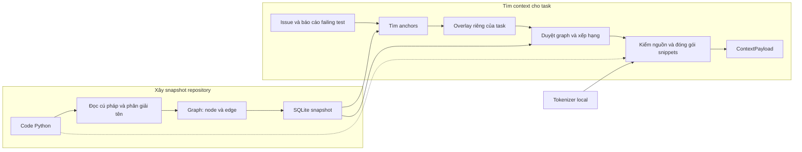

# M1 Graph & Retrieval — handoff W5–W6

Ngày cập nhật: **10/10/2026**. Phạm vi: **M1 W5–W6, không dùng Jedi**.

**Graph builder, task grounding, retrieval và API MCP đã có kiểm chứng trong
phạm vi kiểm thử hiện tại. Đã có đánh giá Graph–BM25 trên development tasks;
chất lượng Graph còn thấp hơn BM25 và ba task SymPy còn timeout.** Có thể bàn
giao bản phát triển M1 để review; chưa có cơ sở xác nhận toàn bộ W5–W6 của nhóm
hoặc một bản phát hành ổn định.

| Mục | Trạng thái tại thời điểm handoff |
|---|---|
| Working tree | `D:/KLTN/VGAR-M1` |
| Branch | `feat/p0-agent-orchestration-clean` |
| Base commit lúc clone | `86d2e68cf4c25bb44bf2916fa73c226781b9d3d3` |
| Git | Thay đổi còn trong working tree; chưa commit/push trong đợt M1 này |
| Môi trường đã kiểm tra | Windows, Python 3.11.9, `.venv-m1` |
| Resolver | Tree-sitter + Python `ast`/`symtable`; không cài Jedi trong môi trường M1 |
| Model | Chỉ dùng tokenizer local để đếm token; môi trường M1 không cài Torch, không chạy model |

## 1. Luồng xử lý đang có

Có hai công đoạn: xây graph từ code, rồi dùng graph để tìm context cho một task.



| Khái niệm | Cách hiểu |
|---|---|
| **Node** | Một đối tượng trong code, như file, class, function, method hoặc test |
| **Edge** | Quan hệ giữa các node, như chứa, import, kế thừa hoặc gọi hàm |
| **Symbol** | Tên trong code được tra cứu để xác định đang trỏ tới node nào; không phải một loại node riêng |
| **Anchor** | Điểm bắt đầu tìm kiếm, suy ra từ issue hoặc báo cáo test |
| **Overlay** | Node `Issue` và các liên kết của riêng task; không ghi vào graph repository |
| **Context** | Các đoạn code được chọn, kèm đường dẫn, vị trí, điểm xếp hạng và số token |

Ví dụ đã kiểm tra trên fixture: issue đề cập `src/web/routes.py`, kèm selector
`tests/test_auth.py::test_login`. Finder tìm được file và test; retrieval trả
ba snippets của test, `auth.service.login` và file routes, tổng **63 token**.
Chuỗi `POST /login` trong cùng issue không khớp route vì fixture không có
decorator route. Kết quả này kiểm tra luồng API, chưa chứng minh sửa được lỗi.

## 2. Tiến độ so với W5–W6

Đối chiếu mục Tuần 5–6 trong `project_plan_16_weeks.md` của hồ sơ `docs/main`
ngoài repository. Trạng thái dưới đây áp dụng cho phần đã kiểm tra trong
working tree này, không thay cho xác nhận của các thành viên khác.

| Yêu cầu | Trạng thái | Phạm vi thực tế |
|---|---|---|
| `find_task_anchors` | Đã triển khai và kiểm thử | Path/line, symbol, traceback, pytest selector và một số route literal; giữ dấu vết mơ hồ/no-match |
| Issue/failing-test liên kết với graph | Đã có, khác cách biểu diễn trong plan | Tạo `Issue`, `MENTIONS`, `REPRODUCES`; dùng node `Test` hiện có, không tạo loại node `FailingTest` riêng |
| `get_related_context` | Đã triển khai và kiểm thử | Trả snippets từ một snapshot được chỉ định, trong ngân sách token |
| Duyệt neighbors/callers/callees/tests/dependents | Đã có ở mức graph hiện tại | Mặc định 2 semantic hops, tối đa 100 candidates; chưa có component/architecture dependencies |
| Xếp hạng candidates | Đã có | Dùng khoảng cách, confidence, mức khớp issue, test proximity và public API proxy; history là đầu vào tùy chọn |
| Đóng gói snippets | Đã kiểm thử | Kiểm source/hash/range; đếm bằng tokenizer local, tổng token không vượt budget |
| MCP và LangChain: issue → anchors → context | Đã smoke test trên fixture | Hai tool W5–W6 hoạt động qua MCP; chưa xác nhận consumer repair/model trên benchmark |
| Graph–BM25 trên 20–30 task | Đã có đánh giá sơ bộ | Manifest 25 task; bảng chính dùng 21 task thành công chung |
| Manual-inspect ít nhất 10 task | Đã có hồ sơ kiểm tra | 2 hữu ích, 4 hữu ích một phần, 4 ít phù hợp; chưa phải nghiệm thu độc lập của nhóm |
| Subset 50–100 task có environment chạy được; Related Work | Chưa xác nhận trong handoff này | Thuộc deliverables M3; bộ 25 task hiện tại chỉ dùng cho retrieval evaluation |

Theo proposal, tầng symbol enrichment đề xuất SCIP hoặc LSP-backed resolver.
Phiên bản này dùng resolver tĩnh Python tối thiểu theo hướng không dùng Jedi;
**chưa triển khai SCIP/LSP và chưa thay thế đầy đủ tầng enrichment của proposal**.
Tương tự, sáu đặc trưng ranking đã có khung triển khai, nhưng không tự sinh dữ
liệu history hoặc architecture khi nguồn đó chưa được cung cấp.

Vị trí công việc hiện tại là bàn giao triển khai và đánh giá sơ bộ M1 W5–W6.
Handoff này không đánh dấu các giai đoạn W7 trở đi hoặc 29 task của kế hoạch
P0–P5 là hoàn tất.

## 3. Các bộ phận cần nhận bàn giao

| Phần | File chính | Hàm/điểm cần đọc |
|---|---|---|
| Xây graph | [builder.py](../src/vgar/graph/builder.py) | `build`, `_extract_file`, `_extract_class`, `_extract_function` |
| Nối edge | [builder.py](../src/vgar/graph/builder.py) | `_link_imports`, `_link_inheritance`, `_resolve_calls`, `_add_edge` |
| Phân giải symbol | [builder.py](../src/vgar/graph/builder.py) | `_index_scopes`, `_resolve_lexical_binding`, `_resolve_typed_receiver`, `_resolve_symbol` |
| Lưu và query | [sqlite_store.py](../src/vgar/graph/sqlite_store.py), [sqlite_service.py](../src/vgar/graph/sqlite_service.py) | Ingest, tìm symbol, callers/callees, node/subgraph và task APIs |
| Grounding/overlay | [grounding.py](../src/vgar/graph/grounding.py), [task_overlay.py](../src/vgar/graph/task_overlay.py) | `find_task_anchors`, `TaskOverlayBuilder.build` |
| Retrieval | [retrieval.py](../src/vgar/graph/retrieval.py) | `retrieve`, `_index_relations`, `_walk`, kiểm snapshot và đóng gói |
| Đếm token | [token_counter.py](../src/vgar/graph/token_counter.py) | `LocalTokenizerCounter` |
| MCP | [graph_server.py](../src/vgar/mcp/servers/graph_server.py), [registry.py](../src/vgar/mcp/registry.py) | Hai tool W5–W6 và kiểm danh sách tool cần có |
| Evaluation | [run_graph_retrieval.py](../scripts/run_graph_retrieval.py), [compare.py](../src/vgar/evaluation/retrieval/compare.py) | Worker có timeout, Graph/BM25 comparison và kiểm điều kiện so sánh |

Các sửa lỗi có regression tests gồm định nghĩa/property accessor trùng ID,
scope và shadowing, rollback khi một file extraction thất bại, edge kế thừa
trùng/tự nối, và range/hash của File/Module có khoảng trắng đầu file.

Grounding đã bổ sung xử lý đề cập trong văn xuôi, member-call và source link.
Retrieval có quan hệ file → declarations được gộp khi duyệt. Các kết quả khớp
tên mơ hồ vẫn là candidates; chúng không tự trở thành edge `CALLS` đã resolve.

## 4. API và ranh giới bàn giao

| MCP tool | Đầu vào chính | Dữ liệu trong `data` của response |
|---|---|---|
| `graph_find_task_anchors` | `issue_text`, `graph_version`, `task_id`, `failing_tests` tùy chọn | Anchors, evidence/ambiguity, `overlay_id`, trace nodes/edges |
| `graph_get_related_context` | `anchor_ids`, `budget_tokens`, `graph_version`, `task_id`; issue/test inputs | `context`, `overlay_id`, counter label và diagnostics |

Consumer giữ cùng `graph_version`, `task_id`, issue và failing-test inputs ở
cả hai bước. `overlay_id` nhận dạng task view; `graph_version` nhận dạng snapshot
repository. Source thay đổi thì rebuild graph trước khi retrieve. SQLite
snapshot cũ không có source ranges cũng cần rebuild để dùng context retrieval.

`ContextPayload` vẫn dùng model chung trong
[contracts/context.py](../src/vgar/contracts/context.py): `graph_version`,
`anchor_ids`, `items`, `total_token_count`, `token_budget`, `truncated`. Mỗi item
có snippet/path/symbol/range, score, confidence, rationale và token count.
Graph node public vẫn qua wrapper `repo` trong
[contracts/graph.py](../src/vgar/contracts/graph.py). Các shared contract files
không có diff so với base commit của working tree này.

Budget mặc định của các lượt đánh giá là **8000 token cho snippet text**.
Issue, instructions, metadata, chat template và response reserve cần được
consumer phân bổ riêng. `get_callers`/`get_callees` trả quan hệ gọi trực tiếp;
duyệt nhiều hop để lấy context nằm trong retrieval.

M1 tạo graph/context; M2 nhận context để repair/verification; M3 quản lý MCP,
model/prompt và orchestration. Smoke test hiện tại dừng ở context, không gọi
model hay áp dụng patch. `REPRODUCES` ghi nhận báo cáo failing test được cung
cấp, không xác nhận rằng test đã được chạy tái hiện lỗi.

## 5. Bằng chứng kiểm tra và đánh giá

### Kiểm thử chức năng

| Kiểm tra | Kết quả | Giới hạn |
|---|---|---|
| Regression đã lưu ngày 09/10 | 168 passed | Bộ M1, retrieval evaluation và graph resource tests; không phải full suite toàn dự án |
| Chạy lại ngày 10/10 | 165 passed, 16,38 giây | M1 và các test evaluation được chọn; không gồm ba graph resource tests của bộ trên; kết quả ghi nhận qua console |
| MCP smoke sau sửa range | PASS; 3 snippets, 63 token; overlay khớp | Fixture local, không gọi LLM; chạy ngoài sandbox sau khi môi trường Windows chặn khởi tạo asyncio socketpair |
| Đối chiếu source tại thời điểm viết | 119 file code/cấu hình khớp fingerprint cuối | Xác nhận code hiện tại khớp bằng chứng; không phải một lượt benchmark mới |

Những lượt kiểm thử trên có phần trùng nhau, không cộng số lượng để báo coverage.

### Số task benchmark đã chạy

```text
25 task được chọn
├── BM25: 25/25 thành công
└── Graph, lượt xác nhận chính
    ├── 21 thành công → bảng so sánh chung 21 task
    └── 4 thất bại
        ├── 1 Django lỗi range/hash → đã sửa, chạy lại riêng thành công
        └── 3 SymPy vượt timeout 300 giây → chưa xử lý
```

Có **22/25 task khác nhau có kết quả Graph hợp lệ**, tính cả lượt phục hồi
Django. Bảng chính vẫn dùng **21 task**; chưa có một lượt chạy đầy đủ 25 task
sau sửa range. Ba task còn timeout là `sympy__sympy-16597`,
`sympy__sympy-17318`, `sympy__sympy-20438`.

### Graph so với BM25

Trung bình trên **21 task thành công chung**, cùng query, corpus, base commit,
tokenizer, budget và scoring/snippet policy. Graph chính chỉ dùng issue; nhánh
`graph_f2p` có thông tin FAIL_TO_PASS là chẩn đoán oracle. BM25 chính dùng full
ranking; bản capped là đối chiếu phụ.

| Metric | BM25 | Graph |
|---|---:|---:|
| File Recall@3 | 34,13% | 25,79% |
| File Recall@5 | 53,97% | 32,14% |
| File Recall@10 | 61,90% | 45,24% |
| Function Recall@3 | 19,44% | 15,67% |
| Function Recall@5 | 27,18% | 16,47% |
| Function Recall@10 | 43,06% | 16,47% |
| Context tokens trung bình | 7.998 | 7.593 |

Recall@k đo tỷ lệ file/function trong nhãn chuẩn xuất hiện ở top-k; đây không
phải tỷ lệ task được sửa thành công. Graph dùng ít token hơn trong bảng này
nhưng recall thấp hơn BM25. Chưa có bằng chứng lợi ích repair từ các số liệu này.

Manual inspection giữ cùng 10 task đã chọn: **2 hữu ích, 4 hữu ích một phần,
4 ít phù hợp**. Ví dụ tốt có `Header.fromstring`/`Card.fromstring` và các API
`integrate`; một số task Pylint/Sphinx lấy nhiều symbol cùng tên nhưng thiếu
hàm liên quan. Đánh giá này dùng context của evaluator chung; packing native
MCP có policy khác. Snippet evaluator giới hạn 80 dòng nên có thể thiếu phần
cuối hàm; native M1 pack nguyên snippet nếu vừa budget.

Các repo Django, SymPy, Pylint, Astropy, Matplotlib, Sphinx và Xarray là đối
tượng benchmark, không phải dependency của core graph/retrieval.

## 6. Hạn chế và việc còn lại

| Vấn đề | Ảnh hưởng | Việc tiếp theo |
|---|---|---|
| Ba SymPy timeout | Chưa có kết quả cho toàn bộ manifest | Tách profiling build/grounding/retrieval trước khi chọn cách cải thiện; chưa xác định nguyên nhân chỉ từ timeout |
| Recall thấp hơn BM25 | Context thường thiếu file/function cần thiết | Review cases thiếu anchors hoặc bị xếp hạng thấp; giữ cùng dev protocol khi đo lại |
| Resolver tĩnh còn giới hạn | Dynamic dispatch, rebinding, decorator, inheritance phức tạp có thể unresolved hoặc cần kiểm tra thêm | Ghi giới hạn rõ; việc bổ sung SCIP/LSP hoặc analyzer khác cần phạm vi riêng |
| Task graph chưa đủ vocabulary của proposal | Không có node `FailingTest` riêng, component dependencies hoặc nguồn history tự động | Review biểu diễn với M2/M3; không tự thêm schema chỉ để khớp tên trong proposal |
| Consumer repair/model chưa được xác nhận | API trả context chưa chứng minh pipeline sửa lỗi | M2/M3 review contract và kiểm luồng nhận context trong công việc tiếp theo |
| Đóng gói chưa hoàn tất | Working tree còn modified/untracked files; file sinh tự động cũ vẫn được Git theo dõi | Review gói commit và cleanup tracking theo quyết định của nhóm |

Đợt M1 này chưa xác nhận held-out evaluation, repair success, impact analysis,
incremental update hoặc hoàn tất kế hoạch P0–P5. Các module agent/repair có sẵn
trong branch không được tính là deliverable mới đã nghiệm thu ở đây.

## 7. Cách người nhận kiểm tra lại

Các lệnh dưới đây là hướng dẫn, không được thực thi lại trong lần viết handoff.
Chạy từ thư mục gốc repository; không cần cài model stack cho phần M1.

### Môi trường và tests

```powershell
py -3.11 -m venv .venv-m1
.\.venv-m1\Scripts\Activate.ps1
python -m pip install -r scripts\requirements_m1.txt
$env:PYTHONPATH = (Resolve-Path .\src).Path
python scripts\run_m1_tests.py
```

Để chạy lại bộ 165 test đã ghi nhận, dùng runner trên cùng năm file evaluation:

```powershell
python scripts\run_m1_tests.py `
  tests/m2/test_graph_arm.py tests/m2/test_retrieval_eval_graph.py `
  tests/m2/test_retrieval_scoring.py tests/m2/test_retrieval_evaluation.py `
  tests/m2/test_dataset_split.py
```

### Tokenizer và MCP smoke

Provision một lần khi có mạng; chỉ tải tokenizer assets tại revision cố định:

```powershell
python scripts\provision_m1_tokenizer.py `
  --model-id Qwen/Qwen3-4B-Instruct-2507 `
  --revision cdbee75f17c01a7cc42f958dc650907174af0554 `
  --assets-root artifacts/m1/tokenizers `
  --manifest artifacts/m1/w5-w6/tokenizer_manifest.json

python scripts\smoke_w5_w6_retrieval.py `
  --tokenizer-manifest artifacts/m1/w5-w6/tokenizer_manifest.json `
  --database artifacts/m1/w5-w6/handoff-smoke.db `
  --failing-test tests/test_auth.py::test_login `
  --budget-tokens 8000
```

Nếu tạo MCP client riêng với SQLite backend, cần đặt `VGAR_REPOSITORY_ROOT` và
`VGAR_TOKENIZER_MANIFEST` cùng database/snapshot. Dùng `--help` của các script
để xem tham số; không dùng cờ Jedi trong lệnh build hiện tại.

Để tái lập benchmark cần chuyển/provision thêm dataset manifest, gold patches
và repository snapshots. Các đầu mối là [prepare_manifest.py](../scripts/prepare_manifest.py),
[run_bm25_retrieval.py](../scripts/run_bm25_retrieval.py),
[run_graph_retrieval.py](../scripts/run_graph_retrieval.py) và
[compare_graph_vs_bm25.py](../scripts/compare_graph_vs_bm25.py).
Ghim đúng dataset revision bên dưới; dùng cùng manifest/tokenizer/budget giữa
các nhánh. Graph runner mặc định có timeout 300 giây/task; full graph JSON cache
là tùy chọn. `--no-report` ở BM25/comparison chỉ giữ output JSON.

## 8. Hồ sơ bằng chứng và gói GitHub

| Bằng chứng | Định danh/đường dẫn local |
|---|---|
| Tổng hợp checkpoint | `artifacts/m1/w5-w6/function-retrieval/evidence.json` |
| Regression 168 test | `artifacts/m1/w5-w6/function-retrieval/range-regression.log` |
| MCP smoke | `artifacts/m1/w5-w6/function-retrieval/smoke-range-fixed.json` |
| Manual inspection | `artifacts/m1/w5-w6/function-retrieval/manual-inspection.json` |
| BM25 25 task | `results/retrieval/20261009T140420317354Z-26094fa9b21b/result.json` |
| Graph xác nhận 25 task, 21 thành công | `results/retrieval/20261009T162430857938Z-5d43f9a6a4cb/result.json` |
| So sánh chung 21 task | `results/retrieval/20261009T170439405653Z-3be752561faf/result.json` |
| Phục hồi Django | `results/retrieval/20261009T170616306614Z-8fd9bbe19977/result.json` |

Dataset: `princeton-nlp/SWE-bench_Verified`, revision
`c104f840cc67f8b6eec6f759ebc8b2693d585d4a`, split `dev` trong manifest nội bộ
`data/manifests/verified-c104f840cc67-dev-25.json`. SHA256 manifest:
`9ce4e3bdc805d140d13af00253970b3c38c919f7424e363efb27c4dd9891f754`.
Đây là subset development dùng cho retrieval, chưa chứng minh environment repair
của 50–100 task đã sẵn sàng.

Raw evidence, data, kết quả chạy mới và tokenizer assets được Git-ignore.
Các đường dẫn local trên không có sẵn chỉ bằng việc clone GitHub; cần chuyển
riêng hoặc chạy lại. Tài liệu này giữ các số liệu và định danh chính để người
nhận phân biệt các lượt chạy mà không gộp kết quả phục hồi vào bảng chính.

Gói commit nên gồm source, tests, fixtures, scripts, requirements và docs liên
quan, kể cả việc xóa resolver/fixture Jedi cũ. Giữ `artifacts/sample_graph.db`
và `sample_graph.json` vì test đang dùng fixture này. `.gitignore` đã thêm quy
tắc cho metadata/cache/output; chưa bỏ tracking các file cũ. Đặc biệt, `results`
cũ vẫn có 205 file được Git theo dõi, khoảng 1,43 GiB trong working tree, cùng
metadata `*.egg-info` và log cũ; cần quyết định cleanup riêng trước khi đóng gói.

## 9. Tài liệu đối chiếu

| Tài liệu | Vai trò khi đọc handoff |
|---|---|
| [README](../README.md) | Cài đặt và cách chạy hiện tại |
| [Graph schema](graph_schema.md) | Node/edge, IDs, resolver và storage/query boundary hiện tại |
| [Context contract](context_payload_contract.md) | Shape payload và nguyên tắc token budget; hồ sơ baseline 03/10 |
| [Retrieval design](retrieval_design.md), [retrieval method](m1_retrieval_method.md) | Thiết kế/checkpoint 03/10; mô tả profile v1 và đường dẫn lịch sử |
| [Handoff 03/10](m1_handoff_2026-10-03.md) | Hồ sơ trước benchmark/API hiện tại; không dùng làm trạng thái mới nhất |
| [Evaluation spec 05/10](specs/2026-10-05-evaluation-pipeline.md) | Yêu cầu đánh giá và cách so sánh; trạng thái blocked trong spec là lịch sử |
| [M3 boundary](m3_system_boundary.md) | Phân chia trách nhiệm graph, repair và orchestration |

Các tài liệu `project_plan_16_weeks.md`, `proposal_vgar_mcp_final_corrected.md`
và kế hoạch P0–P5 ngày 08/10 trong hồ sơ `D:/KLTN/docs/main` là nguồn đối chiếu
phạm vi ngoài repository. Các mục tiêu tương lai trong những tài liệu này
không được ghi thành kết quả đã đạt của checkpoint hiện tại.
