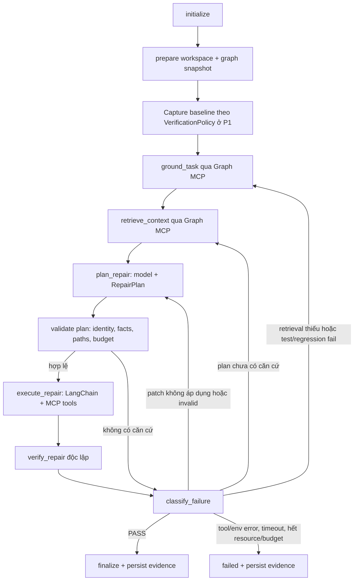

# VGAR P0–P5 — Implementation Plan / Kế hoạch triển khai

> **For agentic workers:** REQUIRED SUB-SKILL: Use `superpowers:executing-plans` để triển khai từng task theo phương thức Native sau khi người dùng xác nhận. Chỉ dùng `superpowers:subagent-driven-development` khi người dùng chọn cách triển khai đó. Các bước dùng checkbox `- [ ]`; không tick thay cho một gate chưa có evidence.

**Goal:** Hoàn thiện chu trình graph grounding → context → kế hoạch có căn cứ → sửa code trong workspace → kiểm chứng độc lập → phân loại lỗi → lập lại kế hoạch, rồi nghiệm thu và đánh giá theo toàn bộ master specs P0–P5.

**Architecture:** Giữ package `src/vgar`, LangGraph outer workflow, LangChain inner agent, ba MCP server và SQLite. Tái sử dụng graph/retrieval/model/pytest hiện có; bổ sung contract, node và guard còn thiếu theo từng phần, không thay cả repo bằng phiên bản cũ. Tách kết quả orchestration, real repair, retrieval benchmark, reliability và nghiên cứu thành các gate độc lập.

**Tech Stack:** Python theo `pyproject.toml` hiện tại (`>=3.11,<3.14`), Pydantic, Tree-sitter Python, resolver hiện có/Jedi, SQLite, MCP Python SDK, `langchain-mcp-adapters`, LangGraph, LangChain, Transformers/Hugging Face, pytest. Không tự thêm training, model provider, vLLM hoặc backend graph mới.

**Spec:** Nguồn có quyền ưu tiên là [VGAR-MASTER-PHASE-SPECS-P0-P5.md](../../../../docs/VGAR-MASTER-PHASE-SPECS-P0-P5.md). Các nguồn bổ trợ được liệt kê ở mục 2. Bản spec bất biến sẽ được đặt vào `docs/specs/` khi bắt đầu Task T00 để plan và spec đi cùng artifact bàn giao.

## Global Constraints — Giới hạn áp dụng toàn plan

- **Trạng thái tài liệu: DRAFT_FOR_USER_APPROVAL, ngày 08/10/2026. Chưa cho phép triển khai.** Việc tạo file này không có nghĩa người dùng đã xác nhận code changes, benchmark, tải model hoặc thuê máy.
- Chỉ triển khai trong `D:\Project\CAPSTONES\VGAR_p0_agent_orchestration_clean`. Không sửa `VGAR`, `VGAR-main`, `vgar_mcp_mvp`, `M2_week_5_6`, tài liệu gốc hoặc các repo khác.
- Không rollback/ghi đè thay đổi chưa commit. Mỗi phiên đọc `git status`, `git diff`, checkpoint của task đang làm; không lặp toàn bộ audit hoặc task đã có evidence hợp lệ.
- Không commit, push, merge, đổi nhánh hoặc xóa artifact nếu chưa được người dùng yêu cầu. Native execution là đề xuất để hạn chế chi phí context, không phải quyền tự tạo subagent.
- Graph MCP là boundary lấy facts; Repository MCP là boundary sửa code; Execution MCP là boundary thực thi tests. Không đi vòng boundary bằng cách cho LLM chạy shell tùy ý.
- Context và kế hoạch phải có nguồn chứng minh; kiểm chứng không tin lời agent nói rằng đã sửa xong. Không hứa proof ngữ nghĩa tuyệt đối hoặc kết quả luôn tốt hơn baseline.
- Mọi giới hạn context, tool calls, replan, output, stage time, wall time và RSS phải độc lập, có giá trị đo/ghi cụ thể và dừng được. Không có retry ngầm hoặc tăng budget sau khi thấy kết quả final.
- Giữ `ContextPayload` hiện có và quy ước không thêm public `schema_version`. `graph_version` là ID snapshot, không phải version schema. Thay contract liên module cần owner review.
- Không sửa population, gold labels, manifest hash hoặc raw results để làm đẹp thí nghiệm. Không truyền gold patch/hints vào context agent trong primary evaluation.
- `PASS`, `FAIL`, `ERROR`, `NOT_RUN`, `PARTIAL`, `TIMEOUT`, `RESOURCE_EXCEEDED` phải được phân biệt. Transport envelope hiện có vẫn dùng bốn status; timeout/resource dùng reason code và task-level outcome, không tự phá schema transport.
- Một phương pháp chạy thực tế fail quá 2 lần: dừng phương pháp đó, ghi evidence/hypothesis/phương pháp thất bại vào báo cáo và chuyển task độc lập. Expected RED của TDD không tính là retry benchmark bị lỗi. Không chạy lần thứ ba cùng phương pháp để hy vọng tự hết lỗi.
- Chỉ công bố phase GREEN khi các acceptance của phase có evidence mới trên bản clone này. `23/25`, `365 passed` trong checkpoint cũ không xác nhận baseline hiện tại.

## Review Focus — Năm điều kiện rủi ro phải có test

1. MCP client mở session mới, hai issue có cùng anchor IDs hoặc graph thay đổi sau patch: không trộn task/snapshot; test tại T04, T05, T09.
2. Model trả JSON hợp lệ nhưng chỉ tới file/symbol không tồn tại, tự mở rộng phạm vi hoặc code chứa prompt injection: không được sửa theo plan đó; test tại T07, T08, T13.
3. Tests không được collect, bị SKIP, timeout, subprocess còn sống hoặc agent không tạo patch: không báo PASS; test tại T02, T09, T12, T23.
4. Hai run khác population/gold/tokenizer/corpus, run thiếu task hoặc chỉ so 23 task tốt: từ chối pair sai và ghi PARTIAL/mẫu số; test tại T15–T19.
5. Windows partial-directory rename, cold-start vượt deadline, SQLite journal/read lặp và hết RSS: lưu stage cuối, dừng bounded, không dùng warm run làm bằng chứng cold; test tại T20–T24.

---

## 1. Baseline thực tế và điều plan này không giả định

### 1.1. Repo được đọc

| Nội dung | Trạng thái quan sát ngày 08/10/2026 |
|---|---|
| Repo | `D:\Project\CAPSTONES\VGAR_p0_agent_orchestration_clean` |
| Branch | `feat/p0-agent-orchestration-clean` |
| HEAD | `d3fdfbe6b1e556013481e7b3692726c7b5589345` |
| Remote | `https://github.com/GauKho/VGAR.git` |
| Git trước khi viết plan | Working tree sạch; không có diff staged/unstaged |
| Clone | Shallow clone; không dựa vào commit message để kết luận P0 đã triển khai |
| Environment riêng của clone | Chưa thấy `.venv/Scripts/python.exe`; `uv.lock` là file rỗng, không phải dependency lock có thể dùng |
| Kiểm thử trong lượt lập plan | **Chưa chạy pytest, model, benchmark hoặc Docker.** Đây là kiểm tra code/tài liệu read-only, không phải báo cáo test PASS |

`PROGRESS.md` hiện tại mô tả tiến độ từ đợt sửa repo `VGAR` cũ, còn nhắc week 3–6, 365 tests, task_handle và 23 paired tasks. Các implementation tương ứng không đầy đủ trong clone. T00 phải lưu lịch sử này rồi tạo checkpoint đúng baseline mới; không sửa lịch sử thành kết quả mới.

### 1.2. Những gì có thể tái sử dụng và những khoảng thiếu đã thấy

| ID | Quan sát code / evidence tĩnh | Ý nghĩa với plan |
|---|---|---|
| B01 | `src/vgar/agents/workflow.py:42` khai báo initialize/prepare/repair/verify; `routes.py:11` retry về repair theo số attempts | Chưa có đầy đủ grounding, retrieval, planning, classifier và evidence-driven routing P0; xử lý T03–T10 |
| B02 | `src/vgar/agents/state.py` có `anchors`, `context`, `repair_plan`, nhưng `nodes/repair.py:16` prompt đầu chỉ có issue/workspace/selectors | Field tồn tại không chứng minh đang được dùng; phải nối dataflow thật |
| B03 | `mcp/servers/graph_server.py` chỉ có ba query tools search/callers/callees; `graph/port.py` và `sqlite_service.py` chưa có retrieval methods | Graph retrieval nội bộ có, nhưng chưa thành MCP grounding/context boundary; T04–T06 |
| B04 | `repository_server.py:15` và `execution_server.py:14` nhận root bất kỳ nếu tồn tại | Relative-path check không đủ để cấp quyền root; phải giới hạn vào workspace lease, T01 |
| B05 | `execution_server.py:35` dùng một runner subprocess riêng; `repair/test_runner.py:108` đã có runner nhiều selectors/JUnit/process-tree | Hai đường verification có thể khác timeout, output và error semantics; hợp nhất backend ở T02 |
| B06 | `nodes/verify.py:24` dùng fingerprint khác baseline + pytest PASS; `typecheck/lint/api/structural` đều NOT_RUN | Chưa đủ VerificationPolicy, patch artifact và metrics P1; T12–T14 |
| B07 | `core.py:57` tool limit áp dụng theo một `ainvoke`; `runtime.py:27` mặc định `use_jedi=True` | Thiếu global budget xuyên vòng lặp; no-Jedi benchmark không được tự thay app default; T10, T15, T23 |
| B08 | `evaluation/retrieval/compare.py:32` đọc per-task `arm`; graph runner tạo per-task `arms` ở `scripts/run_graph_retrieval.py:163` | Producer/consumer không khớp; T16 cần reproducer trước sửa |
| B09 | `compare.py` dùng capped BM25 làm primary, trong khi `scoring.py:3` định nghĩa full rank là primary | Master yêu cầu full ranking primary và capped sensitivity; sửa derived report ở T17, giữ raw rank cũ |
| B10 | `graph/retrieval.py:71` và `task_overlay.py:30` deepcopy graph; `_verify_snapshot():298` đọc toàn bộ sources | Có điểm cần đo về CPU/RSS/read lặp; không kết luận đây là nguyên nhân duy nhất, T21–T22 |
| B11 | `SQLiteGraphStore.ingest()` lưu source line/column nhưng chưa lưu đầy đủ byte range của node | Cần round-trip snapshot đủ metadata cho retriever; không dựng byte offsets giả, T04 |
| B12 | `models/factory.py` chỉ hỗ trợ HF; `hf_model.py` chưa pin revision khi load; model mặc định là `Qwen/Qwen3-4B-Instruct-2507` | Reuse backend, thêm revision/telemetry/preflight; không mặc định có hai model hoặc fine-tune, T11 |
| B13 | `scripts/run_agent.py` rỗng; CLI thật ở `src/vgar/cli.py` có `solve`; `docs/agent_state.md` chỉ ba dòng | Chọn CLI thật để hoàn thiện, không phát triển entry point thứ hai không cần thiết, T13/T25 |
| B14 | `tests/unit/test_workflow.py:1` dùng scripted fake agent; một số smoke script đi thẳng inner agent | Unit/scripted smoke không được báo thành real-model P0/P1 E2E; T10/T14 |

Đây là danh sách phục vụ lập plan, không thay một runtime audit đã tái hiện mọi bug. Các lỗi suy luận từ producer/consumer phải có RED test khi triển khai.

## 2. Tài liệu đầu vào, ưu tiên và quyết định xử lý xung đột

Thứ tự: **master specs P0–P5 → code thực tế để chọn cách triển khai → proposal gốc để giữ mục tiêu khoa học → New_task để tham khảo giao diện/lịch cũ**. Code cũ không được dùng để hạ yêu cầu bắt buộc của master.

| Nguồn | Vai trò trong plan |
|---|---|
| `docs/VGAR-MASTER-PHASE-SPECS-P0-P5.md` ngoài repo clone | Scope, phase, routing, metrics, acceptance và cross-phase invariants bắt buộc |
| `docs/proposal_vgar_mcp_final_corrected.md`, mục 4, 5, 8–13, 16, 18 | Graph infrastructure, task trace, MCP, verification là evidence, baseline-preserving rules và giới hạn claim |
| `New_task/project_plan_16_weeks.md` | Ownership M1/M2/M3, các deliverable graph/repair/evaluation và thí nghiệm cũ |
| `New_task/VGAR_MCP_Contract_Freeze_Plan_No_Schema_Versioning.md` | Stable shared contracts, status, evidence, owner review; ví dụ không được mặc định là implementation |
| `New_task/research_design.md` | Query policy, symmetry F2P, probe/harness và validity threats; các lựa chọn khác master chỉ là tham khảo |
| `New_task/2026-09-30-m2-repair-verification-w3-w4-implementation-plan.md` | Lịch sử workspace/pytest/evidence; không làm lại M2 baseline từ đầu |

`SPEC-P0-AGENT-ORCHESTRATION.md` được master nhắc nhưng chưa thấy trong các vị trí đã kiểm tra. Không bịa nội dung file đó. Plan này xác định giao diện P0 dựa trực tiếp trên master; T00 ghi rõ sự thiếu và xin leader đối chiếu nếu có bản companion mới trước khi freeze contract.

### 2.1. Quyết định đề xuất, cần người dùng/owner chấp thuận qua plan

| Điểm khác nhau | Quyết định triển khai đề xuất |
|---|---|
| `research_design.md` chốt Qwen2.5-Coder-32B/vLLM; code/master nói reuse model layer | Giữ HF/Qwen3-4B hiện có làm điểm bắt đầu. Một model có thể được gọi hai vai trò planner/executor; không bắt buộc hai bộ weights. Model khác/32B là experiment profile mới chỉ sau qualification và duyệt tài nguyên |
| Tài liệu research cấm native Windows; P3 master yêu cầu tìm lỗi Windows | Unit/fixture/native diagnostics vẫn chạy Windows; nghiên cứu SWE-bench repair phải có harness/isolation gate riêng. Đổi sang Linux không chứng minh đã sửa lỗi Windows |
| Research ghi Dev-100; master P2 yêu cầu frozen25 | P2 giữ đúng 25 tasks cố định. Không tự mở 100 tasks. P5 có manifest riêng, không sửa population P2 |
| Graph_F2P có thêm nhãn benchmark | Primary chỉ issue text. Chỉ đưa F2P vào secondary arm đối xứng `bm25_f2p`/`graph_f2p`; không so một arm có oracle với một arm không có |
| Research đề xuất P2P ≥98% và giảm latency >80% | Không coi đây là tiêu chuẩn official resolved hoặc kết quả đã đạt. Official grading theo harness đã pin; mức cải thiện là giả thuyết cần đo |
| Proposal liệt kê full Arch-CPG/GraphDiff/deep analyzers | Không tự nhét toàn bộ vào P0–P5. Các checks có cấu hình được triển khai đúng master; full GraphDiff history cleaning, Joern/Daikon, GNN, đa ngôn ngữ và fine-tune không nằm trên critical path |
| A0–A5 trong proposal, lịch 16 tuần và research có định nghĩa khác nhau | Không dùng chung ID mơ hồ. P5 dùng `P5_A_TRADITIONAL`, `P5_B_VGAR`, `P5_C_NO_GRAPH`, v.v.; manifest lưu mapping, không gọi P5_B là full A5 của proposal |

### 2.2. Khóa tài liệu nguồn

T00 ghi các SHA256 sau vào input manifest; nếu tài liệu thay đổi phải có delta review, không âm thầm dùng plan cũ:

```text
master:   1f9208a613bea4fe00eda634a03ee8318ce2d44f836659fcce3f6a72cd40852d
proposal: e3f9239199faca043417f61080633e3a29dc58240f9fd06ab0c4f80ab5cbd143
16weeks:  e349be0599fb2082b2ae4caa52241332a1c8b776ffe54b2c85fdf535e7c1ea53
contract: bc9ac48b5a963be7e1e22d22456bc0efa28c774a9a4d9997c3c4a4469ba81f21
research: 02141b5761c92c3fb7ca9f0dd96844fe826bb5b6690cb90da8c74e728a63834b
```

## 3. Kiến trúc đích và flow có thể kiểm thử



`validate_plan` là kiểm tra bắt buộc ở boundary trước executor, không phải đổi mục tiêu workflow. `PLANNING_UNGROUNDED` có thể route về RETRIEVE hoặc PLAN theo bằng chứng lỗi: thiếu source/context về RETRIEVE; format/constraint bị reject nhưng evidence đủ về PLAN, đều tính budget.

### 3.1. Identity và source snapshot

- Mỗi run có `run_id`, `task_id`, `workspace_id`, base revision và source hash.
- Grounding trả `task_handle` opaque do server tạo, gắn issue hash + task + graph_version + workspace/source snapshot. Không dùng anchor IDs để đoán lại issue.
- Registry tồn tại trong SQLite riêng của run; server restart/session mới vẫn tra được handle. Handle không phải token cấp quyền đọc root tùy ý.
- Context trả `ContextPayload` giữ shape cũ, đi kèm identity/evidence ở envelope hoặc state, không nhét thêm field vào model `extra='forbid'`.
- Sau patch, graph cũ không được dùng như snapshot của code mới. Replan sau test fail tạo snapshot mới của workspace và handle mới; initial source vẫn bất biến. MVP cho phép bounded full rebuild, chưa claim incremental equivalence.
- Mọi terminal path, kể cả FAIL/timeout, phải kiểm source gốc không đổi và đóng process/SQLite/workspace đúng ownership.

### 3.2. Contracts cần bổ sung — đề xuất khóa ở T03

| Contract | Fields tối thiểu và kiểm tra bắt buộc |
|---|---|
| `EvidenceRef` | `evidence_id`, `kind`, `artifact_ref`, `content_hash`, `task_id`, `graph_version`, `workspace_id`; path artifact tương đối dưới run, không link ngoài allowlist |
| `GroundingResult` | Identity trên + `task_handle`, `issue_hash`, anchors với node/path/score/evidence, ambiguities, unresolved_mentions; confidence không phải proof |
| `RepairPlan` | `plan_id`, identity, `task_handle`, `context_hash`, `facts`, `planned_files`, `steps`, `verification_targets`, `evidence_refs`; facts chỉ được phát biểu trong giới hạn evidence |
| `PlanStep` | `step_id`, action thuộc `READ_CODE/EDIT_CODE/RUN_TESTS`, path hoặc selectors, `fact_ids`, `expected_result`; không có `SHELL` hoặc command tự do |
| `PlanValidation` | `valid`, typed errors, unsupported facts, missing files/symbols, allowed scope; valid=false chặn executor |
| `ExecutionResult` | plan_id, executed step IDs, applied edits, raw diff hash/path, `planned_files`, `actual_modified_files`, `unexpected_modified_files`, tool evidence, exit/failure; no-op không phải patch thành công |
| `FailureClassification` | class, reason code, evidence refs, retryable, route; classifier deterministic, không giao cho LLM tự quyết định PASS |
| `VerificationPolicy` | Đúng tên master: `compileall`, `relevant_pytest`, `full_pytest`, `structural_checks`, `api_checks`; boolean true nghĩa check bắt buộc, lưu nguyên policy trong run |
| `BaselineEvidence` | Selectors cố định, `TestRunResult` trước patch, case outcomes, public API/structural snapshot, source/workspace hash và evidence refs; baseline assertion FAIL có thể là tình trạng bug dự kiến, baseline environment ERROR không được coi là bug |
| `ResourceBudget` | `max_wall_time`, `max_stage_time`, `max_rss`, `max_tool_calls`, `max_replans`, `max_context_tokens`, `max_output_bytes`; số không hợp lệ bị reject |
| `RepairTelemetry` | attempts/replans/tool_calls/retrieval_calls/plan_count; planned/actual/unexpected files; tests; outcome; token usage; stage/wall timing; resource observations |

Các class mới đặt ở `contracts/agent.py`, policy ở `contracts/verification.py`, budget ở `contracts/budget.py`. Reuse `PatchApplyResult`, `TestRunResult`, `EvidenceBundle`; mở rộng EvidenceBundle có kiểm soát thay vì tạo hệ contract song song.

`actual_modified_files`/`unexpected_modified_files` giữ đúng vocabulary master; adapter nhận `PatchApplyResult.changed_files` hiện có, không tự rename field shared cũ. Thêm `baseline_evidence` vào state ở T12, `compileall` check vào VerificationResult qua default NOT_RUN và cập nhật fixtures/consumers có owner review.

Plan validation phải phân biệt: “node tồn tại” với “fact có bằng chứng”. Ví dụ call edge confidence thấp không cho phép khẳng định mọi invocation runtime đều gọi target đó. Statement về yêu cầu nghiệp vụ có thể cite issue, nhưng không được cite issue để khẳng định symbol đã tồn tại.

### 3.3. Routing bắt buộc và precedence

| Class từ evidence | Route | Guard |
|---|---|---|
| PASS | FINALIZE | Patch thật + mọi check bắt buộc PASS + source gốc không đổi |
| RETRIEVAL_INCOMPLETE | GROUND | Còn budget; lưu anchor coverage và thiếu nguồn |
| PLANNING_UNGROUNDED | RETRIEVE/PLAN | Không áp dụng plan bị reject |
| PATCH_NOT_APPLIED / PATCH_INVALID | PLAN | Giữ diff/error evidence; không giả định model đã sửa |
| TEST_FAILED / REGRESSION | GROUND | Snapshot workspace sau patch, feedback tests và plan mới |
| TOOL_ERROR / ENVIRONMENT_ERROR / TIMEOUT | FAILED | Không retry hidden |
| RESOURCE_EXCEEDED / BUDGET_EXHAUSTED | FAILED | Record reason và stage cuối; không chuyển thành test failure |

Lỗi safety/source modified/identity mismatch là terminal. Lỗi môi trường/timeout ưu tiên hơn assertion failure nếu test run không hoàn tất. `NO_PATCH` legacy map sang `PATCH_NOT_APPLIED`. `COMPLETED/FAILED` state legacy có thể giữ qua adapter CLI, nhưng RESULT dùng outcome chuẩn; exit 0 chỉ khi required evidence PASS.

### 3.4. Metric names và mẫu số phải khóa trước experiments

T13 triển khai metrics P1; T29 triển khai metrics P5. Mỗi metric lưu `numerator`, `denominator`, `value`, unit và eligibility rule. Task có lỗi hạ tầng vẫn nằm trong attempted population; conditional means có nhãn/n riêng. `N_attempts` ở population là số task/arm trajectories đã bắt đầu; `attempts` bên trong một trajectory là số lần executor cố sửa, không trộn hai đơn vị này.

| Metric master | Định nghĩa báo cáo đề xuất |
|---|---|
| P1 `repair_success_rate`, `eventual_success_rate` | Số trajectories đạt required independent verification cuối cùng / tất cả trajectories bắt đầu; hai tên là alias được ghi rõ nếu cùng endpoint |
| P1 `first_attempt_success_rate` | Số trajectories verified sau execution attempt đầu / tất cả trajectories bắt đầu; failures trước execute không biến mất khỏi denominator |
| P1 `mean_attempts`, `mean_replans`, `mean_tool_calls` | Tổng counter / tất cả trajectories; zero khi thực sự chưa gọi, null nếu telemetry thất lạc |
| P1 `verification_pass_rate` | Số completed verification invocations PASS / mọi invocation verification đã bắt đầu; invocation không hoàn tất không PASS |
| P1/P5 `no_patch_rate` | Trajectories terminal không có applied nonempty source patch / tất cả trajectories bắt đầu; per-attempt no-patch có cột riêng |
| P1 `test_failure_rate` | Trajectories terminal vì assertion failure / tất cả trajectories; từng test invocation failure có denominator riêng |
| P1/P5 `environment_failure_rate` | Trajectories terminal vì environment / tất cả trajectories, không loại environment failures rồi gọi overall rate |
| P5 `resolved_rate`, `eventual_resolved_rate` | Official independent graded successes trong budget / tất cả trajectories; sửa theo tests fixture chỉ là `verified_fixture_rate`, không official resolved |
| P5 `first_attempt_resolved_rate` | Official grade PASS của patch attempt đầu / tất cả trajectories; cần lưu/grading attempt1 riêng, không suy từ patch cuối |
| P5 `time_to_verified_fix` | Wall time đến required PASS cho success cases; kèm n và unsuccessful/time-censored cases, không giả timeout thành latency success |
| P5 `tool_calls`, `replans`, `retrieval_calls` | Counters toàn trajectory, kèm mean/median/p95 và số task |
| P5 `context_tokens`, `model_tokens` | Packed source tokens tách actual prompt/input/output tokens theo pinned tokenizer; wrapper không được bỏ khỏi model input cost |
| P5 `anchor_precision`, `anchor_recall` | Hits / predicted hoặc rubric-annotated relevant anchors; cần manual label protocol, không giả gold changed functions là toàn bộ anchors |
| P5 `affected_file_recall`, `affected_symbol_recall` | Gold changed locations hit / eligible gold locations; ghi đây là proxy và labels incomplete có denominator riêng |
| P5 `unsupported_fact_rate` | Số plan facts bị rubric/validator xác định thiếu support / tổng facts được kiểm; kèm tasks audited và evidence refs |
| P5 `false_pass_rate` | Verifier-PASS nhưng independent grader/known mutant oracle FAIL / tất cả verifier-PASS có oracle; missing oracle không được đoán FAIL |
| P5 `regression_rate` | Trajectories có regression so baseline/independent P2P / tất cả trajectories có regression grading; báo thêm overall task coverage |
| P5 `verification_failure_rate` | Trajectories terminal không đạt required checks / tất cả trajectories; tách NOT_RUN/error/negative test result |
| P5 `timeout_rate`, `tool_error_rate` | Trajectories terminal TIMEOUT hoặc tool failure / tất cả trajectories; resource exhaustion có cột riêng |

Không dùng `first_attempt_resolved_rate` từ graded patch cuối hoặc `false_pass_rate` chỉ từ verifier tự chấm mình. Với P2, full-rank/packed metrics và per-metric eligibility denominator được khóa riêng tại T17.

## 4. File map — tái sử dụng trước, bổ sung có mục đích

Tất cả đường dẫn bên dưới tương đối với repo clone. “Mới” là **dự kiến**, chưa được tạo ở lượt lập plan.

| File/folder | Hành động và trách nhiệm | Task |
|---|---|---|
| `PROGRESS.md`, `docs/status/P0_P5_TASK_STATUS.md`, `docs/status/P0_P5_FAILURES.md` | Đúng baseline mới, bảng task/evidence/blocker/phương pháp đã fail | T00, cập nhật mỗi task |
| `docs/specs/VGAR-MASTER-PHASE-SPECS-P0-P5.md`, `configs/p0_p5/` | Snapshot spec và config/manifest/protocol nhỏ có hash, không nhét source archives vào Git | T00/T10/T15/T26 |
| `src/vgar/source_scope.py` — mới | Quy tắc inventory/fingerprint/copy chung, không index cache/results làm source | T01/T02 |
| `src/vgar/mcp/workspace_guard.py` — mới | Allowlist từ lease/config, không tin repo_path LLM | T01 |
| `src/vgar/repair/workspace.py`, `test_runner.py`, `evidence_writer.py` | Reuse copy/pytest/atomic evidence; sửa guard/nested tests/output khi có reproducer | T01/T02/T13 |
| `src/vgar/contracts/agent.py`, `verification.py`, `budget.py` — mới | Contracts P0/P1/budgets | T03/T10/T12 |
| `src/vgar/graph/sqlite_store.py`, `sqlite_service.py`, `port.py`, `demo_service.py` | Snapshot export đủ dữ liệu, facade grounding/retrieval; demo không giả source evidence | T04–T06 |
| `src/vgar/graph/task_registry.py` — mới | Persistent task_handle gắn snapshot/workspace, không đổi base graph | T04 |
| `src/vgar/mcp/servers/{graph,repository,execution}_server.py` | Tools/guard/envelope/audit, giữ stdio và prefix names | T01/T02/T05/T08 |
| `src/vgar/agents/nodes/{ground,retrieve,plan,execute,classify}.py` — mới | Năm node còn thiếu, mỗi file một trách nhiệm | T05–T09 |
| `src/vgar/agents/plan_validation.py`, `budget.py` — mới | Grounded-plan gate và budget ledger xuyên attempts | T07/T10 |
| `src/vgar/agents/{state,runtime,workflow,routes,core}.py` | Nối state/flow, injection cho test, tool subsets, shared model | T03/T08–T11 |
| `src/vgar/agents/nodes/{prepare,verify,finalize}.py` | Lease-owned snapshot, verification policy và finalize mọi terminal path | T01/T09/T12/T13 |
| `src/vgar/agents/prompts/{planning,execution}.md` — mới | Prompt có hash, phân biệt trusted instructions/untrusted issue/code | T07/T08 |
| `src/vgar/models/factory.py`, `huggingface/{hf_model,local_hf_chat_model}.py`, `config/settings.py` | Pin revisions, structured output/usage, lazy loading; không thay backend mặc định | T11 |
| `src/vgar/repair/verification.py`, `api_checks.py`, `structural_checks.py` — mới | Policy + compare baseline + repo-configured checks; không claim semantic proof | T12 |
| `src/vgar/repair/run_evidence.py` — mới; `src/vgar/cli.py` | Run-level evidence, raw patch, metrics và CLI E2E | T13 |
| `src/vgar/evaluation/retrieval/{compare,scoring,metrics,report,dataset,graph_arm}.py` | Reuse BM25/gold/scorer; fairness, full rank, arm mapping, extraction | T15–T17/T20 |
| `src/vgar/evaluation/retrieval/{lifecycle,worker,graph_cache}.py` — mới | Bounded task process, persisted lifecycle, correct cache identity | T18/T21/T23 |
| `src/vgar/telemetry.py` — mới | Monotonic stage events, RSS/read/SQL/process observations | T18/T20–T23 |
| `scripts/{run_graph_retrieval,run_bm25_retrieval,compare_graph_vs_bm25}.py` | Giữ CLI rồi expose profile/frozen input đúng cách | T15–T19 |
| `scripts/{qualify_p1_repair,profile_p3_task,package_p4,run_p5_evaluation}.py` — mới | CLI nhỏ cho qualification/profiling/artifact/research, không duplicate product engine | T14/T20–T29 |
| `src/vgar/evaluation/repair/{protocol,runner,harness,metrics,statistics,report}.py` — mới | Experiment policy, paired repair, independent official grading, stats/report | T26–T29 |
| `tests/unit/agents/`, `tests/integration/agents/`, `tests/integration/repair/`, `tests/evaluation/`, `tests/reliability/`, `tests/acceptance/` | Bổ sung tests master yêu cầu; không xóa test cũ để suite xanh | Theo từng task |

Không giải nén `scripts.zip` để lấy implementation; code trong `src/`/`scripts/` là nguồn thực tế. File dư không liên quan được ghi nhận, không tự làm cleanup toàn repo.

## 5. Evidence, checkpoint và cách chạy tests trong lúc triển khai

### 5.1. Quy ước artifact

```text
artifacts/p0-p5/<phase>/<UTC>-<run_id>/
  result.json             # Một record tổng hợp cho lần chạy, kể cả FAIL/ERROR
  stdout.log / stderr.log # Dữ liệu thật; result ghi hash/byte count/truncation
  input-manifest.json     # Code/config/source/model/dataset identity
  evidence/               # Grounding, context, plan, validation, tools, tests
  patch.diff              # Nếu có patch; giữ syntax, không redact nhầm identifier token
  REPORT.md               # Diễn giải; không thay raw evidence
```

Record tối thiểu: phase/task ID/run ID, kind (`unit/scripted_e2e/real_model/retrieval/profile/official_repair`), UTC start/end, command argv + cwd + interpreter, source hash trước/sau, HEAD/dirty/diff hash, versions, config/prompt hashes, dataset/model/tokenizer revisions, seeds, status/complete/exit, duration/stages/resources, stdout/stderr/hash/size, failures và artifact paths.

Trước process tạo pending record `complete=false`. Timeout/crash vẫn có parent finalize record, không để mất task. Nếu output bị cắt vì budget phải ghi `output_truncated=true`, giới hạn thực tế, hash của bytes lưu được; không tuyên bố đã lưu toàn bộ output. Full normal pytest output được lưu, UI chỉ xem tail.

`PROGRESS.md` ghi: task đang làm, bước RED/GREEN/gate gần nhất, file đã đổi, command/evidence, blocker, phương pháp đã fail, bước kế tiếp đúng điểm dừng. Bảng status dùng `NOT_STARTED/IN_PROGRESS/IMPLEMENTED_NOT_VERIFIED/VERIFIED/BLOCKED/ACCEPTED_WITH_LIMITATION`; BLOCKED phải có lý do, không gộp với DONE.

### 5.2. Commands nền — chỉ chạy sau xác nhận

```powershell
# Mỗi phiên: vào đúng bản clone, không dùng environment repo cũ.
Set-Location 'D:\Project\CAPSTONES\VGAR_p0_agent_orchestration_clean'
git status --short --branch
git diff --stat
git diff --cached --stat

# Chỉ cài lần đầu tại T00, sau khi dependency resolution đã được ghi nhận.
py -3.11 -m venv .venv
$python = (Resolve-Path '.\.venv\Scripts\python.exe').Path
& $python -m pip install -e '.[dev]'
if ($LASTEXITCODE -ne 0) { throw 'Cài dependencies thất bại; chưa chạy task tiếp.' }

# Các phiên sau: chỉ chọn interpreter, không tạo/cài lại venv.
$python = (Resolve-Path '.\.venv\Scripts\python.exe').Path
$env:PYTHONUTF8 = '1'
$env:VGAR_M2_TEMP_ROOT = 'D:\Project\CAPSTONES\VGAR_p0_p5_temp'

# Mẫu test task sau khi T02 xác nhận recorder hoạt động.
& $python '.\scripts\record_m2_test.py' 'tests/unit/agents/test_plan_grounding.py' `
  --task-id 'P0-T07-green' --timeout-seconds 120 `
  --artifact-dir '.\artifacts\p0-p5\P0\tests'
$LASTEXITCODE
```

T00 không giả định mọi phiên bản trong ranges của pyproject cài được cùng nhau. Nếu resolve/import fail, lưu lỗi và đề xuất pin tối thiểu trước khi tiếp tục; không `pip install --upgrade` hàng loạt hoặc mượn `.venv` của repo đang đóng băng. Ghi Python/platform/Torch/CUDA/packages thực tế vào environment manifest; lock phải có nội dung thật.

Trong các task dưới, `Test:` là selector chạy qua recorder trên. Mỗi task có RED và GREEN artifact khác nhau; tests trước khi recorder tin cậy dùng cùng JSON schema do bootstrap recorder của T00 capture. Unit tests không được tự tải model hoặc chạy official benchmark.

---

## 6. Phase P0 — Agent orchestration

Mục tiêu: complete lifecycle bằng contracts/fixtures/MCP thật nhưng model stub trước; sửa prerequisite safety của clone, không làm lại graph/BM25.

### T00 — Khóa baseline, environment và checkpoint đúng repo

**Files:** Modify `PROGRESS.md`; create `docs/status/P0_P5_TASK_STATUS.md`, `P0_P5_FAILURES.md`, `docs/specs/VGAR-MASTER-PHASE-SPECS-P0-P5.md`, `scripts/record_command.py`; resolve/pin `pyproject.toml`/lock chỉ khi cần.
**Interfaces:** `record_command(argv: list[str], cwd: Path, timeout_seconds: float, artifact_dir: Path) -> Path`; artifact JSON + exit thật, dùng cho bootstrap/gates.

- [ ] Lưu HEAD/status/diff và snapshot/hash master; chuyển nội dung progress cũ sang history có nhãn historical, giữ evidence gốc.
- [ ] Kiểm Python, package resolution/import và tài nguyên một lần; tạo environment riêng, lưu resolver log + versions/lock. Không tải weights trong T00.
- [ ] RED recorder: command exit 7, output UTF-8, timeout; assert result giữ exit 7/bytes/duration, timeout không PASS và có pending/final JSON.
- [ ] Implement recorder bounded, không shell tự do; GREEN `tests/acceptance/test_command_recorder.py`; ghi bootstrap baseline bằng `python -m pytest -q tests` một lần với timeout 300s, phân loại lỗi môi trường rõ.
- [ ] Cập nhật baseline counts thực tế và gate T00; nếu lỗi dependency chặn, chuyển task không cần dependency đó hoặc báo approval cần thiết, không claim baseline xanh.

**Gate:** Mọi task tiếp biết đúng source/environment/evidence; spec companion thiếu và các assumptions được leader/user ghi nhận. Baseline fail không bị giấu bằng số test lịch sử.

### T01 — Workspace lease và quyền MCP

**Files:** Create `source_scope.py`, `mcp/workspace_guard.py`; modify `repair/workspace.py`, `config/settings.py`, `mcp/client.py`, `repository_server.py`, `execution_server.py`, `agents/nodes/prepare.py`; `graph/builder.py` chỉ discovery hook nếu cần để dùng chung source scope.
**Interfaces:** `require_workspace(repo_path: str, allowed_root: Path, workspace_id: str) -> Path`; `source_inventory(root: Path) -> list[tuple[str, Path]]`; reuse `create_workspace(...) -> WorkspaceLease`.

- [ ] RED `tests/integration/agents/test_workspace_guard.py`: original root, parent/sibling, traversal, symlink/junction và `.env`/`.git` không được đọc/sửa/chạy tests qua model tools.
- [ ] Lease root do Runtime cấp xuống MCP env/config, không do model chọn; path guard áp dụng cả read/write/test và không lộ secrets trong tool output/log.
- [ ] Tách artifact/cache/temp khỏi source inventory nhưng giữ mọi source và nested tests; mọi exclude có policy/hash, không bỏ file vì gây test fail.
- [ ] GREEN guard + `tests/m2/test_workspace.py`; cleanup target phải resolve dưới temp root riêng và source hashes không đổi.

**Gate:** LLM chỉ có quyền thao tác disposable copy; copy directory là filesystem isolation, **không** là sandbox chống code độc. Untrusted third-party tests cần container/OS isolation ở T26.

### T02 — Một pytest backend, source fingerprint và evidence đáng tin

**Files:** Modify `repair/test_runner.py`, `repair/evidence_writer.py`, `scripts/record_m2_test.py`, `execution_server.py`; tests `tests/m2/test_test_runner.py`, `tests/acceptance/test_nested_fingerprint.py`.
**Interfaces:** Giữ `run_tests(workspace: Path, selectors: tuple[str, ...], timeout_seconds: float) -> TestRunResult`; MCP adapter reuse hàm này, không subprocess thứ hai khác semantics.

- [ ] RED assertions: exit1/assertion → FAIL; collection/usage/import error → ERROR; no tests/only skips → không đủ required PASS; multiple selectors và child timeout có JUnit/bytes thật.
- [ ] RED fingerprint: đổi file trong `tests/fixtures/.../tests` phải đổi hash; tạo artifact dưới output root không đổi source fingerprint.
- [ ] Dùng runner hiện có, chỉnh phần sai có reproducer; MCP env sanitized, `shell=False`, bounded selectors/output/process tree; NOT_RUN tiers giữ nguyên nghĩa.
- [ ] GREEN hai tests trên + MCP execution contract tests; record argv/interpreter/cwd thật, không tự thay pytest failure thành environment success.

**Gate:** Recorder và Execution MCP cùng phân loại một input; mọi source mutation, kể cả nested test, quan sát được.

### T03 — Contracts và state P0

**Files:** Create `contracts/agent.py`; modify `agents/state.py`, `contracts/__init__.py`; tests `tests/unit/agents/test_plan_schema.py`, `test_agent_state.py`.
**Interfaces:** Các models mục 3.2; `VGARState` thêm typed serialized grounding/plan_validation/execution_result/failure_classification + history refs, không nhét Runtime/model object.

- [ ] RED schema: missing identity, unknown field/action, duplicate step ID, absolute/traversal path, evidence ref ngoài run → validation fail; context fixture cũ round-trip không đổi.
- [ ] Implement `extra='forbid'`, fields/ranges/path constraints và vocabulary đúng mục 3.2; separate `tool_call_count/replan_count/attempts` không dùng một biến cho cả ba.
- [ ] GREEN schema/state + `tests/test_context_contract.py`, `tests/m2/test_contracts.py`; cập nhật JSON samples trong `docs/agent_state.md`.

**Gate:** M1/M2/M3 review shared contracts; approval plan của user không giả thành chữ ký owner.

### T04 — Snapshot round-trip và persistent task_handle

**Files:** Create `graph/task_registry.py`; modify `graph/sqlite_store.py`, `sqlite_service.py`, `port.py`, `demo_service.py`, `config/settings.py`.
**Interfaces:** `SQLiteGraphStore.export_document(graph_version: str) -> dict`; `TaskRegistry.register(result: GroundingResult) -> str`; `resolve(handle: str, task_id: str, graph_version: str, workspace_id: str) -> GroundingResult`.

- [ ] RED `tests/evaluation/test_sqlite_snapshot_roundtrip.py`: byte ranges/provenance/source metadata giữ nguyên sau ingest/export; dữ liệu cũ thiếu range phải báo cần rebuild, không giả offsets.
- [ ] RED `tests/integration/agents/test_task_handle.py`: register process1 → resolve process2; cùng anchors nhưng issue khác không trộn; stale/cross-workspace/unknown handle bị reject.
- [ ] Bổ sung lưu node record đầy đủ trong DB và registry run-local riêng; dùng bound queries và transaction, không đổi public graph schema hoặc mutate base task graph.
- [ ] GREEN hai tests + `tests/test_sqlite_graph_service.py`; xác nhận disconnect/restart không mất task binding.

**Gate:** Stateless MCP sessions vẫn giữ identity; snapshot phục vụ retriever đủ bytes/range/hash.

### T05 — Grounding qua Graph MCP

**Files:** Create `agents/nodes/ground.py`; modify GraphService/facade/graph server/registry/parser khi cần; tests `tests/unit/agents/test_grounding_node.py`, `tests/integration/agents/test_agent_grounding_mcp.py`.
**Interfaces:** MCP `find_task_anchors(issue_text: str, task_id: str) -> ToolResponse[GroundingResult]`; node `ground_task(state: VGARState, runtime: Runtime) -> dict`.

- [ ] RED tests issue có path/symbol/stack trace, no anchors và ambiguous symbols; assert mọi anchor thuộc pinned graph/source và no oracle hints.
- [ ] Reuse `TaskAnchorFinder`/`TaskOverlayBuilder`; snapshot/workspace từ settings, không nhận root tùy ý từ prompt; trả handle/issue hash/evidence qua common envelope/audit.
- [ ] GREEN unit + integration sử dụng stdio MCP và SQLite fixture; test mới session vẫn resolve handle, error được parse thành typed classification.

**Gate:** Node gọi MCP thật, không import direct graph để đi vòng ở production; empty anchors không giả thành ground thành công đủ context.

### T06 — Retrieval node và prompt budget

**Files:** Create `agents/nodes/retrieve.py`; modify graph facade/server/port/runtime/settings; tests `tests/unit/agents/test_retrieval_node.py`, `tests/integration/agents/test_agent_retrieval_mcp.py`.
**Interfaces:** MCP `get_related_context(anchor_ids: list[str], budget_tokens: int, task_handle: str) -> ToolResponse[ContextPayload]`; `retrieve_context(state, runtime) -> dict`.

- [ ] RED budget8000, stale source hash, wrong anchors/handle, source path ngoài root, empty payload; assert source snippet/range thật và context không vượt snippet budget.
- [ ] Reuse `GraphContextRetriever` và pinned token counter; validate handle trước retrieve. Model/prompt wrapper có budget riêng: actual_prompt_tokens + output reserve phải trong effective model context limit được qualify ở T11, không coi 8000 snippets là toàn prompt.
- [ ] GREEN stdio+SQLite integration: payload thực được lưu state và context hash; snippet mismatch là error/re-ground theo classifier, không fallback im lặng.

**Gate:** Planner nhận đúng context từ Graph MCP; tokenizer identity/evidence gắn với run. Đường facade optimized sau ở P3 phải giữ parity payload.

### T07 — Planning JSON và grounded-plan validation

**Files:** Create `agents/nodes/plan.py`, `agents/plan_validation.py`, `agents/prompts/planning.md`; tests `tests/unit/agents/test_plan_grounding.py`, `tests/integration/agents/test_agent_planning.py`.
**Interfaces:** `plan_repair(state, runtime) -> dict`; `validate_plan(plan: RepairPlan, grounding: GroundingResult, context: ContextPayload) -> PlanValidation`; Runtime có injectable planner callable.

- [ ] RED valid JSON nhưng unsupported symbol, false call assertion, wrong context hash, unauthorized file, issue nói “ignore policy”, truncated JSON → bị reject trước edit; valid evidenced plan → valid=true.
- [ ] Prompt yêu cầu RepairPlan đúng schema; facts cite issue/context/node evidence, không generate chain-of-thought vào log. Parse bounded output, không retry/format-repair ẩn.
- [ ] Implement validator semantic scope tối thiểu: tồn tại/path/range/snapshot/support refs; thiếu supporting evidence không được tự suy diễn. Grounded không có nghĩa chứng minh bug semantic.
- [ ] GREEN plan schema/grounding/planning integration; lưu prompt hash, model response và validation errors.

**Gate:** Chỉ plan hợp lệ sang executor; PLAN_UNGROUNDED có cause để route, không sửa file từ plan rejected.

### T08 — Plan-conditioned executor và tool subsets

**Files:** Create `agents/nodes/execute.py`, `agents/prompts/execution.md`; modify `agents/core.py`, `runtime.py`, `repository_server.py` nếu cần; tests `tests/integration/agents/test_agent_execution_mcp.py`.
**Interfaces:** `execute_repair(state, runtime) -> dict[execution_result]`; consumes TASK, GROUNDING, CONTEXT, REPAIR PLAN, VERIFICATION TARGETS, PREVIOUS FAILURE EVIDENCE đúng master; `build_core_agent(model, tools, settings, *, system_prompt: str | None = None)` giữ backwards-compatible callers; guard edits theo validated plan scope.

- [ ] RED executor nhận plan_id/context/workspace; gọi edit file ngoài planned_files bị reject và không đổi bytes; old_text ambiguous/missing/no-op không PASS patch.
- [ ] Inner agent chỉ có repository/execution tools phù hợp plan; Graph MCP đọc bổ sung theo budget được phép, nhưng muốn mở edit scope phải quay lại plan validation, không tự mở rộng.
- [ ] Dùng textual edit tool hiện có cho fixture; xuất unified diff thật từ before/after workspace, không bắt đầu viết một universal patch engine mới.
- [ ] GREEN integration qua MCP; `executed_step_ids`, `actual_modified_files`, `unexpected_modified_files` và tool evidence chính xác, original source unchanged.

**Gate:** Một step edit thực đi qua Repository MCP; executor không độc lập bỏ plan để tùy ý khám phá/sửa repo.

### T09 — Classifier, routing và graph refresh khi replan

**Files:** Create `agents/nodes/classify.py`; modify `agents/routes.py`, `workflow.py`, `nodes/{prepare,verify,finalize}.py`, `runtime.py`; tests `tests/unit/agents/test_failure_classifier.py`, `test_replan_router.py`, `tests/integration/agents/test_verify_replan.py`, `test_verify_finalize.py`.
**Interfaces:** `classify_failure(state, runtime) -> dict[FailureClassification]`; `route_after_classification(state) -> str`; `refresh_workspace_graph(state, runtime) -> dict` trước re-ground khi code đổi.

- [ ] RED table-driven toàn bộ routing mục 3.3; unknown class terminal ERROR; tool/env/timeout không repair-retry; NO_PATCH về PLAN.
- [ ] RED scripted integration: edit1 test fail → new graph/handle → ground/context/plan2 → edit2 PASS → finalize. Identity cũ không được reuse như snapshot mới.
- [ ] Nối complete LangGraph flow, stale history có bounded refs; verifier/classifier deterministic và source check cả success/failure paths.
- [ ] GREEN bốn selectors trên + legacy workflow regression với assertions cập nhật đúng contract, không xóa scenario cũ.

**Gate:** Log node order chứng minh feedback loop, không chỉ workflow Mermaid hoặc fields rỗng.

### T10 — Budgets xuyên run và nghiệm thu P0

**Files:** Create `contracts/budget.py`, `agents/budget.py`, `configs/p0_p5/p0_fixture.json`; modify runtime/settings/core; tests `tests/unit/agents/test_budget.py` và hai thư mục agents tests.
**Interfaces:** `BudgetLedger.charge_tool(...)`, `charge_replan(...)`, `check_deadline(stage: str)`; state counters và ledger không reset khi invoke mới.

- [ ] RED nhiều `ainvoke` tổng tool calls vượt30, max_replans2, deadline hết trước tool, context/output vượt limit → không gọi thêm backend; planning calls cũng tính usage/time.
- [ ] Fixture profile đề xuất: snippet8000, global tool30, replans2, max_iterations giữ5 làm hard ceiling, planner/executor output512 theo model default, total300s/stage120s, test30s, output2MiB, workspace256MiB. Khi hết budget kết thúc, không tăng tự động.
- [ ] Unit counter/stub tokenizer chỉ dùng fixture; real tokenizer metrics thuộc T11/T15. Recursion limit tính từ flow/budgets và không dùng thay timeout.
- [ ] GREEN toàn `tests/unit/agents`, `tests/integration/agents`, legacy agent/MCP tests; xuất `P0_GATE.md` kèm trace của lifecycle hoàn chỉnh.

**P0 GREEN:** Complete ground→retrieve→plan→execute→verify→classify→route với schemas/security/budgets và independent evidence; đây vẫn là scripted orchestration, **không phải real repair**.

---

## 7. Phase P1 — Real repair quality & verification

### T11 — Pin và qualify model thật bằng backend hiện có

**Files:** Modify `models/factory.py`, `models/huggingface/{hf_model,local_hf_chat_model}.py`, `config/settings.py`; create `configs/p0_p5/p1_local.json`; tests `tests/integration/repair/test_model_identity.py`.
**Interfaces:** `create_core_model(settings: ModelSettings) -> BaseChatModel` vẫn giữ factory; thêm model/tokenizer revision và effective generation config/usage trong metadata. Runtime reuse cùng model giữa planner/executor nếu cùng config.

- [ ] RED bằng mocks: weights/tokenizer đều nhận revision; không gọi load weights khi chỉ unit test; malformed tool-call JSON/truncated plan không bị coi thành successful response.
- [ ] Resolve rồi pin SHA của model/tokenizer đã duyệt; greedy config thật được ghi nhận, không chỉ ghi temperature0 trong metadata; count prompt/output tokens hoặc ghi unavailable với lý do.
- [ ] Qualification một lần qua recorder/parent process có wall-time cap: load model → short invocation → valid RepairPlan → tool-call parse; đo time/RAM/VRAM trên máy hiện tại, không chỉ test tokenizer. Không chạy generate không có watchdog hoặc coi async cancellation là đã kill model.
- [ ] GREEN identity tests; real preflight có artifact riêng. Nếu OOM/timeout, dừng, đề xuất profile quantization/remote riêng cho người dùng duyệt; không tự đổi model giữa hai experimental arms.

**Gate:** Model thực, schema và tools hoạt động trong resource profile; CPU offload nếu có được ghi rõ. Không bắt buộc đổi sang32B/vLLM hoặc fine-tune.

### T12 — VerificationPolicy và baseline-preserving checks

**Files:** Create `contracts/verification.py`, `repair/{verification,api_checks,structural_checks}.py`; modify `nodes/verify.py`, `contracts/evidence.py`; tests `tests/integration/repair/test_verification_policy.py`.
**Interfaces:** `capture_baseline(workspace: Path, policy: VerificationPolicy, selectors: tuple[str, ...]) -> BaselineEvidence`; `verify_repair(workspace: Path, execution: ExecutionResult, policy: VerificationPolicy, baseline: BaselineEvidence) -> VerificationResult`; required-tier aggregation deterministic.

- [ ] RED missing/only-skipped tests, syntax error, API deletion/signature break, forbidden dependency/new cycle fixture, baseline đã có cycle và unchanged violation; case trước FAIL→sau PASS và trước PASS→sau FAIL phải được nhận ra.
- [ ] Capture baseline trong disposable workspace trước model edits, reuse runner/baseline primitives; selectors do approved task/policy quyết định, không để model xóa/relax test/config rồi tự chứng minh PASS. Expected failing assertion được ghi là bug baseline; baseline setup/import/timeout lỗi thì terminal environment/resource.
- [ ] Minimum P1: compileall + relevant pytest + patch/source/scope integrity. Compile trong disposable execution copy để `.pyc` không bị nhận nhầm patch; test selection rỗng chỉ full-suite fallback theo policy đã khai báo, không bỏ tests rồi PASS.
- [ ] API check so Python public signatures/export với baseline; architecture rules repo khai báo, không universal acyclic. Required check không có analyzer/config → NOT_RUN và không đủ PASS; optional check giữ NOT_RUN rõ ràng. Baseline tests/checks là nguồn đối chiếu không làm xấu hơn, không phải danh sách oracle F2P bị truyền vào primary agent.
- [ ] GREEN policy fixtures và unit tests; giữ type/lint NOT_RUN nếu profile không yêu cầu, không claim đã chạy. Full-suite policy có riêng, relevant pass không chứng minh toàn repository pass.

**Gate:** Một policy bất biến quyết định PASS; checks biết giới hạn, không dùng “all tests passed” khi tests không được chạy hoặc không collect.

### T13 — Patch, telemetry, run persistence và CLI chính

**Files:** Create `repair/run_evidence.py`; modify EvidenceBundle, `cli.py`, runtime/finalize, prompt docs; tests `tests/integration/repair/test_plan_conditioned_execution.py`, `test_repair_metrics.py`, `test_run_artifacts.py`.
**Interfaces:** `persist_repair_run(state: VGARState, artifact_dir: Path) -> Path`; `summarize_repair_runs(records: list[dict]) -> dict`; CLI `vgar solve` thêm profile/output/task-id mà giữ query/repo/selector/keep.

- [ ] RED `unexpected_modified_files`, no-op/raw diff invalid, run exception và source modified → artifact failure; per-stage times/counters cộng đúng, missing token data là null không phải0.
- [ ] Save patch trước workspace cleanup; raw diff không bị secret-redaction phá identifier; ngoài scope bị reject hoặc cần plan mới, không silent discard.
- [ ] Telemetry lưu attempts/replans/tool/retrieval/plan calls, planned/actual/unexpected files, selectors/case outcomes, wall/model/retrieval/execution/verify time, prompt/config/model identities; metrics đủ tên và mẫu số mục3.4.
- [ ] GREEN metrics/artifact/CLI tests; exit0 chỉ required PASS + source unchanged. Failure path vẫn có bundle/raw logs/diagnostic; backend errors không masquerade thành NO_PATCH.

**Gate:** Một lệnh E2E có outputs xác định được; sửa source gốc không bao giờ là output mặc định. `scripts/run_agent.py` không trở thành engine thứ hai.

### T14 — Real-model repair smoke và multi-file

**Files:** Create `scripts/qualify_p1_repair.py`, `tests/fixtures/p1/multifile_repo/`, `tests/integration/repair/test_real_model_smoke.py`, `test_multifile_repair.py`; reuse calculator fixture khi phù hợp.
**Interfaces:** Script gọi `run_task(...)`, không đi thẳng inner agent; trả run artifact + qualification outcome, test real-model opt-in.

- [ ] Scripted GREEN năm scenario master: success; test fail→re-ground/re-plan→success; unsupported plan→retrieve/plan; no patch→replan; environment error→terminal.
- [ ] Fixture multi-file có bug/acceptance buộc sửa ít nhất2 source files, tests independent chống test deletion/relaxation; agent chỉ nhận issue/base code/tests được phép.
- [ ] Chạy real single-file1 rồi real multi-file1 theo cùng pinned model/config, qua parent recorder bounded từ T00/T02; lưu plan/patch/tests/source hashes/resources, không báo scripted scenario thành real-model success.
- [ ] Giới hạn tối đa2 failed executions cho cùng phương pháp; nếu chưa qua, ghi P1 BLOCKED/MODEL_OR_RESOURCE, giữ evidence và chuyển task P2/P3 độc lập, không claim P1 GREEN.

**P1 GREEN:** Model thật chạy complete workflow và multi-file patch với required verification PASS, telemetry/guards có evidence. Không suy ra SWE-bench resolved hoặc khả năng sửa mọi repo.

---

## 8. Phase P2 — Frozen retrieval benchmark và fairness

### T15 — Nhập population25 bất biến và khóa profile

**Files:** Create `configs/p0_p5/p2_frozen_inputs.json`, `scripts/import_p2_inputs.py`; reuse dataset/token counter; tests `tests/evaluation/test_population_guard.py`, `test_gold_integrity.py`, `test_no_jedi_profile.py`.
**Interfaces:** `import_frozen_inputs(source_root: Path, target_root: Path, expected_hashes: dict) -> dict`; copy selected metadata/gold bytes, không sync toàn repo cũ.

- [ ] Canonical candidate: `D:\Project\CAPSTONES\VGAR\data\manifests\verified-c104f840cc67-dev-25.json`, SHA256 `33ddf233c44832c87abfeb7b62b1aef9fc1e4e8f89f67653fc5e7dc20cc86708`; xác minh lại trước copy, không tự regenerate25 khác.
- [ ] RED shuffled/missing/duplicate/substituted task, edited gold/query/base/tokenizer → reject; hash source trước/sau import không đổi.
- [ ] Pin dataset revision đầy đủ từ manifest, 25 IDs/order, base commits, issue/gold hashes, scorer/snippet/tokenizer configuration. Nhập valid historical BM25 raw artifacts read-only nếu đủ provenance; nếu thiếu không sửa file cũ để hợp thức hóa, tạo run mới cùng frozen inputs.
- [ ] Profile P2 ghi `use_jedi=false`, snippet8000, existing rank/candidate/snippet policy; profile no-Jedi từng được người dùng duyệt trước nhưng phải ghi acceptance áp dụng bản clone mới. App default Jedi không đổi vì benchmark chậm.
- [ ] GREEN guards; raw archives/tokenizer/cache trong data/artifacts excluded Git được tải lại theo pinned manifests, không commit blobs lớn hoặc secret.

**Gate:** 25 tasks là population đã khóa, không phải 25 tasks được chọn sau khi thấy Graph chạy được.

### T16 — Producer/consumer parity và paired identity

**Files:** Modify `retrieval/compare.py`, `m1_adapter.py`, scripts khi cần; tests `tests/evaluation/test_pair_identity.py`, `test_context_parity.py`.
**Interfaces:** `validate_pair(bm25_record: dict, graph_record: dict, frozen: dict) -> dict`; `compare_runs(...)` giữ entry point, trả validation/denominator rõ ràng.

- [ ] RED Graph summary có `arms` nhưng không có `arm`: valid graph không bị nhầm BM25; genuine BM25 truyền nhầm làm graph vẫn phải reject.
- [ ] RED hai run khác repo/base/query/corpus/patch/hash/tokenizer/scorer/snippet/budget, extra task hoặc thiếu task → lỗi/PARTIAL, không pair theo giao tùy ý rồi báo complete.
- [ ] Support đúng producer shape, validate hash task artifacts trước score; Graph candidate mapping dùng cùng corpus/function identity của BM25, tests vẫn được traverse nhưng không chiếm source gold rank slots.
- [ ] GREEN paired/context tests; parity helper không được đánh dấu P2 benchmark complete.

**Gate:** Mỗi valid pair có chứng minh identity bằng hashes, không chỉ tên instance_id giống nhau.

### T17 — Full rank primary, denominator và F2P symmetry

**Files:** Modify `retrieval/{compare,metrics,report,evaluation,graph_arm}.py`; add optional `bm25_f2p` qua scorer chung; tests `tests/evaluation/test_denominator.py`, `test_partial_failure.py`, `test_rank_metric.py`, `test_capped_rank_reporting.py`, `test_query_symmetry.py`.
**Interfaces:** `summarize_population(expected_ids: list[str], terminal_records: list[dict]) -> dict`; `paired_stats(base, other, seed)` dùng valid per-metric pairs và báo n thật.

- [ ] RED 23 successes/2 failures/25 attempts: coverage/status PARTIAL, failures còn trong attempted population, means conditional có n23; thiếu labels function có eligibility denominator riêng.
- [ ] RED relevant item ngoài cap100: full-rank primary giữ đúng Recall/MRR, capped chỉ sensitivity; packed metrics không đổi khi re-score cap; rank hash được freeze trước gold.
- [ ] Primary Graph/BM25 đều issue-only; nếu report `graph_f2p`, tạo `bm25_f2p` cùng evidence/query transform xác định rồi so pair đối xứng, không gộp vào primary25.
- [ ] GREEN năm tests; report ghi gold-file/function là changed-location proxy, không toàn bộ evidence cần sửa; không impute failed-task retrieval score thành0 nếu protocol chưa định nghĩa.

**Gate:** Các con số cùng nghĩa/cùng mẫu số; protocol correction full-vs-cap có ID/delta mới, raw artifacts không bị rewrite. Không so metric từ report protocol cũ như đã tương đương.

### T18 — Task lifecycle, bounded worker và cache identity

**Files:** Create `retrieval/{lifecycle,worker,graph_cache}.py`, `telemetry.py`; modify retrieval scripts; tests `tests/evaluation/test_task_lifecycle.py`, `test_worker_timeout.py`, `test_cache_identity.py`.
**Interfaces:** `run_retrieval_task(request: dict, budget: ResourceBudget) -> dict`; parent ghi pending/terminal record, child chỉ xử lý một task; `cache_key(request, source_manifest, implementation_hash) -> str`.

- [ ] RED killed/hung worker, interrupted run/resume, stale/malformed graph cache: mỗi ID vẫn có terminal hoặc incomplete evidence rõ; cache không dùng chỉ builder.py hash rồi bỏ dependency changes.
- [ ] Parent độc lập monitor deadline/RSS/output và terminate tree; per-stage events flush trước việc nặng, cache hit có validate checksum/snapshot/profile/implementation.
- [ ] Resume chỉ identity-compatible, giữ parent_run/original attempts; không tạo success thay failure lịch sử hoặc retry cả batch ngầm.
- [ ] GREEN lifecycle/timeout/cache tests; timeout300s/task retrieval đề xuất giữ profile frozen đã ghi, implementation không tăng deadline để qua benchmark.

**Gate:** Run không treo vô hạn, thất bại có stage cuối và không làm mất denominator; sequential workers mặc định trên máy16GB.

### T19 — Pilot3 rồi terminalize population25

**Files:** Modify scripts/config nếu gate yêu cầu; output mới `results/retrieval/<run>/result.json`, `REPORT.md`, task records và paired comparison; status/failure report.
**Interfaces:** Dùng T15–T18, không inference repair/model weights. `--limit3` là pilot có population riêng/subset binding, không gán thành final25.

- [ ] Chạy pilot3 cùng tokenizer/protocol; record hashes/timings/retrieval metrics và verify report artifact integrity.
- [ ] Nếu pilot qua, chạy frozen25 một lần sequential; tất cả SUCCEEDED/FAILED/ERROR retained, report N_attempts/N_terminal/N_success/N_failure/N_pairs.
- [ ] Failure ở extraction/cold/resources chuyển P3 có hypothesis/evidence; không tự đổi tasks/budgets/cache mode. P2 được ghi PARTIAL khi còn failure chưa owner chấp nhận.
- [ ] Sau P3, chỉ rerun tasks được mở lại theo approved fix, giữ protocol/source input và record new implementation hash/lineage; tạo paired report mới, không overwrite cũ.

**P2 GREEN:** 25/25 terminal attempts, valid pairing/fairness/reproducibility và status trung thực. Nếu lỗi còn, phải sửa theo cùng protocol hoặc có documented acceptance của owners; không gọi 23 successes là25 successes, và report population còn lỗi vẫn là PARTIAL.

---

## 9. Phase P3 — Reliability và performance closure

P3 bắt đầu từ failures có evidence T19 hoặc historical reproducer; không quét lại toàn repo. Bốn track độc lập, có thể chuyển track nếu quá số lần fail.

### T20 — Django Windows EXTRACT_TREE: root cause và regression

**Files:** Modify `retrieval/graph_arm.py`, telemetry; create `scripts/profile_p3_task.py`, `tests/reliability/test_windows_extract_rename.py`.
**Interfaces:** `extract_python_tree(archive_path, repo, commit, destination) -> dict` giữ contract; diagnostic events cho partial/write/close/rename.

- [ ] Tái hiện có hạn `django__django-13212`/`django__django-13344`: ghi src/dst/parent existence, PID, OS/filesystem, mở/đóng tar/file/dir/SQLite và error code; chưa kết luận WinError5 do RAM hay antivirus.
- [ ] RED matrix: partial writes→close→rename cùng process; worker; concurrent reader/writer; fresh/existing destination; cache marker và byte integrity.
- [ ] Chỉ implement fix khớp root cause đã đo: handle lifecycle/lease/atomic replacement dưới exact cache root; không xóa mù `.partial`, dùng UUID để giấu lỗi, disable protection hoặc infinite retry.
- [ ] GREEN reproducer + real Django task theo frozen profile; tối đa2 failed executions/phương pháp rồi ghi unresolved và chuyển T21.

**Gate:** Có RED→fix→GREEN trên hành vi thực, hoặc `UNRESOLVED` với hypothesis đã loại trừ và evidence. Windows-specific test không chạy trên Linux không chứng minh đã fix Windows.

### T21 — SymPy cold-start và peak memory

**Files:** Modify telemetry/worker/cache, graph builder/retrieval/task overlay chỉ điểm bottleneck; tests `tests/reliability/test_cold_start_stages.py`, `test_snapshot_ownership.py`.
**Interfaces:** `StageRecorder.stage(name, task_id, cache_state, graph_version)` ghi monotonic start/end/RSS/read bytes; stage vocabulary đúng master.

- [ ] Profile `sympy__sympy-17318` và `sympy__sympy-20438`: LOAD_SOURCE, EXTRACT_TREE, BUILD_GRAPH, PREPARE_RETRIEVAL, GROUND, OVERLAY, SQL_OPEN, RETRIEVE, SOURCE_READ, TOKEN_COUNT; record CPU/I/O/serialization/duplicate reads.
- [ ] Tách cold graph cache và warm; tokenizer/assets đã tải được ghi trong cache state. Run warm không đổi nhãn thành cold. Cache root riêng được tạo có ownership, không xóa cache người dùng để profile.
- [ ] RED ownership: tối ưu loại deepcopy vẫn không cho mutation của caller đổi snapshot; RED stage kill còn telemetry cuối. Tối ưu chỉ measured bottleneck, không suy luận mọi MemoryError là hết RAM.
- [ ] GREEN same payload/rank/gold integrity + cold task trong **deadline gốc** lặp độc lập tối thiểu2 lần. Quá2 failed runs cùng phương pháp thì dừng và report limitation.

**Gate:** Cold characterized có evidence; chỉ claim cold reliability fixed nếu cold repeated PASS theo protocol, không tăng timeout hoặc dựa cache nóng.

### T22 — SQLite/journal/grounding/source read profiling

**Files:** Modify `graph/sqlite_store.py`, registry/service/retrieval/overlay chỉ nơi measured; tests `tests/reliability/test_sqlite_lifecycle.py`, `test_source_read_parity.py`.
**Interfaces:** Reuse export/registry, add bounded cached immutable snapshot handle; connection/cursor ownership đóng deterministic.

- [ ] RED telemetry reader tests và handle release: request xong có thể close/rename run-owned DB; stale source vẫn bị detect dù bật cached data.
- [ ] Đo SQL transaction/journal size/latency/duplicate full exports, grounding/overlay/source reads; đối chiếu repeated request cùng source và request sau edit.
- [ ] Optimize only measured copies/reads/transactions; cache không che source mutation, không disable integrity check hoặc đổi ranking weights để nhanh hơn.
- [ ] GREEN parity anchors/payload/rank/token counts + connection/process cleanup; report cold/warm p50/p95 với n và data thật, không claim journal là nguyên nhân nếu chưa đo.

**Gate:** Có đo và bounded behavior cho cả bốn bottleneck master; giải pháp giữ snapshot correctness.

### T23 — Resource limits, terminal evidence và đóng reliability gate

**Files:** Modify BudgetLedger/worker/test runner/model invocation boundary/config; tests `tests/reliability/test_resource_budget.py`, `test_process_cleanup.py`.
**Interfaces:** ResourceBudget mục 3.2; task-level TIMEOUT/RESOURCE_EXCEEDED; process isolation cho việc không thể hủy an toàn bằng async cancellation.

- [ ] RED worker tăng RSS/hang/spawn child/output flood; assert parent terminalize đúng, không retry, không còn child process, pending/final logs tồn tại.
- [ ] RSS phải gồm child processes được giám sát; Torch/CUDA measurement available được ghi riêng. `asyncio.wait_for` một thread generate không được coi đã kill model process.
- [ ] Freeze resource profiles sau measurements, ghi safety reserve/semantics; max_tool_calls/max_replans không reset giữa attempts và mọi task dùng cùng profile đã duyệt.
- [ ] GREEN resource tests; re-evaluate T19 failures theo approved fixes, lập `P3_GATE.md` tách fixed/characterized/unresolved và ảnh hưởng P2/P5.

**P3 GREEN:** Đúng master: Django fixed **hoặc explicit unresolved**, SymPy có cold-stage evidence, bottlenecks và budgets enforced, failure denominator giữ nguyên. Nếu chấp nhận limitation, ghi `ACCEPTED_WITH_LIMITATION` và owner; không diễn giải GREEN là mọi lỗi đã biến mất.

---

## 10. Phase P4 — Acceptance, reproducibility và sign-off

### T24 — Full regression sạch và real symlink tests

**Files:** Tests `tests/acceptance/test_source_integrity.py`, `test_real_symlinks.py`, regression selectors các phase; modify scope/runner khi có bug cụ thể.
**Interfaces:** Whole-source manifest trước/sau suite, gồm nested tests/config/prompts/product source; artifact-output root loại theo policy đã freeze.

- [ ] Freeze source/config/docs trước suite; không sửa file khi wrapper/full pytest đang chạy. Source hash race → invalid run, không chỉ đọc exit0.
- [ ] Chạy full suite `python -m pytest -q tests` qua recorder, lưu exact selected/deselected/skipped/errors/duration/interpreter/plugin config và code hash.
- [ ] Chạy đủ bốn symlink cases master với link thật khi OS có quyền; không thể tạo thì ghi NOT_RUN do privilege và owner risk acceptance. Synthetic mocking không thay real symlink evidence.
- [ ] GREEN clean suite; không xóa failing tests, thay skip thành pass hoặc dùng count cũ365. Nếu code đổi sau suite, gate đó stale, chỉ final clean suite mới dùng nghiệm thu.

**Gate:** Regression evidence tương ứng exact code revision + dirty diff hash; mọi skip/limitation được liệt kê.

### T25 — Provenance, docs, ownership và artifact package

**Files:** Modify README/PROGRESS/agent_state/MCP/context/model/verification docs; create `docs/adr/p0-p5-decisions.md`, `docs/status/P0_P5_ACCEPTANCE.md`, `scripts/package_p4.py`; tests `tests/acceptance/test_artifact_package.py`, `test_provenance_chain.py`.
**Interfaces:** `build_repro_package(run_refs: list[Path], output: Path) -> Path`; verifier hash/path/ref checks, không auto sign cho owners.

- [ ] RED missing source archive hash, broken EvidenceRef, altered patch/model/tokenizer/manifest, mismatch context versus snapshot → package/provenance fail.
- [ ] Generate RUN_MANIFEST, ENVIRONMENT, CONFIG, TASK_MANIFEST, RESULT, REPORT, FAILURES, PROVENANCE với code revision/fingerprint/lock/dataset/model/tokenizer/policy/platform và artifact checksum.
- [ ] README mô tả flow/commands thực sau sửa, docs đúng fields/tools/status; mọi wording “đã hoàn thành” có evidence, YAML/doc không được giả là runtime config source.
- [ ] Lấy M1 sign-off identity/grounding/retrieval/provenance; M2 lease/patch/pytest/fingerprint/resources; M3 handles/MCP/orchestration/routing/verification integration. Pending owner không tick hộ.
- [ ] GREEN package/provenance tests và clean doc-link checks; export small reproducibility pack, không weights/source caches/secrets hoặc toàn history artifacts.

**P4 GREEN:** Full regression + provenance + docs + actual owner sign-off + explicit limitations. Chưa push/merge hoặc tuyên bố P5 thesis results.

---

## 11. Phase P5 — Thí nghiệm đúng mức khóa luận

### T26 — Freeze research protocol và independent grading

**Files:** Create `evaluation/repair/protocol.py`, `harness.py`, `configs/p0_p5/p5_protocol.json`, `docs/research/p5_protocol.md`; tests `tests/evaluation/test_repair_protocol.py`, `test_oracle_separation.py`.
**Interfaces:** `validate_repair_protocol(config: dict, manifest: dict) -> dict`; `grade_patch(task_id: str, patch_path: Path, harness_config: dict) -> dict`; model process không có quyền đọc gold artifacts.

- [ ] Chốt P5 RQ theo master: graph-grounded MCP planning giúp multi-file repair so với traditional agent không; không biến retrieval@k thành bằng chứng repair success.
- [ ] Đề xuất dev smoke3 → frozen heldout20 multi-file tasks cho A/B; xác định20 task/eligibility trước agent runs, không lấy lại dev25 đã tuning làm final. Nếu chưa đủ runnable, báo n và selection, không thay sau thấy A/B outcome.
- [ ] Pin official harness/dataset/image/test setup; benchmark cần base + evaluation test patch theo harness. Không so project pytest PASS với official resolved; P2 retrieval source-only cache không đủ môi trường chạy repo thật.
- [ ] Nếu cần probe oracle, chạy trong evaluator isolated workspace, tách gold/test_patch/F2P/P2P khỏi agent input; exclude chỉ trước freeze theo rule và báo attempted/excluded. Không dùng threshold98% thay official grade.
- [ ] RED oracle leakage/F2P bất đối xứng, altered protocol/heldout tuning, test adapter sai runner; GREEN protocol tests và Docker/WSL2 hoặc Linux grading micro-pilot có resource evidence.

**Gate:** User/leader duyệt population/model/tool/verification/budget/seed/claims và tài nguyên grading trước tốn chi phí chạy. Nếu Docker/harness không khả dụng, P5 benchmark BLOCKED; vẫn bàn giao được fixture qualification với đúng nhãn, không thay bằng fake SWE-bench result.

### T27 — Baseline A/B và ablation một yếu tố

**Files:** Create `evaluation/repair/runner.py`, `scripts/run_p5_evaluation.py`; tests `tests/evaluation/test_experiment_arms.py`, `test_arm_fairness.py`.
**Interfaces:** `run_experiment_task(task: dict, arm: str, protocol: dict) -> dict`; product workflow dùng flags đã freeze, không fork engine tùy tiện.

- [ ] RED A/B khác model/revision/generation/tool rights/test policy/time/context accounting hoặc thiếu task ID → refuse pairing. A/B là system comparison, không claim chỉ khác một yếu tố.
- [ ] A dùng issue→model→lexical/repository/execution tools→repair→verify; B dùng ground→graph context→structured plan→MCP repair→verify→re-ground/re-plan. Giữ backend/security/budget/independent grader chung.
- [ ] Optional C không graph nhưng structured plan dựa lexical/source evidence; D không structured plan; E không failure re-ground; F khác context budget. Mỗi optional arm đổi đúng một factor so với B; code/fixture chứng minh factor khác thật.
- [ ] GREEN scripted fairness/integration tests; baseline vẫn an toàn/source unchanged. Không giả ablation bằng cách chỉ thay nhãn run hoặc chỉ đổi prompt text.

**Gate:** Arm IDs/config hashes rõ, telemetry cùng format; chỉ hai arms A/B bắt buộc, C–F chạy khi có budget approval.

### T28 — Chạy paired study, giữ mọi terminal attempt

**Files:** Runner/harness/worker reuse; output `results/repair/<run>/`; tests `tests/evaluation/test_repair_population.py`, `test_repair_partial.py`.
**Interfaces:** `run_paired_study(protocol, tasks, arms) -> Path`; mỗi trajectory giữ attempts/replans dưới budget, không best-of-N hidden.

- [ ] RED interrupt/taskerror/armmissing/resumewronghash → giữ fail/partial denominator; trajectory lineage không chọn lần rerun tốt nhất.
- [ ] Pilot dev3 một lần để đo throughput/resources, freeze effective configs trước heldout; không dùng final gold/result để chỉnh prompt.
- [ ] Chạy A/B trên cùng heldout20 nếu approved, mặc định tuần tự:40 trajectories, không40 successes. Lưu patch mỗi execution attempt để grader chấm attempt1 và patch cuối độc lập; failed/no-patch tasks vẫn trong rate denominator.
- [ ] Optional ablations: đề xuất tối đa10 dev tasks × B+C+D+E+F =50 trajectories; có thể chỉ chọn C/D/E để giảm cost, ghi giới hạn không thay design sau nhìn heldout.
- [ ] GREEN integrity tests; real study report COMPLETE/PARTIAL và paired coverage thật. Quá2 failed runs cùng method dừng để note; model tạo patch sai là kết quả nghiên cứu, không xóa khỏi dataset.

**Gate:** Frozen population/inputs unchanged, no gold leakage, complete evidence cho mọi attempted task. Không hứa Graph phải thắng hoặc resolved100%.

### T29 — Metrics, thống kê, failure analysis và báo cáo cuối

**Files:** Create `evaluation/repair/{metrics,statistics,report}.py`; tests `tests/evaluation/test_repair_statistics.py`, `test_repair_report.py`; docs `docs/research/P5_RESULTS.md`.
**Interfaces:** `compute_repair_metrics(records, expected_ids) -> dict`; `paired_bootstrap(pairs, metric, seed, rounds=2000) -> dict`; `write_repair_report(records, grades, protocol) -> Path`.

- [ ] RED small known outcomes tính đúng first/eventual/falsepass/nopatch/regression và denominators, zero pairs/missing token data không giả0 hoặc significant.
- [ ] Báo N_attempts/N_terminal/N_success/N_failure/N_excluded/N_pairs; `first_attempt_success_rate`/`first_attempt_resolved_rate` tách eventual rates đúng mục3.4. Resolved/pass@1 là một **trajectory** theo protocol, không một attempt nội bộ; ghi rõ max_replans.
- [ ] Compute time_to_verified_patch/tools/replans/retrieval/context/input/output tokens, env/tool/timeout rates; false-pass label từ independent grader/known mutants, không từ verifier tự làm ground truth.
- [ ] Anchor/file/symbol recall từ gold chỉ proxy; anchor precision/unsupported facts cần audit theo rubric pre-defined, sample n≥10 hoặc báo chưa đo. Không báo precision tuyệt đối từ gold patch không đầy đủ.
- [ ] Paired bootstrap95% CI theo task, McNemar exact cho binary A/B; hiệu ứng nhỏ/N20 chỉ exploratory. Optional nhiều comparisons có Holm correction; report failure taxonomy GROUNDING/RETRIEVAL/PLANNING/PATCH/TEST/REGRESSION/TOOL/ENVIRONMENT/TIMEOUT + RESOURCE, không gộp hạ tầng vào reasoning.
- [ ] GREEN stats/report fixtures; cuối cùng cross-check tables với raw hashes, cập nhật checkpoint/acceptance và giải thích findings/limitations/repro steps bằng tiếng Việt.

**P5 GREEN:** Có paired repair study trung thực, efficiency/grounding/verification/robustness/failure evidence và protocol tái lập. Kết quả không cải thiện baseline vẫn là kết quả hợp lệ; không overclaim leaderboard/frontier capability hoặc semantic proof.

---

## 12. Trình tự, dependency và điều kiện dừng

```text
T00 → T01 → T02 → T03 → T04 → T05 → T06 → T07 → T08 → T09 → T10 = P0
P0 → T11 → T12 → T13 → T14                              = P1
T02/T04 + P0 → T15 → T16 → T17 → T18 → T19               = P2
T19 failures → T20/T21/T22 → T23 → recheck T19           = P3 + P2 closure
P0/P1/P2/P3 accepted → T24 → T25                         = P4
P4 + research/resource approval → T26 → T27 → T28 → T29  = P5
```

Nếu P1 blocked bởi model/resources, vẫn có thể xử lý P2/P3 độc lập, nhưng không công bố release đủ P4/P5. P2 có thể PARTIAL trước P3; đây là dependency để xử lý lỗi, không đổi mục tiêu/frozen inputs. Không chạy tasks tốn tài nguyên concurrently trên laptop hiện tại.

| Gate | Điều kiện được chuyển | Trường hợp phải dừng/giữ trạng thái |
|---|---|---|
| G0 baseline | Environment/recorder/identity rõ | Dependencies hoặc checkpoint không khớp chưa được giải quyết |
| G-P0 | Complete scripted lifecycle + MCP/plan/security/budgets | Chỉ có skeleton/state fields/diagram |
| G-P1 | Real model + multi-file patch + required verification | OOM, schema/tool failures, only fake agent hoặc tokenizer |
| G-P2 | Frozen25 terminal, fair pairs, failures resolved/accepted và PARTIAL rõ | Drop failed tasks, mismatched tokenizer/gold/corpus, cap mislabeled primary |
| G-P3 | Instrumented cold/Windows/SQL/resources; limitations accepted | Warm-only result, retry vô hạn, nguồn cũ bị thay |
| G-P4 | Clean suite + provenance/docs/owner sign-off | Owner chưa ký; skip privilege chưa ghi nhận; hash race |
| G-P5 | Controlled repair arms + independent grading + denominator/stats | Native pytest giả official grade, gold leakage, thiếu nguồn lực chạy final |

## 13. Tài nguyên và chi phí theo máy thực tế

### 13.1. Snapshot hardware đọc ngày 08/10/2026

| Tài nguyên | Quan sát | Hệ quả |
|---|---|---|
| Máy | GIGABYTE G5 MF,12 logical processors | Phù hợp dev/unit/static graph nhỏ; không mặc định đủ throughput nghiên cứu |
| RAM | 16,886,784,000 bytes, khoảng15.73GiB | Sequential workers; lưu peak RSS gồm children; không giữ nhiều graph/model copies |
| GPU | RTX4050 Laptop,6141MiB, driver573.22 | Cần actual preflight; model4B FP16 weights xấp xỉ7.45GiB, chưa KV/activations, nên không giả chạy toàn GPU6GB |
| Storage trống | C≈18.89GiB; D≈52.89GiB | Đặt cache/temp/results trên D; không tải hàng loạt Docker images hoặc model32B trước kiểm dung lượng |

Phép tính weights là ước lượng `parameters × bytes_per_parameter`, không phải VRAM benchmark. 4-bit weights4B khoảng1.86GiB trước overhead; backend hiện tại **chưa** cấu hình quantization. Thêm quantization là profile/code change cần qualification/duyệt, không nhận mặc định đã có.

Tokenizer qualification không chứng minh đủ tài nguyên weights. CPU offload có thể chạy nhưng tăng latency; timeout và chất lượng repair phải đo, không cứ tăng3600s để đạt PASS. 32B FP16 weights khoảng59.6GiB trước overhead, ngoài profile local này.

### 13.2. Profiles và capacity gate

| Profile | Policy đề xuất | Chỉ khóa sau |
|---|---|---|
| P0 fixture/unit | Không weights;8000 snippet tokens, tool30 toàn run, replan2, total300s/stage120s,2MiB output | T10 deterministic tests |
| P1 local | Giữ model/output512 mặc định để qualification; total1800s, per-model-call300s/test120s là **starting cap đề xuất**, không đảm bảo đủ; max_replans2 | T11 measurements + duyệt effective profile |
| P2 retrieval | Frozen25, snippet8000, no-Jedi explicit, task deadline300s nếu đúng canonical frozen profile, max_candidates/snippets/scorer giữ manifest | T15; nếu historical profile khác thì giữ profile thật và ghi rõ, không tự reset |
| P3 resource | Peak aggregate RSS cap gợi ý8GiB cho retrieval worker,1 worker; observed host headroom trước job | Measurement T18/T21; không giả đây là requirement master |
| P5 repair | Cùng model/config/tool/verify/time giữa arms; task timeout theo qualified container/model pilot, frozen trước heldout | T26 resource approval |

Profile JSON runtime được lưu cùng run; biến environment precedence document rõ. Master không cho exact RAM/model deadline, nên các con số trên là đề xuất vận hành, không trích giả từ spec.

Local software/model inference không phát sinh API fee nếu không dùng API. Thời gian máy/điện/storage vẫn là chi phí. Không tự mua cloud, tải paid data hoặc phát sinh API bill.

Ước lượng compute phải dựa pilot: `T_total = T_setup + số_trajectories × mean_task_time + grading_time + failures/cleanup`. Ví dụ40 trajectories ×10 phút =6.67 giờ inference **nếu** pilot đo10 phút; chưa tính indexing/container/tests. Nếu30 phút/task thì20 giờ. Không coi ví dụ là SLA của laptop.

Nếu thuê máy, dự toán `cost = giờ × giá/giờ + storage + transfer`; nhập quote có ngày/provider do người dùng chọn, không ghi giá thị trường chưa kiểm. Dự phòng20–30% chỉ áp dụng budget đã duyệt, không quyền tự retry/pay.

## 14. Lịch triển khai và ownership

Đây là estimate engineering, không phải cam kết hoàn thành theo một số phiên Codex. Không chạy liên tục để hết usage; mỗi phiên dừng ở task checkpoint và tiếp đúng bước.

| Milestone | Task | Effort ước lượng | Output review |
|---|---|---|---|
| M0/P0 | T00–T10 | 30–45 giờ | Correct baseline, contracts/guards, lifecycle trace, P0_GATE |
| M1/P1 | T11–T14 | 20–35 giờ + real inference | Qualified model, verified multi-file fixture, repair telemetry |
| M2/P2 | T15–T19 | 12–20 giờ + retrieval jobs | Frozen25, full-rank/fairness/paired report, terminal failures |
| M3/P3 | T20–T23 | 15–30 giờ + cold profiles | Root-cause/limitation report, cold evidence, resource budget |
| M4/P4 | T24–T25 | 8–15 giờ | Full regression, docs/sign-off, reproducibility package |
| M5/P5 | T26–T29 | 20–35 giờ + independent grading | A/B study, optional ablation, statistics/failure report |
| Tổng | 30 tasks | 105–180 giờ engineering; buffer20% →126–216 giờ | Với20 giờ/tuần ≈6.3–10.8 tuần, chưa gồm blocked approval/compute queues |

M1 owner graph/facts/context; M2 owner repair/verification/lease/test evidence; M3 owner orchestration/MCP/experiment/statistics và integration review. Đây là phân công theo tài liệu nhóm, không tự giao người khác phải hoàn thành task; thay đổi public contract xin review trước tích hợp.

Đối chiếu lịch16 tuần chỉ để phân bố: P0/P1 tương ứng làm tròn flow tuần7–8 trở đi; P2 đóng retrieval tuần5–6 còn thiếu; P3/P4 reliability/security/acceptance; P5 tương ứng evaluation/báo cáo. Không ép phase ID bằng tuần hoặc ghi research tuần1–2 pending integration.

## 15. Risk register và phương án giảm rủi ro

| Risk | Dấu hiệu | Phương án trong scope | Không được làm |
|---|---|---|---|
| Stale checkpoint | Docs tick nhưng không có code/tests | T00 baseline mới, historical labels | Copy số365/23 thành kết quả clone |
| Shared contract conflict | Consumer expects field/name khác | T03/T04/T16 fixtures + owner review | Đổi ContextPayload tự phát/schema_version |
| Small model không xuất plan/tools đúng | JSON truncated, invalid tool calls | T11/T14 qualification, surface model limit | Hidden format retries hoặc giả plan deterministic là real LLM |
| Model không fit VRAM | CPU offload/OOM/latency | Resource gate, đề xuất profile mới xin duyệt | Tải32B/đổi model giữa arms không ghi nhận |
| Root escape | Tool nhận original/other folder | T01 capability/lease allowlist | Chỉ normalize relative path rồi cho arbitrary root |
| Archive rename lỗi | WinError5 ở Django | T20 instrumentation/reproducer/fix | Xóa cache mù/đổi UUID/disable security/drop tasks |
| Cold graph quá nặng | SymPy timeout/RSS peak | T21/T22 measured optimization | Dùng warm thành cold hoặc tăng benchmark deadline |
| Frozen protocol bị thay | Scorer/tokenizer/cap/quota đổi | T15–T17 delta ID, raw preservation | Rewrite gold/hash hoặc chọn subset đẹp |
| Grading environment thiếu | Image/disk/runner/deps fail | T26 measured micro-pilot, explicit BLOCKED | Báo pytest fixture là SWE-bench resolved |
| Scope phình | Tự thêm training/GNN/fullGraphDiff | T29 note separate extension | Kéo optional research vào critical path |
| Retry tốn usage | Lặp cùng failing method | Failure report +2-failure limit | Reset counter mỗi phiên để chạy lại |

## 16. Ma trận coverage master → task → bằng chứng

| Master requirement | Task | Evidence nghiệm thu |
|---|---|---|
| P0 contracts/state | T03/T04 | Schema round-trip, snapshot/handle tests |
| P0 grounding/context qua MCP | T05/T06 | Stdio trace + ContextPayload source/token identities |
| P0 grounded plan/execution | T07/T08 | PlanValidation + Repository MCP edit + scope proof |
| P0 verify/failure routes/budgets | T02/T09/T10 | Table routing, complete lifecycle và budget termination |
| P1 real model/config pin | T11/T14 | Actual model preflight/inference artifact, không chỉ tokenizer |
| P1 plan scope/multifile | T13/T14 | Planned/actual/unexpected files + ≥2 source-file patch |
| P1 required verification/telemetry | T12/T13 | Policy tiers, tests, counters/stage/model/token data |
| P2 frozen inputs/gold/fair pairs | T15/T16 | Input hashes/provenance/identity guards |
| P2 rank/packed/capped/no-Jedi | T15/T17 | Primary/sensitivity tables + profile config |
| P2 population terminal/partial | T18/T19 |25 expected IDs, all terminal records, failure/pair denominators |
| P3 Django root cause/reproducer | T20 | Handle/rename instrumentation + real Windows result hoặc unresolved |
| P3 SymPy cold stages | T21 | Cold stage/RSS/I/O evidence và repeated same-deadline runs |
| P3 journal/SQL/reads/ownership | T22 | Before/after measured bottleneck + payload parity |
| P3 resource limits | T10/T18/T23 | Process kill/terminal reason/no-hidden-retry proof |
| P4 regression/symlinks | T24 | Exact-source full suite + four real-link statuses |
| P4 provenance/docs/sign-off/package | T25 | Complete package, current docs, actual owners acceptance |
| P5 arms/fairness/protocol | T26/T27 | Frozen manifest/config/query/tool/model/grading controls |
| P5 repair/efficiency/grounding/verif/robustness | T28/T29 | Paired real trajectories + independent grading + denominators |
| P5 ablation/failure taxonomy/claim discipline | T27/T29 | One-factor optional arms, raw-backed stats, limitations |
| Cross-phase identity/evidence/budget/status | T01–T29 | Traceable refs + consistent hashes + explicit task/check outcomes |

### 16.1. Mối liên hệ với proposal — không tuyên bố coverage quá mức

| Nội dung proposal | P0–P5 đóng góp | Phần chưa được plan này hứa triển khai đầy đủ |
|---|---|---|
| Graph + task trace + MCP access | Ground/context/facts/plan trace có source evidence | Full task/requirement ontology cho mọi loại requirement |
| Graph-guided repair + verification | Complete evidence-driven workflow và baseline-aware checks | Semantic correctness proof hoặc sửa mọi issue |
| Multi-file repair/evaluation | P1 fixture ≥2source files; P5 paired multi-file study | Toàn SWE-bench500 hoặc leaderboard frontier claim |
| Architecture/API constraints | Configured Python checks và no-new-violation policy | Full component/port/connector auto-lift + all routing/schema formats |
| GraphDiff/history cleaning | Patch artifact/source diff dùng cho execution/verification | Full GumTree/RefactoringMiner/commit-history mining |
| Incremental update | Refresh snapshot correctness khi replan, bounded rebuild MVP | Incremental/full-rebuild equivalence nghiên cứu đầy đủ |
| Deep CPG/dataflow/invariants | Không giả claim nếu analyzer chưa chạy | Joern/CodeQL/Daikon sâu; GNN/fine-tune/multilang không bắt buộc |

Lựa chọn này giữ master specs làm phạm vi chính, đồng thời báo thành thật phần proposal rộng hơn chưa được bao phủ. Hoàn thành plan P0–P5 không đồng nghĩa đã implement mọi công nghệ và stretch goal trong proposal.

## 17. Self-review plan và handoff

- Coverage: các mục P0–P5 và cross-phase invariants có task/evidence ở mục16; companion spec chưa có được ghi nhận, không bịa.
- Type consistency: `GroundingResult`/`RepairPlan`/`PlanValidation`/`ExecutionResult`/`FailureClassification`, `ResourceBudget`, `VerificationPolicy` và counters dùng cùng tên giữa producers/consumers.
- Review Focus: năm input/failure classes đều được gắn vào tests cụ thể, không chỉ thêm checklist.
- Scope/proportion: tái sử dụng graph/BM25/pytest/model/MCP; code mới chia theo trách nhiệm, không phát triển engine thứ hai; chưa có sản phẩm code nào được sửa bởi lượt lập plan.
- Decisions cần duyệt: task_handle/stateless identity; one-model-first HF; proposed resource profiles; frozen25 import; independent harness gate; P5 heldout20 A/B, optional ablations và actual owner sign-off.

**Bước kế tiếp chỉ sau xác nhận:** Native execution bắt đầu **T00**, ghi baseline/evidence/checkpoint rồi **T01**. Không mở ngay real-model/hundred-task benchmark; sau mỗi task báo ngắn file đã đổi/test/evidence/blocker và chuyển task có dependency satisfied.

Mẫu xác nhận:

> Tôi xác nhận kế hoạch `2026-10-08-vgar-p0-p5-implementation-plan.md`. Triển khai Native từng task trong `VGAR_p0_agent_orchestration_clean`, bắt đầu T00; lưu evidence và checkpoint, không đụng repo cũ, không commit/push. Dừng phương pháp thực tế fail quá2 lần, ghi nguyên nhân và chuyển task độc lập.

Nếu muốn thay model/population/tài nguyên hoặc cách execution, ghi rõ trước khi bắt đầu. Plan sẽ được sửa đúng điểm đó và lưu decision delta; không coi im lặng là duyệt phát sinh chi phí.
